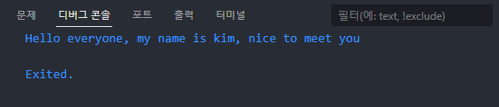
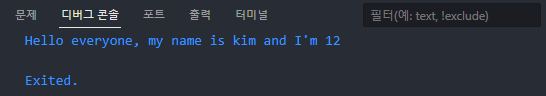
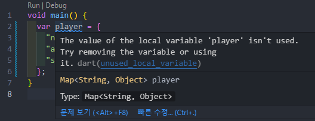
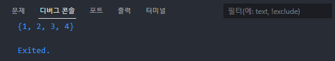

# 데이터 타입

## 기본 데이터 타입

```dart
void main() {
  String name = "nico";
  bool alive = true;
  int age = 12;
  double money = 59.99;
}
```

 dart에서는 모든 자료형 자체가 object로 이루어져있음

function도 마찬가지

Dart가 객체 지향 언어로 불리는 이유


## num

```dart
void main() {
  num x = 12;
  x = 1.1;
}
```

int, double은 num을 상속받는 object

num은 int와 double이 모두 호환 가능함


## List

```dart
void main() {
  // List<int> number = [];
  var numbers = [
    1,
    2,
    3,
    4,
  ];
}
```

List를 사용할 때는 var와 List<E>로 사용할 수 있음

자료형을 명시하는 방법은 class를 다룰 때 쓰기 때문에 보통 var를 사용

List를 선언할 때 마지막 요소 뒤에 콤마를 넣으면 보기 쉽게 formatting 됨


### collection if

> if로 존재할 수도 안할 수도 있는 요소를 가지고 리스트를 만들 수 있음

```dart
void main() {
  var giveMeFive = true;
  var numbers = [
    1,
    2,
    3,
    4,
    if (giveMeFive) 5,
  ];
}
```

요소 안에서 조건문을 사용하여 리스트에 요소를 추가할 수 있음


```dart
if (giveMeFive) {
  numbers.add(5);
}
```

실제론 이렇게 긴 코드를 리스트 안에서 짧게 사용할 수 있음


### String interpolation

> text에 변수를 추가하는 방법

```dart
void main() {
  var name = 'kim';
  var greeting = "Hello everyone, my name is $name, nice to meet you";

  print(greeting);
}
```



큰 따옴표, 작은 따옴표 중 아무거나 사용해도 됨

문자열을 작은 따옴표로 묶었을 때 문자열 안에서 작은 따옴표를 사용하고 싶다면 `\`를 사용하거나 큰 따옴표로 바꿔서 묶으면 됨

달러 기호 뒤에 변수명을 사용하면 변수의 값이 문자열에 들어감


```dart
void main() {
  var name = 'kim';
  var age = 10;
  var greeting = "Hello everyone, my name is $name and I'm ${age + 2}";

  print(greeting);
}
```



계산이 필요하다면 달러와 중괄호로 묶어서 사용


### collection for

> 리스트에 반복이 가능한 객체의 요소를 추가할 때 추가 연산을 쉽게 사용할 수 있음

```dart
void main() {
  var oldFriends = ['kim', 'lee'];
  var newFirends = [
    'park',
    'choi',
    for (var friend in oldFriends) "❤️ $friend",
  ];

  print(newFirends);
}
```


## Map

> 키와 값을 갖는 구조

```dart
void main() {
  var player = {
    "name": "kim",
    "age": 29,
    "superpower": false,
  };
}
```



Object는 모든 자료형이 올 수 있음(Typescript에서의 any와 같음)


```dart
void main() {
  Map<String, Object> player = {
    "name": "kim",
    "age": 29,
    "superpower": false,
  };
}
```

자료형을 명시해서 사용 가능


```dart
void main() {
  Map<List<int>, bool> player = {
    [1, 2, 3, 5]: true,
  };
  
  List<Map<String, Object>> players = [
    {'name': 'kim', 'xp': 1000.1},
    {'name': 'lee', 'xp': 1000.2}
  ];
}
```

키와 값에 모든 자료형을 사용할 수 있음

만약 Object를 만든다면 Map을 많이 사용하는 것이 좋지 않고 class를 사용


## Set

> 중복이 없는 리스트

```dart
void main() {
  var numbers = {1, 2, 3, 4};
  // Set<int> numbers = {1, 2, 3, 4};

  numbers.add(1);
  numbers.add(1);
  numbers.add(1);

  print(numbers);
}
```



중복이 제거된 채로 출력됨