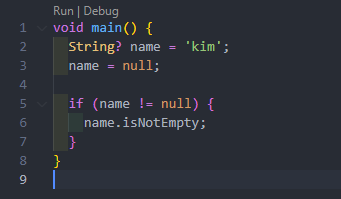

# Dart 변수

## 변수 선언

```dart
void main() {
  var name = 'kim';
}
```

변경이 가능한 변수를 var로 선언

변경을 할 경우에는 타입이 같은 값으로만 변경이 가능함

관습적으로 함수나 메소드 내부에 지역 변수를 선언할 때 var를 사용


```dart
void main() {
  String name = 'kim';
}
```

변수를 선언할 때 명시적으로 변수의 타입을 지정해서 선언할 수 있음

class에서 변수나 property를 사용하는 경우 타입을 명시해줌


## dynamic

> 여러가지 타입을 가질 수 있는 변수에 쓰는 키워드

사용하는 게 추천되지 않지만 그렇게 사용해야 할 때도 있음


```dart
void main() {
  var name;
  // dynamic name;

  name = 'nico';
  name = 12;
}
```

변수가 어떤 타입일지 알기 어려운 경우가 있기 때문(json 작업)

dynamic으로 살짝 돌아가는게 유용한 경우가 있음


dynamic으로 지정하고 변수 뒤에 `.`을 찍으면 타입을 모르기 때문에 사용 가능한 메소드가 몇 개 없음


변수의 타입이 String일 경우로 조건을 걸어서 안에서 사용한다면 String의 타입에서 사용 가능한 메소드가 나오게 됨


int 타입도 마찬가지


## null safety

> 어떤 변수, 혹은 데이터가 null이 될 수 있음을 명시하는 것
>
> 모든 변수는 기본적으로 nullable이 아님
>
> 개발자가 null 값을 참조할 수 없도록 하는 것

dart의 원래 버전에는 없었지만 몇 개 버전 뒤에 생김

코드에서 null을 참조하면 사용할 경우에 발생하는 컴파일러가 잡지 못하는 런타임 에러가 발생함

컴파일 전에 에러를 잡는 것이 좋고 이는 null safety가 해결해줌


```dart
bool isEmpty(String string) => string.length == 0;

main() {
    isEmpty(null);
}
```

위와 같은 코드에서는 런타임 에러인 `NoSuchMethodError`가 발생함

이는 null은 String이 아니기 때문에 length 메소드가 없기 때문


null은 유용하기 때문에 삭제하는 것이 정답이 아님

null은 부재를 의미하고 이러한 상태도 필요함

하지만 이러한 값을 참조할 때 문제가 생김


String으로 선언한 변수에 null을 넣을 수 없음


만약 변수가 String이거나 null이 될 수도 있다고 하려면 타입 뒤에 `?`를 붙이면 됨

length와 같이 String 속성과 메소드를 사용하면 변수가 null일 수도 있다고 알려줌




조건을 걸어서 null이 아니라고 할 경우 dart가 null이 아닌 것을 알기 때문에 String이 사용 가능한 속성과 메소드를 사용할 수 있음


단축 문법을 사용하여 값이 존재하는지 판단하고 그 이후의 연산을 진행


## final

> 한 번 정의된 변수를 수정할 수 없게 만드는 변수 선언

```dart
void main() {
  final name = 'kim';
  name = 'lee'; // 에러 발생
}
```


```dart
void main() {
  final String name = 'kim';
  name = 'lee';
}
```

좀 더 구체적으로 선언하고 싶다면 final 뒤에 타입을 명시해주면 됨(필수 아님)

dart 컴파일러는 똑똑해서 알아서 변수의 타입을 이해함


## late

> final이나 var 앞에 붙여줄 수 있는 수식어
>
> 초기 데이터 없이 먼저 변수를 생성하고 나중에 값을 할당할 때 사용

```dart
void main() {
  late final String name;
  // do something, go to api
  name = 'kim';
  print(name);
}
```

변수에 데이터를 넣어야 사용할 수 있음

data fetching에 유용함


API에서 얻어온 값을 사용하려고 할 때는 한 번만 할당할 수 있는 변수를 먼저 만들고 API에 요청을 보낸 뒤 값을 얻어 late 변수에 할당


## const

> 상수를 의미
>
> dart에서는 js, ts에서와의 의미가 다름

js, ts에서의 const는 dart의 final과 비슷함

dart에서 const는 compile-time constant를 만들어줌

API에서 데이터를 가져오는 일에서 유용


final과 같이 동작하며 수정할 수 없음


중요한 점은 compile-time에 알고 있는 값이 있어야 한다는 것


API 요청을 통해 얻은 값을 넣는다고 가정할 때 const를 사용할 수 없음

컴파일 전에 값을 알고 있어야 하기 때문에 사용할 수 없고 final을 대신 사용해야 함

앱을 컴파일해서 앱스토어에 올리기 전에 이미 알고 있는 값을 다룰 때 사용