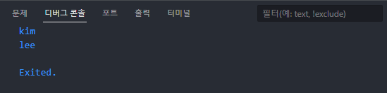
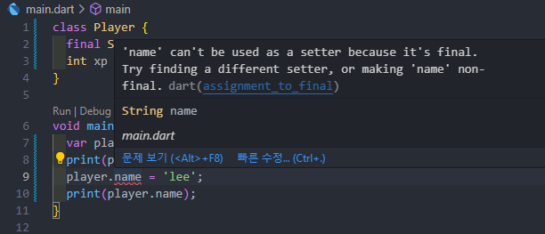
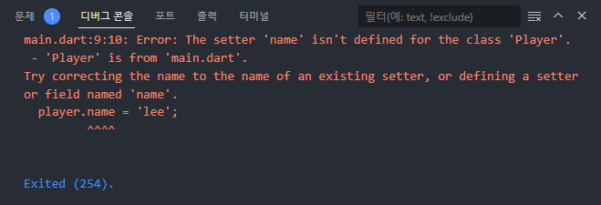
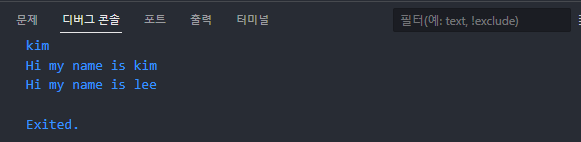
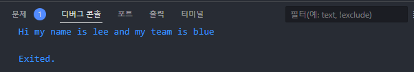

# Class

클래스에서 요소를 선언할 때 타입을 사용해서 정의함

```dart
class Player {
  String name = 'kim';
  int xp = 1500;
}

void main() {
  var player = Player();
  print(player.name);
  player.name = 'lee';
  print(player.name);
}
```




만약 Player의 name을 바꾸지 못하게 하고 싶다면

```dart
class Player {
  final String name = 'kim';
  int xp = 1500;
}

void main() {
  var player = Player();
  print(player.name);
  player.name = 'lee';
  print(player.name);
}
```

final 수식어를 붙이면 됨

final 변수와 요소는 수정할 수 없기 때문






## Method

```dart
class Player {
  final String name = 'kim';
  int xp = 1500;

  void sayHello() {
    var name = 'lee';
    print("Hi my name is ${this.name}");
    print("Hi my name is $name");
  }
}

void main() {
  var player = Player();
  print(player.name);

  player.sayHello();
}
```

메소드에서 요소를 사용할 때 요소의 이름을 붙여서 사용하면 됨

만약 클래스의 요소의 값을 사용하려고 하지만 같은 이름의 변수가 메소드 안에 존재한다면 요소를 사용할 땐 `${this.name}`을 사용하고 변수를 사용하려면 `$name`을 사용하면 됨




## Constructors

> 인스턴스를 생성할 때 인자의 값을 넘겨서 생성

```dart
class Player {
  late final String name;
  late int xp;

  Player(String name, int xp) {
    this.name = name;
    this.xp = xp;
  }

  void sayHello() {
    print("Hi my name is $name");
  }
}

void main() {
  var player1 = Player('kim', 1500);
  player1.sayHello();
  
  var player2 = Player('lee', 1000);
  player2.sayHello();
}
```

this를 사용하여 값을 할당해줌

null을 체크하기 때문에 late를 사용하여 변수의 값을 나중에 할당해준다고 선언


```dart
class Player {
  final String name;
  int xp;

  Player(this.name, this.xp);

  void sayHello() {
    print("Hi my name is $name");
  }
}
```

생성자를 축약해서 작성할 수 있음

바로 요소에 할당하기 때문에 late 수식어를 제거할 수 있음

인자의 순서가 중요함(positional arguments)


## Named Constructor Parameters

```dart
class Player {
  final String name;
  int xp;
  String team;
  int age;

  Player({
    required this.name,
    required this.xp,
    required this.team,
    required this.age,
  });

  void sayHello() {
    print("Hi my name is $name");
  }
}

void main() {
  var player1 = Player(
    name: 'kim',
    xp: 1500,
    team: 'red',
    age: 12,
  );
  player1.sayHello();
  
  var player2 = Player(
    name: 'lee',
    xp: 1000,
    team: 'blue',
    age: 20,
  );
  player2.sayHello();
}
```

함수에서와 같이 생성자 파라미터를 중괄호로 묶고 default 값을 지정하거나 required 수식어를 붙여 null을 방지

인스턴스를 생성할 때 인자에 클래스 요소의 이름을 붙여서 생성


## Named Constructors

> 생성자에 이름을 붙여 default 값을 가지고 있는 생성자를 여러 개 만들 수 있음

```dart
class Player {
  final String name;
  int xp, age;
  String team;

  Player({
    required this.name,
    required this.xp,
    required this.team,
    required this.age,
  });

  void sayHello() {
    print("Hi my name is $name");
  }
}
```

int 타입의 요소가 여러 개라면 한 번에 선언할 수 있음


```dart
class Player {
  final String name;
  int xp, age;
  String team;

  Player({
    required this.name,
    required this.xp,
    required this.team,
    required this.age,
  });

  Player.createBluePlayer({
    required String name,
    required int age,
  })  : this.age = age,
        this.name = name,
        this.team = 'blue',
        this.xp = 0;

  void sayHello() {
    print("Hi my name is $name");
  }
}
```

createBluePlayer라는 named constructor를 통해서 `:` 전의 코드로 객체를 만들고 `:` 후의 코드로 객체를 초기화하겠다고 선언

createBluePlayer는 named constructor parameter를 사용한 방식(required 수식어 필요)


```dart
class Player {
  final String name;
  int xp, age;
  String team;

  Player({
    required this.name,
    required this.xp,
    required this.team,
    required this.age,
  });

  Player.createBluePlayer({
    required String name,
    required int age,
  })  : this.age = age,
        this.name = name,
        this.team = 'blue',
        this.xp = 0;

  Player.createRedPlayer(String name, int age)
      : this.age = age,
        this.name = name,
        this.team = 'red',
        this.xp = 0;

  void sayHello() {
    print("Hi my name is $name");
  }
}

void main() {
  var player1 = Player.createBluePlayer(
    name: 'kim',
    age: 12,
  );
  player1.sayHello();

  var player2 = Player.createRedPlayer('lee', 20);
  player2.sayHello();
}
```

createRedPlayer 생성자는 positional constructor parameter 방식을 사용


## Named Constructor 2

```dart
class Player {
  final String name;
  int xp;
  String team;

  Player.fromJson(Map<String, dynamic> playerJson)
      : name = playerJson['name'],
        xp = playerJson['xp'],
        team = playerJson['team'];

  void sayHello() {
    print("Hi my name is $name");
  }
}

void main() {
  var apiData = [
    {
      "name": "kim",
      "team": "red",
      "xp": 0,
    },
    {
      "name": "lee",
      "team": "blue",
      "xp": 0,
    },
    {
      "name": "park",
      "team": "green",
      "xp": 0,
    }
  ];

  apiData.forEach((playerJson) {
    var player = Player.fromJson(playerJson);
    player.sayHello();
  });
}
```

apiData를 가져온다면 데이터에 맞는 생성자를 만들어줘야 함

파라미터를 `Map<String, dynamic>`으로 하고 `:`을 통해서 객체를 초기화해줌

이 때 `dynamic`을 사용하는 이유는 playerJson의 값이 무엇인지 알 수 없지만 클래스의 요소의 타입이 지정되어 있기 때문에 타입에 맞게 동적으로 값을 할당할 수 있음

`Object`를 사용하려면 요소의 타입에 맞게 파라미터 값의 타입을 변경해줘야 함(`name = playerJson['name'].toString()`)


## Cascade Notation

```dart
class Player {
  String name;
  int xp;
  String team;

  Player({required this.name, required this.xp, required this.team});

  void sayHello() {
    print("Hi my name is $name");
  }
}

void main() {
  var kim = Player(name: 'kim', xp: 1200, team: 'red');

  kim.name = 'lee';
  kim.xp = 1300;
  kim.team = 'blue';
}
```

기본 생성자로 인스턴스를 만들고 인스턴스의 요소 값을 수정하는 코드


```dart
class Player {
  String name;
  int xp;
  String team;

  Player({required this.name, required this.xp, required this.team});

  void sayHello() {
    print("Hi my name is $name");
  }
}

void main() {
  var kim = Player(name: 'kim', xp: 1200, team: 'red')
    ..name = 'lee'
    ..xp = 1300
    ..team = 'blue'
    ..sayHello();
}
```

인스턴스를 생성하는 코드 뒤에 세미콜론을 지우고 인스턴스를 가리키는 이름을 `.`으로 대체 후 마지막에만 세미콜론을 작성

`.`은 바로 앞에 있는 클래스를 가리킴


## Enum

> 옵션을 미리 지정하여 선택의 폭을 좁혀 개발자들이 잘못 입력하는 것을 방지해줌

```dart
enum Team { red, blue }

enum XPLevel { beginner, medium, pro }

class Player {
  String name;
  XPLevel xp;
  Team team;

  Player({required this.name, required this.xp, required this.team});

  void sayHello() {
    print("Hi my name is $name and my team is ${team.name}");
  }
}

void main() {
  var kim = Player(
    name: 'kim',
    xp: XPLevel.beginner,
    team: Team.red,
  );
  var lee = kim
    ..name = 'lee'
    ..xp = XPLevel.pro
    ..team = Team.blue
    ..sayHello();
}
```



출력을 하려면 enum의 name으로 접근해서 사용


## Abstract Class

> 추상화 클래스는 다른 클래스들이 직접 구현해야 하는 메소드들의 청사진

```dart
abstract class Human {
  void walk();
}

enum Team { red, blue }

enum XPLevel { beginner, medium, pro }

class Player extends Human {
  String name;
  XPLevel xp;
  Team team;

  Player({required this.name, required this.xp, required this.team});

  void sayHello() {
    print("Hi my name is $name and my team is ${team.name}");
  }

  void walk() {
    print("im walking");
  }
}

class Coach extends Human {
  void walk() {
    print('the coach is walking');
  }
}
```

추상화 클래스는 이를 상속받는 모든 클래스가 가지고 있어야 하는 메소드를 정의함

상속받은 클래스는 추후에 메소드를 구현해야 함


## Inheritance

```dart
enum Team { blue, red }

class Human {
  final String name;
  Human({required this.name});
  void sayHello() {
    print("Hi my name is $name");
  }
}

class Player extends Human {
  final Team team;

  Player({
    required this.team,
    required String name,
  }) : super(name: name);

  @override
  void sayHello() {
    super.sayHello();
    print('and I play for ${team.name}');
  }
}

void main() {
  var player = Player(
    team: Team.red,
    name: 'kim',
  );

  player.sayHello();
}
```

Human이라는 부모 클래스를 만들고 Player 클래스에서 Human 클래스를 상속받음

Player 클래스에서 name이라는 요소만 가지고 있고 team이라는 요소는 Human에서 상속받아서 인스턴스를 생성하고 싶다면 생성자에 `super`를 사용하여 부모 클래스의 생성자에 전달할 수 있음

`super` 키워드를 통해 부모 클래스와 상호작용을 할 수 있게 해줌

`@override`를 통해 부모 클래스에서 상속받은 메소드를 재정의할 수 있음

`@override` 안에서 `super`를 통해서 부모의 메소드를 불러올 수 있음


```dart
class Human {
  final String name;
  Human(this.name);
  void sayHello() {
    print("Hi my name is $name");
  }
}

class Player extends Human {
  final Team team;

  Player({
    required this.team,
    required String name,
  }) : super(name);

  @override
  void sayHello() {
    super.sayHello();
    print('and I play for ${team.name}');
  }
}
```

named parameter를 안쓰고 positional parameter를 사용하는 방법


## Mixin

> 생성자가 없는 클래스
>
> with을 사용하여 요소나 메소드를 가져옴

```dart
class Strong {
  final double strengthLevel = 1500.99;
}

class QuickRunner {
  void runQuick() {
    print("runnnn!");
  }
}

class Tall {
  final double height = 1.99;
}

enum Team { blue, red }

class Player with Strong, QuickRunner, Tall {
  final Team team;

  Player({
    required this.team,
  });
}

class Horse with Strong, QuickRunner {}

class Kid with QuickRunner {}

void main() {
  var player = Player(
    team: Team.red,
  );

  player.runQuick();
}
```

Mixin은 생성자가 없어야 함

`with` 키워드로 Mixin 클래스를 합칠 수 있음

합쳐진 클래스로 생성된 인스턴스에서 Mixin의 요소나 메소드를 사용할 수 있음
