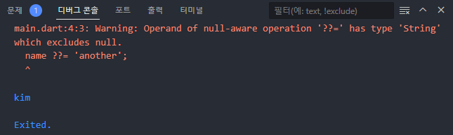

# Function

```dart
void sayHello(String name) {
  print("Hello $name nice to meet you");
}

void main() {
  sayHello('kim');
}
```

void는 return 값이 없다는 것


```dart
String sayHello(String name) {
  return "Hello $name nice to meet you";
}

void main() {
  print(sayHello('kim'));
}
```

return 값이 있다면 함수를 return 값의 자료형으로 사용


```dart
String sayHello(String name) => "Hello $name nice to meet you";

num plus(num a, num b) => a + b;
```

함수가 한 줄짜리 함수이며 return 값이 있는 경우 fat arrow syntax를 사용하여 곧 바로 return 할 수 있음


## named parameters

```dart
String sayHello(String name, int age, String country) {
  return "Hello $name, you are $age, and you come from $country";
}

void main() {
  print(sayHello('kim', 20, 'korea'));
}
```

함수의 파라미터가 여러 개인 경우 함수를 호출할 때 순서를 기억하여 인자를 넘겨주어야 함

이 방법은 순서가 틀리면 에러가 발생함(positional parameters)


```dart
String sayHello({
  String name = 'anon',
  int age = 99,
  String country = 'wakanda',
}) {
  return "Hello $name, you are $age, and you come from $country";
}

void main() {
  print(sayHello(
    age: 20,
    name: 'kim',
    country: 'korea',
  ));
}
```

named parameters를 사용하여 인자에 이름을 정해준다면 순서가 바뀌어도 상관 없음

함수의 파라미터에도 이름을 지정해주어야 함

중괄호를 사용하여 파라미터를 묶으면 됨

하지만 dart는 null safety를 제공하기 때문에 default 값을 지정해줘야 함


```dart
String sayHello({
  required String name,
  required int age,
  required String country,
}) {
  return "Hello $name, you are $age, and you come from $country";
}

void main() {
  print(sayHello(
    name: 'kim',
    age: 20,
    country: 'korea',
  ));
}
```

default 값을 사용하고 싶지 않다면 required 수식어를 붙이면 됨

만약 함수 호출 시 필수 인자가 없다면 dart는 함수를 컴파일하지 않음


## optional positional parameters

```dart
String sayHello(String name, int age, [String? country = 'korea']) =>
    "Hello $name, you are $age, and you come from $country";

void main() {
  var result = sayHello('kim', 20);
  print(result);
}
```

만약 country의 값이 없어도 함수가 호출이 되게 하고 싶다면 대괄호로 파라미터를 묶고 `?`를 붙인 뒤(null도 가능) default 값을 설정해주면 됨


## QQ(null aware) operator

```dart
String capitalizeName(String? name) {
  if (name != null) {
    return name.toUpperCase();
  }
  return 'KIM';
}

void main() {
  capitalizeName('kim');
  capitalizeName(null);
}
```

이름을 대문자로 바꿔주는 함수를 만들었다고 가정

만약 이름에 null이 들어온다면 함수 파라미터에서 null이 가능하게 `?`를 붙이고 조건 추가


```dart
String capitalizeName(String? name) =>
    name != null ? name.toUpperCase() : 'KIM';
```

조건문을 한 줄로 줄여서 사용 가능


```dart
String capitalizeName(String? name) => name?.toUpperCase() ?? 'KIM';
```

`??`의 경우 좌항이 null이면 좌항, 좌항이 null이면 우항이 됨

name이 null인 경우 null 자체에서 toUpperCase 메소드를 실행할 수 없기 때문에 name에도 `?`를 붙임


### QQ equals(QQ assignment operator)

```dart
void main() {
  String? name;
  name ??= 'kim';
  name ??= 'another';

  print(name);
}
```

null이 가능한 변수를 선언

`??=`는 변수가 null인 경우만에 값을 넣어줌




만약 null이 아니라면 warning과 함께 값이 출력됨


## typedef

> 자료형에 별칭을 붙여 긴 자료형을 변수처럼 정의할 수 있음

```dart
typedef ListOfInts = List<int>;

ListOfInts reverseListOfNumbers(ListOfInts list) {
  var reversed = list.reversed;

  return reversed.toList();
}

void main() {
  print(reverseListOfNumbers([1, 2, 3]));
}
```

```dart
typedef UserInfo = Map<String, String>;

String sayHi(UserInfo userInfo) {
  return "Hi ${userInfo['name']}";
}

void main() {
  print(sayHi({"name": 'kim'}));
}
```

