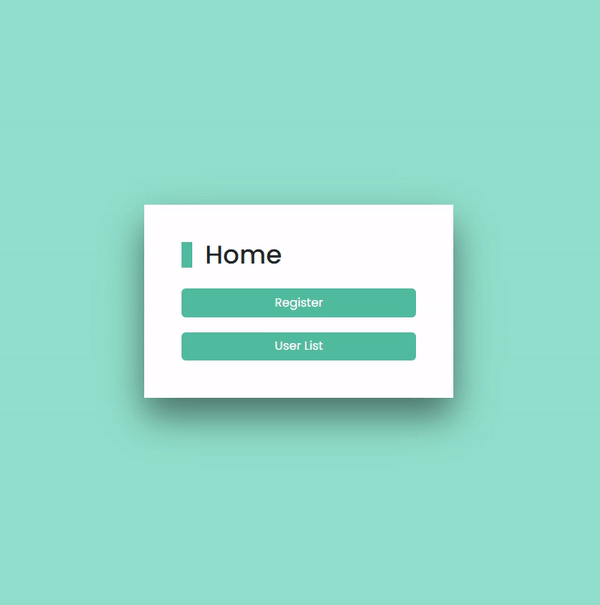

# Django 회원 가입 만들기

## 1. 웹 페이지



<br/>

## 2. 프로젝트 소개

- `Django`에 있는 **User Model**을 커스텀하여 **본인의 User Model**을 만들어 회원 가입 페이지를 만든다.

<br/>

## 3. 배운 내용

- `models.py`

  - ```python
    from django contrib auth models import AbstractUser
    
    
    class User(AbstractUser):
        pass
    ```

  - `AbstractUser`을 상속 받은 `User` Class를 만든다

- `settings.py`

  - `AUTH_USER_MODEL = 'accounts.User'`
  - Django 프로젝트에서 User를 나타내는데 사용하는 모델을 위에서 생성한 Custom User 모델로 지정

- `admin.py`

  - ```python
    from django.contrib import admin
    from django.contrib.auth.admin import UserAdmin
    from .models import User
    
    
    admin.site.reigter(User, UserAdmin)
    ```

  - 기본 User 모델이 아니기 때문에 등록하지 않으면 `admin site`에 출력 되지 않음

- `forms.py`

  - ```python
    from django.contrib.auth import get_user_model
    from django.contrib.auth.forms import UserCreationFrom
    
    class CustomUserCreationForm(UserCreationForm):
        
        class Meta(UserCreationForm.Meta):
            model = get_user_model()
    ```

  - 기존 `UserCreationForm`을 상속 받아 `User Model` 재정의

  - `get_user_model()`

    - 현재 프로젝트에서 `활성화된 사용자 모델(active user model)`을 반환
    - Django에서는 User 클래스는 커스텀을 통해 변경 가능하여, ~~직접 참조~~하는 대신 `get_user_model()`을 사용할 것을 권장

<br/>

## 4. 기능

### [상세코드 흐름 보기](./상세코드.md)

### 4-0. `Main(index)`

```python
def index(request):
    return render(request, "index.html")
```

- `GET` `http://127.0.0.1:8000/`
- 회원 가입 페이지 이동 버튼
- 회원 목록 페이지 이동 버튼

<br/>

### 4-1. `signup`

```python
def signup(request):
    if request.method == "POST":
        form = CustomUserCreationForm(request.POST)

        if form.is_valid():
            form.save()

            return redirect("accounts:index")

    else:
        form = CustomUserCreationForm()

    context = {
        "form": form,
    }

    return render(request, "accounts/signup.html", context)
```

- `POST` `http://127.0.0.1:8000/accounts/signup/`
- `CustomUserCreationForm`을 활용해서 회원가입 구현

<br/>

### 4-2. `Read(index)`

```python
def index(request):
    users = get_user_model().objects.all()

    context = {
        "users": users,
    }

    return render(request, "accounts/index.html", context)
```

- 0GET` `http://127.0.0.1:8000/accounts/`
- 회원 목록 조회

<br/>

### 4-3. `detail`

```python
def detail(request, pk):
    user = get_user_model().objects.get(pk=pk)

    context = {
        "user": user,
    }

    return render(request, "accounts/detail.html", context)
```

- `GET` `http://127.0.0.1:8000/accounts/<int:user_pk>/`
- 회원 정보 출력

<br/>

## 5. 참고

### 5-0. `static` 적용하기

- `settings.py`

  ```python
  import os
  
  TEMPLATES = [
      {
          ...
      	"DIRS": [os.path.join(BASE_DIR, "pjt", "templates")],
          ...
      },
  ]
  
  STATICFILES_DIRS = [os.path.join(BASE_DIR, "pjt", "static")]
  ```

- `templates/base.html`

  ```html
  
  
  
  <!DOCTYPE html>
  <html lang="en">
  
    <head>
      <meta charset="UTF-8">
      <meta http-equiv="X-UA-Compatible" content="IE=edge">
      <meta name="viewport" content="width=device-width, initial-scale=1.0">
      
      
      <link rel="stylesheet" href="">
    </head>
  
    <body>
      
    </body>
  
  </html>
  ```

  