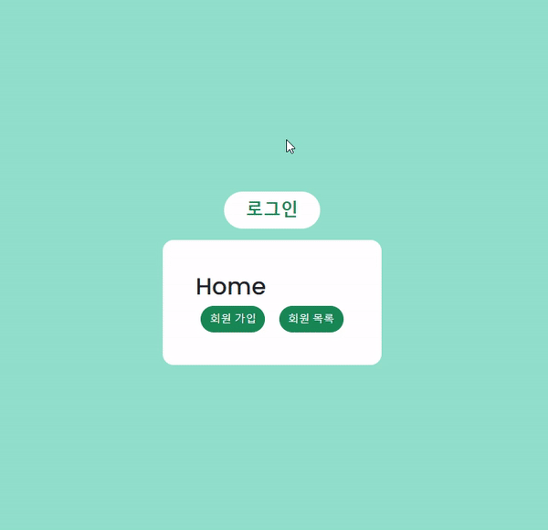

# Django 로그인 기능 만들기

## 1. 웹 페이지



<br/>

## 2. 프로젝트 소개

- `Django`에 있는 `AuthenticationForm`을 활용하여 로그인 Form 만들기

<br/>

## 3. 배운 내용

### 3-1. Login

>- `login(request, user, backend=None)`
>- 인증된 사용자를 로그인
>  - 유저의 ID를 세션에 저장하여 세션을 기록
>- `HttpRequest 객체`와 `User 객체`가 필요

<br/>

- `urls.py`

  ```python
  urlpatterns = [
      path("login/", views.login, name="login"),
  ]
  ```

<br/>

- `views.py` 임시

  ```python
  from django.contrib.auth.forms import AuthenticationForm
  
  
  def login(request):
      if request.method == "POST":
          pass
      else:
          form = AuthenticationForm()
  
      context = {
          "form": form,
      }
  
      return render(request, "accounts/login.html", context)
  ```

<br/>

- `login.html`

  ```html
  <h1>로그인</h1>
  <form action="" method="POST">
    
    {{ form.as_p }}
    <input type="submit" value="로그인">
  </form>
  ```

<br/>

- `views.py` 수정

  ```python
  from django.contrib.auth.forms import AuthenticationForm
  from django.contrib.auth import login as auth_login
  
  
  def login(request):
      if request.method == "POST":
          form = AuthenticationForm(request, data=requset.POST)
  
          if form.is_valid():
              auth_login(request, form.get_user())
              return redirect("accounts:index")
      else:
          form = AuthenticationForm()
  
      context = {
          "form": form,
      }
  
      return render(request, "accounts/login.html", context)
  ```

  - 일반적인 `ModelForm` 기반의 **Create 로직**과 동일하지만 `Form`이기 때문에 필수 인자 구성이 다름
  - `DB`에 저장하는 것 대신 세션에 유저를 기록하는 함수 호출
  - `get_user()`
    - `AuthenticationForm`의 인스턴스 메서드
    - 유효성 검사를 통과했을 경우 로그인한 사용자 객체를 반환

<br/>

- `base.html`

  ```html
  <body>
    <h3>Hello,
      {{ user }}
    </h3>
    <a href="">로그인</a>
    
  </body>
  ```

  - `context` 데이터 없이 `user` 변수를 사용할 수 있는 이유는 `settings.py`의 `context processors 설정`의 `"django.contrib.auth.context_processors.auth"` 때문에 가능
  - `context processors`
    - 템플릿이 렌더링될 때 호출 가능한 context 데이터 목록
    - 작성된 context 데이터는 기본적으로 템플릿에서 사용 가능한 변수로 포함됨
    - django에서 자주 사용하는 데이터 목록을 미리 템플릿에 로드해둔 것
  - 템플릿 변수 `{{ user }}`
    - 클라이언트가 로그인한 경우 `User 클래스의 인스턴스`
    - 클라이언트가 로그인하지 않은 경우 `AnonymousUser 클래스의 인스턴스`

<br/>

- 세션 데이터 확인하기
  - DB에서 확인
    - `django_session` 테이블에서 확인
  - 브라우저에서 확인
    - `개발자도구` - `Application` - `Cookies`

### 3-2. Logout

> - `logout(request)`
> - 요청 유저에 대한 세션 정보를 삭제
>   - DB에서 `session data` 삭제
>   - 클라이언트의 쿠키에서 `session id` 삭제
> - `HttpRequest 객체`를 인자로 받고 반환값이 없음
> - 사용자가 로그인하지 않은 경우 오류를 발생시키지 않음

<br/>

- `urs.py`

  ```python
  urlpatterns = [
      path("logout/", views.logout, name="logout"),
  ]
  ```

- `views.py`

  ```python
  from django.contrib.auth import logout as auth_logout
  
  def logout(request):
      auth_logout(request)
  
      return redirect('index')
  ```

<br/>

### 3-3. 로그인 사용자에 대한 접근 제한

#### 3-3-1. `is_authenticated attribute`를 활용한 조건문

> - `User model`의 속성(`attributes`) 중 하나
> - 사용자가 인증되었는지 여부를 알 수 있는 방법
> - 모든 `User 인스턴스`에 대해 항상 `True`인 읽기 전용 속성
>   - `AnonymousUser`에 대해서는 항상 `False`
> - 일반적으로 `request.user`에서 이 속성을 사용 (`request.user.is_authenticated`)
> - 권한(`permission`)과는 관련이 없으며, 사용자가 활성화 상태(`active`)이거나 유효한 세션(`valid session`)을 가지고 있는지도 확인하지 않음

<br/>

- `base.html`

  ```html
  <body>
    
      <h3>Hello,
        {{ user }}
      </h3>
      <a href="">로그아웃</a>
    
      <a href="">로그인</a>
    
    
  </body>
  ```

  - 로그인이 된 경우와 로그인이 안된 경우를 나누어 링크를 다르게 출력

<br/>

- `views.py` : 인증된 사용자 로그인 막기

  ```python
  def login(request):
      if request.user.is_authenticated:
          return redirect("accounts:index")
      else:
          if request.method == "POST":
              form = AuthenticationForm(request, data=request.POST)
  
              if form.is_valid():
                  auth_login(request, form.get_user())
                  return redirect("accounts:index")
          else:
              form = AuthenticationForm()
  
          context = {
              "form": form,
          }
  
          return render(request, "accounts/login.html", context)
  ```

  - 로그인과 비로그인 상태에서 출력되는 링크 다르게 설정하기(`is_authenticated`)
    - 로그인 : `index.html`로 이동
    - 비로그인 : `login.html`로 이동

<br/>

#### 3-3-2. `The login_required decorator`를 활용한 `views.py`에서의 제한

> - 사용자가 로그인되어 있으면 정상적으로 `view` 함수를 실행
> - 로그인하지 않은 사용자의 경우 `settings.py`의 `LOGIN_URL` 문자열 주소로 `redirect`
>   - [참고] LOGIN_URL의 기본값은 `/accounts/login/`

<br/>

- `views.py` : 로그인 상태에서만 회원 목록 조회 가능

  ```python
  from django.contrib.auth.decorators import login_required
  
  
  @login_required
  def index(request):
      return render(request, "accounts/index.html")
  ```

<br/>

- `views.py` : `next`라는 쿼리 문자열 매개 변수 대응

  ```python
  def login(request):
      if request.user.is_authenticated:
          return redirect("accounts:index")
      else:
          if request.method == "POST":
              form = AuthenticationForm(request, data=request.POST)
  
              if form.is_valid():
                  auth_login(request, form.get_user())
                  return redirect(request.GET.get("next") or "accounts:index")
          else:
              form = AuthenticationForm()
  
          context = {
              "form": form,
          }
  
          return render(request, "accounts/login.html", context)
  ```

  - 인증 성공시 사용자가 `redirect` 되어야 하는 경로는 `"next"`라는 쿼리 문자열 매개 변수에 저장됨
    - `http://localhost:8000/accounts/login/?next=/accounts/`
    - redirect에 `request.GET.get("next")`를 사용

  - `"next" query string parameter` 주의사항
    - 만약 `login.html` 템플릿에서 `form action`이 작성되어 있다면 동작하지 않음
    - 해당 `action` 주소 `next 파라미터`가 작성되어 있는 현재 url이 아닌 `/accounts/login/`으로 요청을 보내기 때문