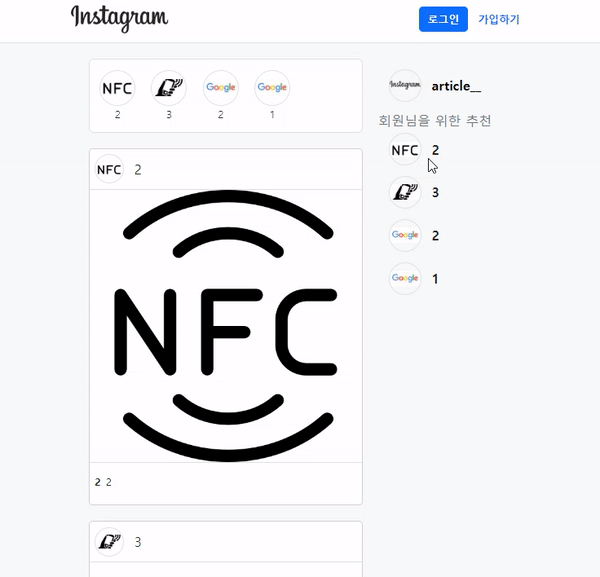

# Django 이미지 DB에 저장하기

## 1. 웹 페이지



<br/>

## 2. 프로젝트 소개

- `DB`에 `image`와 `thumbnail`을 이미지 파일을 입력받아 저장하여 웹 페이지를 구현

<br/>

## 3. 배운 내용

- 미디어 파일
  - 사용자가 웹에서 업로드하는 정적 파일 (user-uploaded)
  - 유저가 업로드한 모든 정적 파일
- Media 관련 필드
  - `ImageField`
    - 이미지 업로드에 사용하는 모델 필드
    - `FileField`를 상속받는 서브 클래스이기 때문에 `FileField`의 모든 속성 및 메서드 사용 가능, 사용자에 의해 업로드된 객체가 유효한 이미지인지 검사
    - `ImageField` 인스턴스는 최대 길이가 100자인 문자열로 DB에 생성되며, `max_length` 인자를 사용하여 최대 길이를 변경할 수 있음
    - **[주의]** 사용하려면 반드시 [Pillow](https://pillow.readthedocs.io/en/latest/) 라이브러리가 필요
  - `FileField`
    - 파일 업로드에 사용하는 모델 필드
    - `upload_to`, `storage` 2개의 선택 인자를 가지고 있음

<br/>

- `models.py`

  - ```python
    # 문자열로 경로 지정 방식
    class MyModel(models.Model):
        # MEDIA_ROOT/uploads/ 경로로 파일 업로드
        upload = models.FileField(upload_to='uploads/')
        # or
        # MEDIA_ROOT/uploads/2021/01/01/ 경로로 파일 업로드
        upload = models.FileField(upload_to='uploads/%Y/%m/%d/')
        
    # 함수 호출
    def articles_image_path(instance, filename):
        # MEDIA_ROOT/user_<pk>/ 경로로 <filename> 이름으로 업로드
        return f'user_{instance.user.pk}/{filename}'
    
    
    class Article(models.Model):
        image = models.ImageField(upload_to=articles_image_path)
    ```

- `URL 설정`

  - `settings.py`에 `MEDIA_ROOT`, `MEDIA_URL` 설정

  - `upload_to` 속성을 정의하여 업로드된 파일에 사용할 `MEDIA_ROOT`의 하위 경로를 지정

  - 업로드된 파일의 경로는 django가 제공하는 `'url'` 속성을 통해 얻을 수 있음

    ```html
    

## 4. 기능

### 4-0. 이미지 업로드(CREATE)

#### 4-0-0. `models.py`

```python
class Article(models.Model):
    title = models.CharField(max_length=50)
    content = models.TextField()
    # saved to 'MEDIA_ROOT/'
    # MEDIA_ROOT = BASE_DIR / "images"
    image = models.ImageField(blank=True)
    thumbnail = ProcessedImageField(
        upload_to="image",
        processors=[ResizeToFill(100, 50)],
        format="JPEG",
        options={"quality": 60},
    )
```

- `upload_to='images/'`

  - 실제 이미지가 저장되는 경로

- `blank=True`

  - 이미지 필드에 빈 값(빈 문자열)이 허용되도록 설정 (이미지를 선택적으로 업로드할 수 있도록)

- `blank & null` 비교

  - `blank`
    - `Validation - related`
  - `null`
    - `Database - related`
  - 문자열 기반 및 비문자열 기반 필드 모두에 대해 `null option`은 DB에만 영향을 미치므로, `form`에서 빈 값을 허용하려면 `blank=True`를 설정해야 함

- 마이그레이션 실행

  - ```bash
    $ pip install Pillow
    
    $ python manage.py makemigrations
    $ python manage.py migrate
    
    $ pip freeze > requirements.txt
    ```

<br/>

#### 4-0-1. `create.html`

```html
<form action="" method="POST" enctype="multipart/form-data">
  
  
  <input class="btn btn-primary" type="submit" value="작성">
</form>
```

- `form` 요소  - `enctype(인코딩)` 속성
  - `multipart/form-data`
    - 파일/이미지 업로드 시에 반드시 사용해야 함 (전송되는 데이터의 형식을 지정)
    - `<input type="file">`을 사용할 경우에 사용
  - `applictions/x-www-form-urlencoded`
    - (기본값) 모든 문자 인코딩
  - `text/plain`
    - 인코딩하지 않은 문자 상태로 전송
    - 공백은 `'+'` 기호로 변환하지만, 특수 문자는 인코딩하지 않음

<br/>

#### 4-0-2. `views.py`

```python
def create(request):
    if request.method == "POST":
        article_form = ArticleForm(request.POST, request.FILES)
        if article_form.is_valid():
            article_form.save()
            return redirect("articles:index")
    else:
        article_form = ArticleForm()
    context = {
        "article_form": article_form,
    }
    return render(request, "articles/form.html", context)
```

- 업로드한 파일은 `request.FILES` 객체로 전달됨

<br/>

### 4-1. 이미지 업로드 (READ)

#### 4-1-0. `detail.html`

```html

  <h1>게시글</h1>
  <h2>{{ article.title }}</h2>
  <p>{{ article.content }}</p>
  
  <a href="">수정</a>
  <a href="">삭제</a>

```

- `article.image.url` == 업로드 파일의 경로
- `article.image` == 업로드 파일의 파일 이름

<br/>

### 4-2. 이미지 업로드 (UPDATE)

#### 4-2-0. `update.html`

```html

  <h1>UPDATE</h1>

  <form action="" method="POST" enctype="multipart/form-data">
    
    
    <input class="btn btn-primary" type="submit" value="수정">
  </form>

```

- 이미지는 바이너리 데이터(하나의 덩어리)이기 때문에 텍스트처럼 일부만 수정하는 것은 불가능하고, 새로운 사진으로 덮어 씌우는 방식을 사용

<br/>

#### 4-2-1. `views.py`

```python
def update(request, pk):
    article = Article.objects.get(pk=pk)
    if request.method == "POST":
        article_form = ArticleForm(request.POST, request.FILES, instance=article)
        if article_form.is_valid():
            article_form.save()
            return redirect("articles:detail", article.pk)
    else:
        article_form = ArticleForm(instance=article)
    context = {
        "article_form": article_form,
    }
    return render(request, "articles/form.html", context)
```

<br/>

### 4-3. 이미지 Resizing

#### 4-3-0. `Django-imagekit`

- 실제 원본 이미지를 서버에 그대로 업로드하는 것은 서버의 부담이 큰 작업
- `` 태그에서 직접 사이즈를 조정(`width`와 `height`)할 수도 있지만 업로드될 때 이미지 자체를 `resizing`하는 것을 사용해 볼 것
- [django-imagekit](https://github.com/matthewwithanm/django-imagekit/) 라이브러리 활용

<br/>

1. `django-imagekit` 설치

   ```bash
   $ pip install django-imagekit
   
   $ pip freeze > requirements.txt
   ```

2. `INSTALLED_APPS`에 추가

   ```python
   INSTALLED_APPS = [
       # ...
       'imagekit',
       # ...
   ]
   ```

3. `models.py` 이미지 크기 변경하기

   ```python
   from imagekit.models import ProcessedImageField
   from imagekit.processors import ResizeToFill
   
   # Create your models here.
   class Article(models.Model):
       title = models.CharField(max_length=50)
       content = models.TextField()
       image = models.ImageField(blank=True)
       thumbnail = ProcessedImageField(
           upload_to="image",
           processors=[ResizeToFill(100, 50)],
           format="JPEG",
           options={"quality": 60},
       )
   ```

   ```bash
   $ python manage.py makemigrations
   
   $ python manage.py migrate
   ```

   - `ProcessedImageField()`의 `parameter`로 작성된 값들은 변경이 되더라도 **다시 makemigrations를 해줄 필요없이 즉시 반영됨**