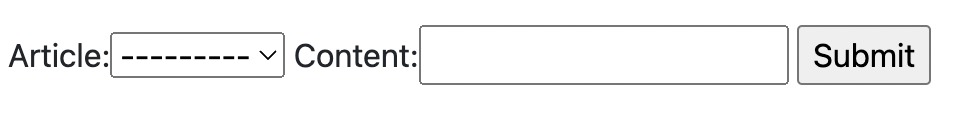
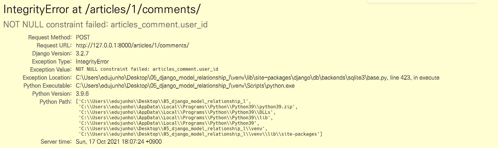

# Django 유저-게시글-댓글 연동하기

## 1. 웹 페이지


<br/>

## 2. 프로젝트 소개

- **1명의 유저**는 **N개의 글, N개의 댓글**을 작성할 수 있고, **1개의 글**에는 **N개의 댓글**이 있을 수 있다
- `외래키`를 사용하여 `유저와 글`, `유저와 댓글`, `글과 댓글` 모델 간의 관계를 설정한다

<br/>

## 3. 배운 내용

### 3-0. `Django Relationship fields` 종류

- `OneToOneField()`
  - A one-to-one relationship
- `ForeignKey()`
  - A one-to-many relationship
  - 2개의 필수 위치 인자가 필요
    - 참조하는 `model class`
    - `on_delete` 옵션
      - 외래키가 참조하는 객체가 사라졌을 때, 외래키를 가진 객체를 어떻게 처리할 지를 정의
      - `CASCADE` : 부모 객체(참조된 객체)가 삭제됐을 때 이를 참조하는 객체도 삭제
      - `PROTECT`, `SET_NULL`, `SET_DEFAULT` ... 등 여러 옵션들이 존재
    - [참고 링크](https://docs.djangoproject.com/en/3.2/ref/models/fields/#foreignkey)
- `ManyToManyField()`
  - A many-to-many relationship

<br/>

### 3-1. `Comment` 모델 정의

> 외래키 필드는 `ForeignKey` 클래스를 작성하는 위치와 관계없이 필드의 마지막에 작성됨
>
> `ForeignKey()` 클래스의 인스턴스 이름은 **참조하는 모델 클래스 이름의 단수형(소문자)**으로 작성하는 것을 권장

- `models.py`

  - ```python
    class Article(models.Model):
        # ...
        user = modesl.ForeignKey(settings.AUTH_USER_MODEL, on_delete=models.CASCADE)
        
    
    class Comment(models.Model):
        # ...
        article = models.ForeignKey(settings.AUTH_USER_MODEL, on_delete=models.CASCADE)
        user = models.ForeignKey(settings.AUTH_USER_MODEL, on_delete=models.CASCADE)
    ```

  - `Article` 모델에 `User` 모델을 참조하는 외래키 작성

  - `Comment` 모델에 `User` 모델을 참조하는 외래키 작성

- `Migration`

  - ```bash
    $ python manage.py makemigrations
    
    $ python manage.py migrate
    ```

  - `models.py`에서 모델에 대한 수정사항이 발생했기 때문에 migration 과정 진행


<br/>

### 3-2. 역참조

> 나를 참조하는 테이블(나를 외래키로 지정한)을 참조하는 것
>
> 본인을 외래키로 참조 중인 다른 테이블에 접근하는 것
>
> 1:N 관계에서 1이 N을 참조하는 상황

```python
article.comment_set.method()
```

- `Article` 모델이 `Comment` 모델을 참조(역참조)할 때 사용하는 매니저
- `article.comment` 형식으로는 댓글 객체를 참조할 수 없음
  - 실제로 `Article` 클래스에는 `Comment`와의 어떠한 관계도 작성되어 있지 않음
- 대신 DJango가 역참조할 수 있는 `comment_set manager`를 자동으로 생성해 `article.comment_set` 형태로 댓글 객체를 참조할 수 있음
  - `1:N` 관계에서 생성되는 `Related manager`의 이름은 참조하는 `모델명_set` 이름 규칙으로 만들어짐
- 반면 참조 상황(`Comment` -> `Article`)에서는 실제 `ForeignKey` 클래스로 작성한 인스턴스가 `Comment` 클래스의 클래스 변수이기 때문에 `comment.article` 형태로 작성 가능

<br/>

#### 3-2-0. admin site 등록

- 새로 작성한 `Comment` 모델을 `admin site`에 등록하기

  ```python
  from .models import Article, Comment
  
  admin.site.register(Article)
  admin.site.register(Comment)
  ```

<br/>

## 4. 기능

### 4-0. Article-Comment 구현

#### 4-0-0. CREATE

- `forms.py`

  ```python
  from .models import Article, Comment
  
  
  class CommentForm(forms.ModelForm):
      
      class Meta:
          model = Comment
          fields = "__all__"
  ```

  - 사용자로부터 댓글 데이터를 입력 받기 위한 CommentForm 작성

- `views.py`

  ```python
  from .forms import ArticleForm, CommentForm
  
  
  def detail(request, pk):
      article = Article.objects.get(pk=pk)
      comment_form = CommentForm()
      context = {
          "article": article,
          "comment_form": comment_form,
      }
      return render(request, "articles/detail.html", context)
  ```

- `detail.html`

  ```html
  <form action="" method ="POST">
      
      {{ comment_form }}
      <input type="submit">
  </form>
  ```

  - `detail` 페이지에서 `CommentForm` 출력

- **잠깐!!**

  - `detail` 페이지에서 출력된 `CommentForm`을 살펴보면 아래 이미지와 같이 출력됨

    

  - 실 서비스에서는 댓글을 작성할 때 댓글을 어떤 게시글에 작성하는지 직접 게시글 번호를 선택하지 않음

  - `Comment` 클래스의 외래키 필드 `article` 또한 데이터 입력이 필요하기 때문에 출력되고 있음

  - 외래키 필드는 사용자의 입력으로 받는 것이 아니라 view 함수 내에서 받아 별도로 처리되어 저장되어야 함

- `forms.py`

  ```python
  class CommentForm(forms.ModelForm):
      
      class Meta:
          model = Comment
          # 1번 케이스
          exclude = [
              "article",
          ]
          # 2번 케이스
          fields = [
              "content",
          ]
  ```

- 출력에서 제외된 외래키 데이터는 어디서 받아와야 할까?

  - detail 페이지의 url에는 해당 게시글의 pk 값이 사용되고 있음
  - url을 통해 변수를 넘기는 `variable routing` 사용

- `urls.py`

  ```python
  urlpatterns = [
      path('<int:pk>/comments/', views.comments_create, name="comments_create"),
  ]
  ```

- `detail.html`

  ```html
  <form action="{% url 'articles:comments_create' article.pk }" method="POST">
      
      {{ comment_form }}
      <input type="submit">
  </form>
  ```

- `views.py`

  ```python
  def comments_create(request, pk):
      article = Article.objects.get(pk=pk)
      comment_form = CommentForm(request.POST)
      if comment_form.is_valid():
          # article 객체는 언제 저장할 수 있으락?
          comment.save()
      return redirect("articles:detail", article.pk)
  ```

  - 작성을 한 뒤 article 객체를 저장하지 못함
  - `save()` 메서드는 데이터베이스에 저장하기 전에 객체에 대한 추가적인 작업을 진행할 수 있도록 인스턴스만을 반환해주는 옵션값을 제공
    - `save(commit=False)`
      - `save()`의 `return` 값은 **모델의 인스턴스**
      - "Create, but don't save the new instance"
      - 저장하기 전에 객체에 대한 사용자 지정 처리를 수행할 때 유용하게 사용
      - [참고 링크](https://docs.djangoproject.com/en/3.2/topics/forms/modelforms/#the%20save%20method)

- `views.py`

  ```python
  def comments_create(request, pk):
      article = Article.objects.get(pk=pk)
      comment_form = CommentForm(request.POST)
      if comment_form.is_valid():
          # 추가
          comment = comment_form.save(commit=False)
          comment.article = article
          #
          comment.save()
      return redirect("articles:detail", article.pk)
  ```

  - `save` 메서드의 `commit` 옵션을 사용해 DB에 저장되기 전 `article` 객체 저장

<br/>

#### 4-0-1. READ

- `views.py`

  ```python
  def detail(request, pk):
      article = Article.objects.get(pk=pk)
      comment_form = CommentForm()
      context = {
          "article": article,
          "comment_form": comment_form,
          "comments": article.comment_set.all(),
      }
      return render(request, "articles/detail.html", context)
  ```

  - 특정 `article`에 있는 **모든 댓글**을 `context`에 추가

- `detail.html`

  ```html
  <h4>댓글 목록</h4>
  <ul>
    
      <li>{{ comment.content }}</li>
    
  </ul>
  ```

  - `detail` 템플릿에서 댓글 목록 출력

<br/>

#### 4-0-2. DELETE

- `urls.py`

  ```python
  urlpatterns = [
      path('<int:article_pk>/comments/<int:comment_pk>/delete', views.comments_delete, name="comments_delete"),
  ]
  ```

- `views.py`

  ```python
  def comments_delete(request, article_pk, comment_pk):
      comment = Comment.objects.get(pk=comment_pk)
      comment.delete()
      return redirect('articles:detail', article_pk)
  ```

  - 댓글 삭제 구현

- `detail.html`

  ```html
  
    <li>
      {{ comment.content }}
      <form action="" method="POST">
        
        <input type="submit" value="DELETE">
      </form>
    </li>
  
  ```

  - 댓글을 삭제할 수 있는 버튼을 각각의 댓글 옆에 출력

<br/>

#### 4-0-3. 추가 디테일

- 댓글 개수 출력하기

  - `DTL filter - length` 사용

    ```django
    {{ comments|length }}
    
    {{ article.comment_set.all|length }}
    ```

  - `Queryset API - count()` 사용

    ```django
    {{ comments.count }}
    
    {{ article.comment_set.count }}
    ```

- 댓글이 없는 경우 대체 컨텐츠 출력

  - `DTL for empty` 활용하기

    ```html
    
      <li>
        ...
      </li>
    
      <p>댓글이 없어요..</p>
    
    ```

<br/>

### 4-1. User-Comment 구현

#### 4-1-0. CREATE

- `forms.py`

  ```python
  class CommentForm(forms.ModelForm):
      
      class Meta:
          model = Comment
          # 1번 케이스
          exclude = [
              "article",
              "user",
          ]
          # 2번 케이스
          fields = [
              "content",
          ]
  ```

  - 불필요한 필드(user)가 출력되기 때문에 제거

- 외래키 데이터 누락

  

  - 댓글 작성 시 NOT NULL constraint failed: articles_comment.user_id 에러 발생
  - 댓글 작성 시 외래키에 저장되어야 할 작성자 정보가 누락되었기 때문

- `views.py`

  ```python
  def comment_create(request, pk):
      article = Article.objects.get(pk=pk)
      comment_form = CommentForm(request.POST)
      if comment_form.is_valid():
          comment = comment_form.save(commit=False)
          comment.article = article
          # 추가
          comment.user = request.user
          #
          comment.save()
      return redirect("articles:detail", article.pk)
  ```

  - 댓글 작성 시 작성자 정보가 함께 저장될 수 있도록 `save`의 `commit` 옵션 활용

<br/>

#### 4-1-1. READ

- `detail.html`

  ```html
  
    <li>
      {{ comment.user }} - {{ comment.content }}
      ...
    </li>
  
  ```

  - `detail` 템플릿에서 각 게시글의 작성자 출력

<br/>

#### 4-1-2. DELETE

- `views.py`

  ```python
  def comments_delete(request, article_pk, comment_pk):
      comment = Comment.objects.get(pk=comment_pk)
      if request.user == comment.user:
          comment.delete()
      return redirect('articles:detail', article_pk)
  ```

  - 댓글에는 작성자 정보가 함께 들어있기 때문에 현재 삭제를 요청하는 사람과 댓글을 작성한 사람을 비교하여 본인의 댓글만 삭제할 수 있도록 함

- `detail.html`

  ```html
  
    <li>
      {{ comment.user }} - {{ comment.content }}
      
      
        <form action="" method="POST">
          
          <input type="submit" value="DELETE">
        </form>
    </li>
  
  ```

  - 추가로 해당 댓글의 작성자가 아니라면, 삭제 버튼을 출력하지 않도록 함

