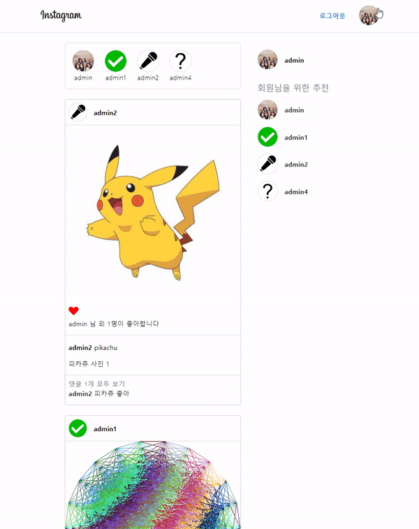

# Django 좋아요, 팔로우(M:N) 구현

## 1. 웹 페이지



<br/>

## 2. 프로젝트 소개

- 저번 인스타그램을 구현했던 프로젝트에서 추가적인 **좋아요**와 **팔로우** 기능을 통해 M:N 관계에 대해 학습하기

<br/>

## 3. 배운 내용

### 3-0.  RDB에서의 관계 복습

- 1:1
  - One-to-one relationships
  - 한 테이블의 레코드 하나가 다른 테이블의 레코드 단 한 개와 관련된 경우
- N:1
  - Many-to-one relationships
  - 한 테이블의 0개 이상의 레코드가 다른 테이블의 레코드 한 개와 관련된 경우
  - 기준 테이블에 따라 1:N (One-to-many relationships)이라고도 함
- M:N
  - Many-to-many relationships
  - 한 테이블의 0개 이상의 레코드가 다른 테이블의 0개 이상의 레코드와 관련된 경우
  - 양쪽 모두에서 N:1 관계를 가짐

<br/>

### 3-1. N:1의 한계

- 의사와 환자간 예약 시스템을 구현

- N:1 관계를 생각해 한 명의 의사에게 여러 환자가 예약할 수 있다고 모델 관계 설정

  ```python
  class Doctor(models.Model):
      name = models.TextField()
      
      def __str__(self):
          return f'{self.pk}번 의사 {self.name}'
      
  class Patient(models.Model):
      doctor = models.ForeignKey(Doctor, on_delete=models.CASCADE)
      name = models.TextField()
      
      def __str__(self):
          return f'{self.pk}번 환자 {self.name}'
  ```

- Migration 진행 및 shell_plus 실행

  ```bash
  $ python manage.py makemigrations
  $ python manage.py migrate
  
  $ python manage.py shell_plus
  ```

- 각각 2명의 의사와 환자를 생성하고 환자는 서로 다른 의사에게 예약을 했다고 가정

  ```python
  doctor1 = Doctor.objects.create(name='alice')
  doctor2 = Doctor.objects.create(name='bella')
  patient1 = Patient.objects.create(name='carol', doctor=doctor1)
  patient2 = Patient.objects.create(name='dane', doctor=doctor2)
  
  doctor1
  <Doctor: 1번 의사 alice>
  
  doctor2
  <Doctor: 2번 의사 bella>
  
  patient1
  <Patient: 1번 환자 carol>
  
  Patient2
  <Patient: 2번 환자 dane>
  ```

- 1번 환자(carol)가 두 의사 모두에게 방문하려고 함

  ```python
  patient3 = Patient.objects.create(name='carol', doctor=doctor2)
  ```

- 동시에 예약할 수는 없을까?

  ```python
  patient4 = Patient.objects.create(name='carol', doctor=doctor1, doctor2)
  # SyntaxError 발생!!!
  # doctor에 값을 두 개를 넣을 수 없음
  ```

- 동일한 환자지만 다른 의사에게 예약하기 위해서는 객체를 하나 더 만들어서 예약을 진행해야 함

  - 새로운 환자 객체를 생성할 수 밖에 없음

- 외래키 컬럼에 `'1, 2'` 형태로 참조하는 것은 `Integer` 타입이 아니기 때문에 불가능

- 그렇다면 **"예약 테이블을 따로 만들자"**

### 3-2. 중개 모델

- 환자 모델의 외래키를 삭제하고 별도의 예약 모델을 새로 작성

- 예약 모델은 의사와 환자에 각각 N:1 관계를 가짐

  ```python
  class Patient(models.Model):
      name = models.TextField()
      
      def __str__(self):
          return f'{self.pk}번 환자 {self.name}'
      
  class Reservation(models.Model):
      doctor = models.ForeignKey(Doctor, on_delete=models.CASCADE)
      patient = models.ForeignKey(Patient, on_delete=models.CASCADE)
      
      def __str__(self):
          return f'{self.doctor_id}번 의사의 {self.patient_id}번 환자'
  ```

- 데이터베이스 초기화 후 Migration 진행 및 shell_plus 실행

  - migration 파일 삭제

  - 데이터베이스 파일 삭제

    ```bash
    $ python manage.py makemigrations
    $ python manage.py migrate
    
    $ python manage.py shell_plus
    ```

- 의사와 환자 생성 후 예약 만들기

  ```python
  doctor1 = Doctor.objects.create(name='alice')
  patient1 = Patient.objects.create(name='carol')
  
  Reservation.objects.create(doctor=doctor1, patient=patient1)
  ```

- 예약 정보 조회

  ```python
  # 의사 -> 예약 정보 찾기
  doctor1.reservation_set.all()
  <QuerySet [<Reservation: 1번 의사의 1번 환자>]
  
  # 환자 -> 예약 정보 찾기
  patient1.reservation_set.all()
  <QuerySet [<Reservation: 1번 의사의 1번 환자>]
  ```

- 1번 의사에게 새로운 환자 예약이 생성 된다면

  ```python
  patient2 = Patient.objects.create(name='dane')
  
  Reservation.objects.create(doctor=doctor1, patient=patient2)
  ```

- 1번 의사의 예약 정보 조회

  ```python
  # 의사 -> 환자 목록
  doctor1.reservation_set.all()
  <QuerySet [<Reservation: 1번 의사의 1번 환자>, <Reservation: 1번 의사의 2번 환자>]>
  ```

<br/>

### 3-3. Django ManyToManyField

- 환자 모델에 Django ManyToManyField 작성

  ```python
  class Patient(models.Model):
      doctors = models.ManyToManyField(Doctor)
      name = models.TextField()
      
      def __str__(self):
          return f'{self.pk}번 환자 {self.name}'
  ```

- 데이터베이스 초기화 후 Migration 진행 및 shell_plus 실행

  - migration 파일 삭제
  - 데이터베이스 파일 삭제

  ```bash
  $ python manage.py makemigrations
  $ python manage.py migrate
  
  $ python manage.py shell_plus
  ```

- 의사 1명과 환자 2명 생성

  ```python
  doctor1 = Doctor.objects.create(name='alice')
  patient1 = Patient.objects.create(name='carol')
  patient2 = Patient.objects.create(name='dane')
  ```

- 예약 생성 (환자가 의사에게 예약)

  ```python
  patient1.doctors.add(doctor1)
  
  patient1.doctors.all()
  <QuerySet [<Doctor: 1번 의사 alice>]>
  
  doctor1.patient_set.all()
  <QuerySet [<Patient: 1번 환자 carol>]>
  ```

- 예약 생성 (의사가 환자를 예약)

  ```python
  doctor1.patient_set.add(patient2)
  
  doctor1.patient_set.all()
  <QuerySet [<Patient: 1번 환자 carol>, <Patient: 2번 환자 dane>]>
  
  patient1.doctors.all()
  <QuerySet [<Doctor: 1번 의사 alice>]>
  
  patient2.doctors.all()
  <QuerySet [<Doctor: 1번 의사 alice>]>
  ```

- 예약 취소하기 (삭제)

- 기존에는 해당하는 `Reservation`을 찾아서 지워야 했다면, 이제는 `.remove()` 사용

  ```python
  # doctor1이 patient1 진료 예약 취소
  doctor1.patient_set.remove(patient1)
  
  doctor1.patient_set.all()
  <QuerySet [<Patient: 2번 환자 harry>]>
  
  patient1.doctors.all()
  <QuerySet []>
  
  # patient2가 doctor1 진료 예약 취소
  patient2.doctors.remove(doctor1)
  
  patient2.doctors.all()
  <QuerySet []>
  
  doctor1.patient_set.all()
  <QuerySet []>
  ```

- `Django`는 `ManyToManyField`를 통해 중개 테이블을 자동으로 생성함

<br/>

### 3-4. `'related_name' argument`

- target model이 source model을 참조할 때 사용할 manager name

- `ForeignKey()`의 related_name과 동일

  ```python
  class Patient(models.Model):
      doctors = models.ManyToManyField(Doctor, related_name='patient')
      name = models.TextField()
      
      def __str__(self):
          return f'{self.pk}번 환자 {self.name}'
  ```

- Migration 진행 및 shell_plus 실행

  ```bash
  $ python manage.py makemigrations
  $ python manage.py migrate
  
  $ python manage.py shell_plus
  ```

- `related_name` 설정값 확인하기

  ```python
  doctor1 = Doctor.objects.get(pk=1)
  
  # 에러 발생 (related_name을 설정하면 기존 _set manager는 사용할 수 없음)
  doctor1.patient_set.all()
  AttributeError: 'Doctor' object has no attribute 'patient_set'
  
  # 변경 후
  doctor1.patients.all()
  <QuerySet []>
  ```

<br/>

### 3-5. `'through' argument`

- 중개 모델을 직접 작성(수동)하는 경우 `through` 옵션을 사용하여 Django 모델을 지정할 수 있음

- 가장 일반적인 용도는 중개 테이블에 추가 데이터를 사용해 다대다 관계와 연결하려는 경우

- `through` 설정 및 `Reservation Class` 수정

  - 예약 정보에 증상과 예약일이라는 추가 데이터 생성

  ```python
  class Patient(models.Model):
      doctors = models.ManyToManyField(Doctor, through='Reservation')
      name = models.TextField()
      
      def __str__(self):
          return f'{self.pk}번 환자 {self.name}'
      
  class Reservation(models.Model):
      doctor = models.ForeignKey(Doctor, on_delete=models.CASCADE)
      patient = models.ForeignKey(Patient, on_delete=models.CASCADE)
      symptom = models.TextField()
      reserved_at = models.DateTimeField(auto_now_add=True)
      
      def __str__(self):
          return f'{self.doctro.pk}번 의사의 {self.patientpk}번 환자'
  ```

<br/>

### 3-6. `'symmetrical' argument`

-  기본값 : `True`

- ManyToManyField가 동일한 모델(on self)을 가리키는 정의에서만 사용

  ```python
  class Person(models.Model):
      friends = models.ManyToManyField('self')
      # friends = models.ManyToManyField('self', symmetrical=False)
  ```

- `True`일 경우

  - `_set` 매니저를 추가하지 않음
  - `source` 모델의 인스턴스가 `target` 모델의 인스턴스를 참조하면 자동으로 `target` 모델 인스턴스도 `source` 모델 인스턴스를 자동으로 참조하도록 함(대칭)
  - 즉, 내가 당신의 친구라면 당신도 내 친구가 됨

- 대칭을 원하지 않는 경우 `False`로 설정

<br/>

### 3-7. Related Manager

- N:1 혹은 M:N 관계에서 사용 가능한 문맥(context)
- Django는 모델 간 N:1 혹은 M:N 관계가 설정되면 역참조시에 사용할 수 있는 manager를 생성
  - 이전 모델 생성시 `objects`라는 매니저를 통해 `queryset api`를 사용했던 것처럼 `related manager`를 통해 `queryset api`를 사용할 수 있게 됨
- 같은 이름의 메서드여도 각 관계(N:1, M:N)에 따라 다르게 사용 및 동작됨
  - N:1에서는 target 모델 객체만 사용 가능
  - M:N 관계에서는 관련된 두 객체에서 모두 사용 가능
- 메서드 종류
  - `add()`
    - "지정된 객체를 관련 객체 집합에 추가"
    - 이미 존재하는 관계에 사용하면 관계가 복제되지 않음
    - 모델 인스턴스, 필드값(PK)을 인자로 허용
  - `remove()`
    - "관련 객체 집합에서 지정된 모델 개체를 제거"
    - 내부적으로 `QuerySet.delete()`를 사용하여 관계가 삭제됨
    - 모델 인스턴스, 필드값(PK)을 인자로 허용

<br/>

### 3-8. 중개 테이블 필드 생성 규칙

- 소스(source model) 및 대상(target model) 모델이 다른 경우
  - `id`
  - `<containing_model>_id`
  - `<other_model>_id`
- ManyToManyField가 동일한 모델을 가리키는 경우
  - `id`
  - `from_<model>_id`
  - `to_<model>_id`

<br/>

### 3-9. 정리

- M:N 관계로 맺어진 두 테이블에는 변화가 없음
- Django의 ManyToManyField는 중개 테이블을 자동으로 생성함
- Django의 ManyToManyField는 M:N 관계를 가진 모델 어디에 위치해도 상관 없음
  - 대신 필드 작성 위치에 따라 참조와 역참조 방향을 주의

<br/>

## 4. 기능

### 4-0. LIKE (좋아요)

#### 4-0-0. `articles/models.py`

```python
class Article(models.Model):
    title = models.CharField(max_length=20)
    content = models.TextField()
    created_at = models.DateTimeField(auto_now_add=True)
    updated_at = models.DateTimeField(auto_now=True)
    image = ProcessedImageField(upload_to='images/', blank=True,
                                processors=[ResizeToFill(1200, 960)],
                                format='JPEG',
                                options={'quality': 80})
    user = models.ForeignKey(settings.AUTH_USER_MODEL, on_delete=models.CASCADE)
    like_users = models.ManyToManyField(settings.AUTH_USER_MODEL, related_name='like_articles')
```

- `like_users` 필드 생성 시 자동으로 역참조에는 `.article_set` 매니저가 생성됨
- 그러나 이전 N:1 `(Article-User)` 관계에서 이미 해당 매니저를 사용 중
  - `user.article_set.all()` -> 해당 유저가 작성한 모든 게시글 조회
  - user가 작성한 글들(`user.article_set`)과 user가 좋아요를 누른 글(`user.article_set`)을 구분할 수 없게 됨
- user와 관계된 ForeignKey 혹은 ManyToManyField 중 하나에 `related_name`을 작성해야 함
- ManyToManyField에 `related_name` 작성 후 Migration
- `User-Article` 간 사용 가능한 `related manager` 정리
  - `article.user`
    - 게시글을 작성한 유저 - N:1
  - `user.article_set`
    - 유저가 작성한 게시글(역참조) - 1:N
  - `article.like_users`
    - 게시글을 좋아요한 유저 - M:N
  - `user.like_articles`
    - 유저가 좋아요한 게시글(역참조) - N:M

<br/>

#### 4-0-1. `articles/urls.py`

```python
urlpatterns = [
    # ...
    path('<int:article_pk>/like/', views.like, name='like'),
]
```

<br/>

#### 4-0-2. `articles/views.py`

```python
@login_required
def like(request, pk):
    # 이전 경로
    pre_url = request.META.get("HTTP_REFERER")
    
    article = Article.objects.get(pk=pk)
    if article.like_users.filter(pk=request.user.pk).exists():
        article.like_users.remove(request.user)
    else:
        article.like_users.add(request.user)
    
    # 이전 경로가 detail일 경우
    if not pre_url.endswith("articles/"):
        return redirect("articles:detail", article.pk)
    # 이전 경로가 index일 경우
    else:
        return redirect("articles:index")
```

- `.exists()`
  - `QuerySet`에 결과가 포함되어 있으면 `True`를 반환하고 그렇지 않으면 `False`를 반환
  - 특히 큰 `QuerySet`에 있는 특정 개체의 존재와 관련된 검색에 유용

<br/>

#### 4-0-3. `articles/detail.html`

```html
<div class="d-flex align-items-center">
  
    <a class="fs-4 text-decoration-none text-dark" href="" style="">
      <i class="bi bi-suit-heart"></i>
    </a>
  
    <a class="fs-4 text-decoration-none" href="">
      <i class="bi bi-suit-heart-fill" style="color:red;"></i>
    </a>
  

  <span class="ms-2">{{ article.like_users.all|first }}</span>
  
    님 외
    {{ article.like_users.all|length|add:"-1" }}명이 좋아합니다
  
    님이 좋아합니다
  
</div>
```

<br/>

### 4-1. FOLLOW (팔로우)

#### 4-1-0. `accounts/models.py`

```python
class User(AbstractUser):
    # A가 B를 팔로잉, 이 것은 서로 친구 X(symmetrical=False)
    followings = models.ManyToManyField('self', symmetrical=False, related_name='followers')
```

- ManyToManyField 작성 및 Migration 진행

<br/>

#### 4-1-1. `accounts/urls.py`

```python
urlpatterns = [
    # ...
    path("<int:pk>/follow/", views.follow, name="follow"),
]
```

<br/>

#### 4-1-2. `accounts/views.py`

```python
@login_required
def follow(request, pk):
    user = get_user_model().objects.get(pk=pk)
	
    # 로그인한 유저와 현재 유저 페이지의 유저가 같으면 팔로우를 할 수 없음
    if request.user == user:
        messages.warning(request, "스스로 팔로우할 수 없습니다.")
        return redirect("accounts:detail", pk)
    else:
        if user.followers.filter(pk=request.user.pk).exists():
        # if request.user in user.followers.all():
            user.followers.remove(request.user)
        else:
            user.followers.add(request.user)
        return redirect("accounts:detail", pk)
```

<br/>

#### 4-1-3. `accounts/detail.html`

```html
<p>팔로잉 :
  {{ user.followings.count }}
  | 팔로워 :
  {{ user.followers.count }}</p>


  
    <a href="">팔로우 취소</a>
  
    <a href="">팔로우</a>
  

```

- 프로필 유저의 팔로잉, 팔로워 수 & 팔로우, 언팔로우 버튼 작성