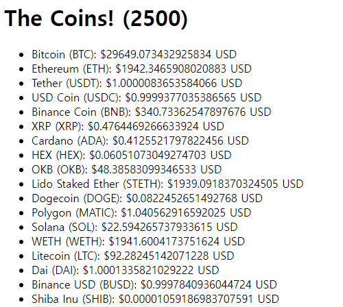

# Coin Tracker

```jsx
import { useEffect, useState } from "react";

function App() {
  const [loading, setLoading] = useState(true);
  const [coins, setCoins] = useState([]);
  useEffect(() => {
    fetch("https://api.coinpaprika.com/v1/tickers")
      .then((response) => response.json())
      .then((json) => {
        setCoins(json);
        setLoading(false);
      });
  }, []);
  return (
    <div>
      <h1>The Coins! ({coins.length})</h1>
      {loading ? <strong>Loading...</strong> : null}
      <ul>
        {coins.map((coin) => (
          <li key={coin.id}>
            {coin.name} ({coin.symbol}): ${coin.quotes.USD.price} USD
          </li>
        ))}
      </ul>
    </div>
  );
}

export default App;
```

coinpaprika API를 통해서 코인들의 정보를 가져옴

useEffect를 사용해서 코인 정보를 한 번만 가져올 수 있도록 설정

가져온 데이터를 json으로 변환하고 변환된 json을 coins state에 넣어줌

coins의 정보를 map 함수를 활용하여 각각 li 태그로 출력




