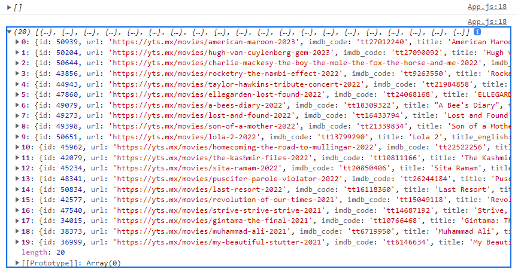
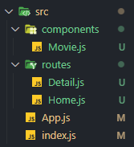

# Movie App

```jsx
import { useEffect, useState } from "react";

function App() {
  const [loading, setLoading] = useState(true);
  const [movies, setMovies] = useState([]);
  useEffect(() => {
    fetch(
      `https://yts.mx/api/v2/list_movies.json?minimum_rating=8.5&sort_by=year`
    )
      .then((response) => response.json())
      .then((json) => {
        setMovies(json.data.movies);
        setLoading(false);
      });
  }, []);
  console.log(movies);
  return <div>{loading ? <h1>Loading...</h1> : null}</div>;
}

export default App;
```

fetch를 사용하여 API의 데이터를 받아옴

loading의 state를 변경해줌




## async-await

요즘은 then 대신 async-await을 사용

```jsx
const getMovies = async () => {
  const response = await fetch(
    `https://yts.mx/api/v2/list_movies.json?minimum_rating=8.5&sort_by=year`
  );
  const json = await response.json();
  setMovies(json.data.movies);
  setLoading(false);
};

useEffect(() => {
  getMovies();
}, []);
```

getMovies라는 async 함수를 만들고 response를 await으로 작성

그 후 json을 response.json()의 await으로 만들고 state에 넣어줌


### 축약 버전

```jsx
const getMovies = async () => {
  const json = await (
    await fetch(
      `https://yts.mx/api/v2/list_movies.json?minimum_rating=8.5&sort_by=year`
    )
  ).json();
  setMovies(json.data.movies);
  setLoading(false);
};
```

await의 김밥같은 것. await을 감싸는 await이 있는 것


## Movie 각각 출력해보기

```jsx
import { useEffect, useState } from "react";

function App() {
  const [loading, setLoading] = useState(true);
  const [movies, setMovies] = useState([]);
  const getMovies = async () => {
    const json = await (
      await fetch(
        `https://yts.mx/api/v2/list_movies.json?minimum_rating=8.5&sort_by=year`
      )
    ).json();
    setMovies(json.data.movies);
    setLoading(false);
  };
  useEffect(() => {
    getMovies();
  }, []);
  console.log(movies);
  return (
    <div>
      {loading ? (
        <h1>Loading...</h1>
      ) : (
        <div>
          {movies.map((movie) => (
            <div key={movie.id}>
              
              <h2>{movie.title}</h2>
              <p>{movie.summary}</p>
              <ul>
                {movie.genres.map((g) => (
                  <li key={g}>{g}</li>
                ))}
              </ul>
            </div>
          ))}
        </div>
      )}
    </div>
  );
}

export default App;
```

API로 받은 데이터를 map 함수를 사용하여 각각 출력하기

key를 movie의 고유한 값인 movie.id로 사용

이미지, 타이틀, 요약, 장르를 출력

장르를 출력할 때도 map 함수를 사용하는데 이 때 key는 각각의 장르가 될 수 있음 (장르 하나하나가 고유한 값이기 때문(중복 X))


## Code refactoring

너무 길어지는 코드를 분할하여 Movie.js 컴포넌트를 따로 생성

```jsx
// Movie.js

function Movie({ coverImg, title, summary, genres }) {
  return (
    <div>
      
      <h2>{title}</h2>
      <p>{summary}</p>
      <ul>
        {genres.map((g) => (
          <li key={g}>{g}</li>
        ))}
      </ul>
    </div>
  );
}

export default Movie;
```


```jsx
// App.js

import { useEffect, useState } from "react";
import Movie from "./Movie";

function App() {
  const [loading, setLoading] = useState(true);
  const [movies, setMovies] = useState([]);
  const getMovies = async () => {
    const json = await (
      await fetch(
        `https://yts.mx/api/v2/list_movies.json?minimum_rating=8.5&sort_by=year`
      )
    ).json();
    setMovies(json.data.movies);
    setLoading(false);
  };
  useEffect(() => {
    getMovies();
  }, []);
  console.log(movies);
  return (
    <div>
      {loading ? (
        <h1>Loading...</h1>
      ) : (
        <div>
          {movies.map((movie) => (
            <Movie
              key={movie.id}
              coverImg={movie.medium_cover_image}
              title={movie.title}
              summary={movie.summary}
              genres={movie.genres}
            />
          ))}
        </div>
      )}
    </div>
  );
}

export default App;
```

컴포넌트를 생성할 때 map 함수를 사용하여 각각의 컴포넌트를 생성

컴포넌트를 생성할 때 필요한 데이터들을 prop을 사용하여 넘겨줌

이 때도 key를 넣어줘야 함. map 함수를 사용하면 key는 필수!!!


## prop-types

prop을 사용하기 때문에 어떤 props 타입을 가지고 있는지 알면 좋음


```jsx
import PropTypes from "prop-types";

function Movie({ coverImg, title, summary, genres }) {
  return (
    <div>
      
      <h2>{title}</h2>
      <p>{summary}</p>
      <ul>
        {genres.map((g) => (
          <li key={g}>{g}</li>
        ))}
      </ul>
    </div>
  );
}

Movie.propTypes = {
  coverImg: PropTypes.string.isRequired,
  title: PropTypes.string.isRequired,
  summary: PropTypes.string.isRequired,
  genres: PropTypes.arrayOf(PropTypes.string).isRequired,
};

export default Movie;
```

propTypes 추가

배열의 경우 arrayOf를 사용해서 각각의 배열 안 요소들의 데이터 타입을 지정할 수 있음


## Movie 디테일 페이지로 이동

### react-router 설치

```bash
$ npm install react-router-dom@5.3.0
```


### 폴더 구조 변경



Movie.js를 components 폴더 안에 넣고

routes에 Home.js와 Detail.js를 생성 (화면에 보이는 스크린 개념으로 파일을 구성)

Home.js는 기존 App.js를 그대로 옮긴 후 컴포넌트 명만 수정


#### Movie.js

```jsx
import PropTypes from "prop-types";

function Movie({ coverImg, title, summary, genres }) {
  return (
    <div>
      
      <h2>{title}</h2>
      <p>{summary}</p>
      <ul>
        {genres.map((g) => (
          <li key={g}>{g}</li>
        ))}
      </ul>
    </div>
  );
}

Movie.propTypes = {
  coverImg: PropTypes.string.isRequired,
  title: PropTypes.string.isRequired,
  summary: PropTypes.string.isRequired,
  genres: PropTypes.arrayOf(PropTypes.string).isRequired,
};

export default Movie;
```


#### Detail.js

```jsx
function Detail() {
  return <h1>Detail</h1>;
}

export default Detail;
```


#### Home.js

```jsx
import { useEffect, useState } from "react";
import Movie from "../components/Movie";

function Home() {
  const [loading, setLoading] = useState(true);
  const [movies, setMovies] = useState([]);
  const getMovies = async () => {
    const json = await (
      await fetch(
        `https://yts.mx/api/v2/list_movies.json?minimum_rating=8.5&sort_by=year`
      )
    ).json();
    setMovies(json.data.movies);
    setLoading(false);
  };
  useEffect(() => {
    getMovies();
  }, []);
  console.log(movies);
  return (
    <div>
      {loading ? (
        <h1>Loading...</h1>
      ) : (
        <div>
          {movies.map((movie) => (
            <Movie
              key={movie.id}
              coverImg={movie.medium_cover_image}
              title={movie.title}
              summary={movie.summary}
              genres={movie.genres}
            />
          ))}
        </div>
      )}
    </div>
  );
}

export default Home;
```


#### App.js

```jsx
function App() {
  return null;
}

export default App;
```

App.js는 이제 컴포넌트를 render하는 것이 아니라 router를 render해야 함

router는 URL을 보고 있는 component


```jsx
// App.js

import { BrowserRouter as Router, Switch, Route } from "react-router-dom";
import Home from "./routes/Home";

function App() {
  return (
    <Router>
      <Switch>
        <Route path="/movie">
          <Detail />
        </Route>
        <Route path="/">
          <Home />
        </Route>
      </Switch>
    </Router>
  );
}

export default App;
```

react-router-dom에 있는 BrowserRouter, Switch, Route를 import해줌


Router 컴포넌트 생성

Switch는 Route(URL)를 찾는 것, Route를 찾으면 컴포넌트를 렌더링함

Switch는 하나의 Route만 렌더링

Route 컴포넌트 생성하고 그 안에 컴포넌트를 작성

Route에 컴포넌트가 보여질 경로(URL)를 path로 설정


## Router 종류

Router 종류는 BrowserRouter, HashRouter 두 개가 있음


- BrowserRouter

일반적인 URL이며 보통의 웹사이트처럼 생김


- HashRouter

URL 뒤에 #이 붙음


## 컴포넌트 간 이동

```jsx
function Movie({ coverImg, title, summary, genres }) {
  return (
    <div>
      
      <h2>
        <a href="/movie">{title}</a>
      </h2>
      <p>{summary}</p>
      <ul>
        {genres.map((g) => (
          <li key={g}>{g}</li>
        ))}
      </ul>
    </div>
  );
}
```

Movie 컴포넌트에서 title을 누르면 Detail 컴포넌트로 이동하고 싶음

이 때 a 태그를 사용해도 되지만 a 태그를 사용하면 페이지 전체가 새로고침됨

React에서는 페이지 전체가 새로고침되는 것을 원하지 않음


### Link 컴포넌트

```jsx
import { Link } from "react-router-dom";

function Movie({ coverImg, title, summary, genres }) {
  return (
    <div>
      
      <h2>
        <Link to="/movie">{title}</Link>
      </h2>
      <p>{summary}</p>
      <ul>
        {genres.map((g) => (
          <li key={g}>{g}</li>
        ))}
      </ul>
    </div>
  );
}
```

react-router-dom에서 Link를 import하고

a 태그 대신 Link 컴포넌트를 사용해 to 속성으로 URL 설정


### Prop 넘겨주기

```jsx
// App.js

function App() {
  return (
    <Router>
      <Switch>
        <Route path="/movie/:id">
          <Detail />
        </Route>
        <Route path="/">
          <Home />
        </Route>
      </Switch>
    </Router>
  );
}
```

App.js에서 Detail 페이지로 넘어갈 때 path에 id 변수 추가

이 url이 변수를 받을거라고 설정하는 것


```jsx
// Home.js

function Home() {
  const [loading, setLoading] = useState(true);
  const [movies, setMovies] = useState([]);
  const getMovies = async () => {
    const json = await (
      await fetch(
        `https://yts.mx/api/v2/list_movies.json?minimum_rating=8.5&sort_by=year`
      )
    ).json();
    setMovies(json.data.movies);
    setLoading(false);
  };
  useEffect(() => {
    getMovies();
  }, []);
  console.log(movies);
  return (
    <div>
      {loading ? (
        <h1>Loading...</h1>
      ) : (
        <div>
          {movies.map((movie) => (
            <Movie
              key={movie.id}
              id={movie.id}
              coverImg={movie.medium_cover_image}
              title={movie.title}
              summary={movie.summary}
              genres={movie.genres}
            />
          ))}
        </div>
      )}
    </div>
  );
}
```

Home.js에서 Movie 컴포넌트를 생성할 때, id 추가


```jsx
// Movie.js

function Movie({ id, coverImg, title, summary, genres }) {
  return (
    <div>
      
      <h2>
        <Link to={`/movie/${id}`}>{title}</Link>
      </h2>
      <p>{summary}</p>
      <ul>
        {genres.map((g) => (
          <li key={g}>{g}</li>
        ))}
      </ul>
    </div>
  );
}
```

Movie.js에서 prop으로 넘겨받은 id를 Link 컴포넌트의 경로에 변수로 설정


```jsx
// Detail.js

import { useParams } from "react-router-dom";

function Detail() {
  const x = useParams();
  console.log(x);
  return <h1>Detail</h1>;
}
```

Detail 페이지에서 useParams를 사용하면 App.js에서 Route에 사용한 변수를 출력해줌

Route path="/movie/:id" 라고 했기 때문에 

id라는 변수를 출력할 수 있음

id가 아닌 다른 이름을 쓰면 그 이름을 key로 가진 값으로 사용 가능


```jsx
// Detail.js

import { useEffect } from "react";
import { useParams } from "react-router-dom";

function Detail() {
  const { id } = useParams();
  const getMovie = async () => {
    const json = await (
      await fetch(`https://yts.mx/api/v2/movie_details.json?movie_id=${id}`)
    ).json();
    console.log(json);
  };
  useEffect(() => {
    getMovie();
  }, []);
  return <h1>Detail</h1>;
}

export default Detail;
```

useParams로 받은 id 값을 API 주소에 사용하여 id마다 다른 API 호출을 할 수 있도록 함

