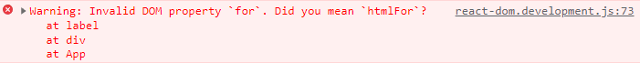
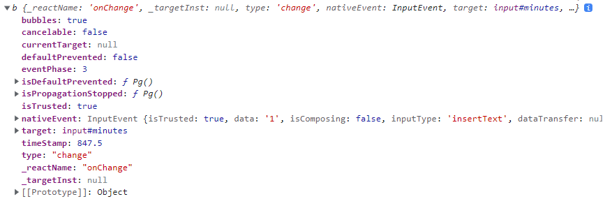

# 1. Super Converter

JSX는 HTML과 매우 유사함


## HTML의 문법을 사용했을 때

```html
<!DOCTYPE html>
<html>
  <body>
    <div id="root"></div>
  </body>
  <script src="https://unpkg.com/react@18/umd/react.production.min.js"></script>
  <script src="https://unpkg.com/react-dom@18/umd/react-dom.production.min.js"></script>
  <script src="https://unpkg.com/@babel/standalone/babel.min.js"></script>
  <script type="text/babel">
    const root = document.getElementById("root");
    function App() {
      return (
        <div>
          <h1>Super Converter</h1>
          <label for="minutes">Minutes</label>
          <input id="minutes" type="number" placeholder="Minutes" />
          <label for="hours">Hours</label>
          <input id="hours" type="number" placeholder="Hours" />
        </div>
      );
    }
    ReactDOM.render(<App />, root);
  </script>
</html>
```

- label을 사용하여 input과 연결
  - label엔 for 속성을 넣고 input에는 id를 넣어줌
  - 하지만 이것은 JSX에서는 틀린 문법
  - script에서 production.min.js를 사용하기 때문
  - 만약 development.js로 바꾼다면 오류 발생



- for 속성은 JavaScript 용어이기 때문에 속성으로 쓸 경우 오류가 나게 됨
- 마찬가지로 class를 사용할 수 없음
  - for은 htmlFor, class는 className로 사용하면 됨


## JSX 문법을 사용했을 때

```html
<!DOCTYPE html>
<html>
  <body>
    <div id="root"></div>
  </body>
  <script src="https://unpkg.com/react@18/umd/react.development.js"></script>
  <script src="https://unpkg.com/react-dom@18/umd/react-dom.development.js"></script>
  <script src="https://unpkg.com/@babel/standalone/babel.min.js"></script>
  <script type="text/babel">
    const root = document.getElementById("root");
    function App() {
      return (
        <div>
          <h1 className="hi">Super Converter</h1>
          <label htmlFor="minutes">Minutes</label>
          <input id="minutes" type="number" placeholder="Minutes" />
          <label htmlFor="hours">Hours</label>
          <input id="hours" type="number" placeholder="Hours" />
        </div>
      );
    }
    ReactDOM.render(<App />, root);
  </script>
</html>
```


## React.js에서 input

React.js에서 input은 uncontrolled라고 알려져 있음

input의 value를 통제할 수 없다는 뜻


```jsx
function App() {
  const [minutes, setMinutes] = React.useState();
  const onChange = (event) => {
    console.log(event);
  };
  return (
    <div>
      <h1>Super Converter</h1>
      <label htmlFor="minutes">Minutes</label>
      <input
        value={minutes}
        id="minutes"
        placeholder="Minutes"
        type="number"
        onChange={onChange}
      />
      <label htmlFor="hours">Hours</label>
      <input id="hours" type="number" placeholder="Hours" />
    </div>
  );
}
```



- React.js는 가짜 event를 발생시킴
  - event를 최적화 시키기 위해
  - 원래의 이벤트는 nativeEvent에 있음
- target을 가지고 있음 => input의 값을 알기 위해서는 target의 value로 접근


```jsx
function App() {
  const [minutes, setMinutes] = React.useState();
  const onChange = (event) => {
    console.log(event.target.value);
  };
  return (
    <div>
      <h1>Super Converter</h1>
      <label htmlFor="minutes">Minutes</label>
      <input
        value={minutes}
        id="minutes"
        placeholder="Minutes"
        type="number"
        onChange={onChange}
      />
      <label htmlFor="hours">Hours</label>
      <input id="hours" type="number" placeholder="Hours" />
    </div>
  );
}
```

- input의 value가 변했을 때, onChange를 리스닝하여 onChange 함수가 실행됨
- onChange 함수는 event가 발생한 곳(target)의 값(value)를 콘솔에 출력해줌


## value 변화

```jsx
function App() {
  const [minutes, setMinutes] = React.useState(0);
  const onChange = (event) => {
    setMinutes(event.target.value);
  };
  const reset = () => {
    setMinutes(0);
  };
  return (
    <div>
      <h1>Super Converter</h1>
      <div>
        <label htmlFor="minutes">Minutes</label>
        <input
          value={minutes}
          id="minutes"
          placeholder="Minutes"
          type="number"
          onChange={onChange}
        />
      </div>

      <div>
        <label htmlFor="hours">Hours</label>
        <input
          value={minutes / 60}
          id="hours"
          placeholder="Hours"
          type="number"
        />
      </div>

      <button onClick={reset}>Reset</button>
    </div>
  );
}
```

- input의 value가 변하면 onChange 함수를 거쳐, setMinutes 함수를 통해 minutes라는 state를 변경하고 input의 value에 state인 minutes로 연결해줌
- value를 state로 연결하는 이유는 어디서든 input의 value를 수정할 수 있도록 하기 위해서

- 만약 onChange 함수를 지운다면 state는 계속 0으로 존재하기 때문에 키보드 입력이 들어와도 value가 변하지 않음

- reset 버튼을 누르면 minutes state가 0으로 설정됨


## 최종

```jsx
const root = document.getElementById("root");
function App() {
  const [amount, setAmount] = React.useState(0);
  const [inverted, setInverted] = React.useState(false);
  const onChange = (event) => {
    setAmount(event.target.value);
  };
  const reset = () => {
    setAmount(0);
  };
  const onInvert = () => {
    reset();
    setInverted((current) => !current);
  };
  return (
    <div>
      <h1>Super Converter</h1>
      <div>
        <label htmlFor="minutes">Minutes</label>
        <input
          value={inverted ? amount * 60 : amount}
          id="minutes"
          placeholder="Minutes"
          type="number"
          onChange={onChange}
          disabled={inverted}
        />
      </div>

      <div>
        <label htmlFor="hours">Hours</label>
        <input
          value={inverted ? amount : amount / 60}
          id="hours"
          placeholder="Hours"
          type="number"
          onChange={onChange}
          disabled={!inverted}
        />
      </div>

      <button onClick={reset}>Reset</button>
      <button onClick={onInvert}>
        {inverted ? "Turn back" : "Invert"}
      </button>
    </div>
  );
}
ReactDOM.render(<App />, root);
```

- flipped라는 state를 생성
  - flipped 버튼을 누르면 default 값이었던 false가 true로 바뀜 (현재와 반대되는 값으로 변환)
  - disabled 속성을 flipped 변수를 사용해서 나타냄
  - 만약 flipped가 false라면 minutes를 입력할 수 있고 true라면 hours를 입력할 수 있음
- input의 value는 flipped 변수의 값에 따라 달라져야 함
  - flipped가 false라면 minutes의 value는 amount가 들어가고 hours의 value는 amount / 60이 들어감
  - flipped가 true라면 hours의 value는 amount가 들어가고 minutes의 value는 amount * 60이 들어감