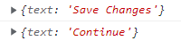
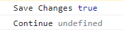
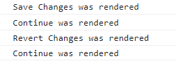
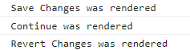
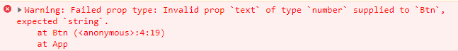
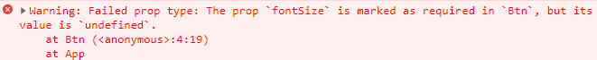

# Props

> 부모 컴포넌트에서 자식 컴포넌트로 데이터를 보낼 수 있게 해주는 방법


## Props가 필요한 이유

```jsx
function SaveBtn() {
  return (
    <button
      style={{
        backgroundColor: "tomato",
        color: "white",
        padding: "10px 20px",
        border: 0,
        borderRadius: 10,
      }}
    >
      Save Changes
    </button>
  );
}

function ConfirmBtn() {
  return (
    <button
      style={{
        backgroundColor: "tomato",
        color: "white",
        padding: "10px 20px",
        border: 0,
        borderRadius: 10,
      }}
    >
      Confirm
    </button>
  );
}

function App() {
  return (
    <div>
      <SaveBtn />
      <ConfirmBtn />
    </div>
  );
}
const root = document.getElementById("root");
ReactDOM.render(<App />, root);
```

- SaveBtn과 ConfirmBtn은 같은 버튼이지만 안에 들어가는 Text 값만 다름
- 이러한 버튼들이 필요할 때마다 같은 코드를 반복해서 사용한다면 너무 복잡한 코드가 될 수 있고 버튼 디자인을 수정한다면 모든 버튼 코드를 수정해야 함


## Props 적용

```jsx
function Btn(props) {
  console.log(props);
  return (
    <button
      style={{
        backgroundColor: "tomato",
        color: "white",
        padding: "10px 20px",
        border: 0,
        borderRadius: 10,
      }}
    >
      {props.text}
    </button>
  );
}

function App() {
  return (
    <div>
      <Btn text="Save Changes" />
      <Btn text="Continue" />
    </div>
  );
}
const root = document.getElementById("root");
ReactDOM.render(<App />, root);
```

- Btn에 text라는 변수에 각각 들어갈 텍스트 값을 지정해주고 렌더링
- 모든 컴포넌트는 생성될 때 인자(argument)를 받을 수 있음
  - 보통 매개변수(parameter)로 props를 사용
- `Btn({text:"Save Changes"})`로 함수를 호출하는 것과 같음




- Btn 컴포넌트에서 props를 콘솔 로그로 출력했을 때 나오는 값


> React.js는 자동으로 컴포넌트를 생성할 때 넣은 모든 property(prop)들을 하나의 Object로 만들어서 컴포넌트의 첫 번째 인자로 넣어줌
>
> 두 번째 인자는 없고 첫 번째 인자가 처음이자 유일한 인자


## Props ShortCut

```jsx
function Btn({ text }) {
  return (
    <button
      style={{
        backgroundColor: "tomato",
        color: "white",
        padding: "10px 20px",
        border: 0,
        borderRadius: 10,
      }}
    >
      {text}
    </button>
  );
}
```

- property를 Object로부터 꺼내는 방식
  - props 안에 text가 있다는 사실을 알고 있기 때문에 중괄호를 사용하여 바로 꺼내서 사용할 수 있음


## Props 응용

```jsx
function Btn({ text, big }) {
  console.log(text, big);
  return (
    <button
      style={{
        backgroundColor: "tomato",
        color: "white",
        padding: "10px 20px",
        border: 0,
        borderRadius: 10,
        fontSize: big ? 18 : 16,
      }}
    >
      {text}
    </button>
  );
}

function App() {
  return (
    <div>
      <Btn text="Save Changes" big={true} />
      <Btn text="Continue" />
    </div>
  );
}
const root = document.getElementById("root");
ReactDOM.render(<App />, root);
```

- props로 text와 big 두 개의 데이터를 전달할 수 있다고 했을 때, 만약 인자를 넘겨주지 않았다면 undefined로 출력



- 전달받은 props를 통해 if else 구문을 사용할 수 있음


## Props 함수 전달

```jsx
function Btn({ text }) {
  return (
    <button
      style={{
        backgroundColor: "tomato",
        color: "white",
        padding: "10px 20px",
        border: 0,
        borderRadius: 10,
        fontSize: 16,
      }}
    >
      {text}
    </button>
  );
}

function App() {
  const [value, setValue] = React.useState("Save Changes");
  const changeValue = () => {
    setValue("Revert Changes");
  };
  return (
    <div>
      <Btn text={value} onClick={changeValue} />
      <Btn text="Continue" />
    </div>
  );
}
const root = document.getElementById("root");
ReactDOM.render(<App />, root);
```

- 컴포넌트 안에 함수를 전달할 수도 있음
  - Btn 컴포넌트를 생성할 때 text와 onClick를 prop로 넘겨주는 것이고 이 때 onClick은 이벤트리스너가 아닌 단지 prop의 이름일 뿐임
  - HTML 요소(button 태그) 안에 onClick를 넣었을 경우에는 이벤트리스너이지만 커스텀컴포넌트에 넣었을 때는 prop임

- prop에 뭐든지 넣을 수 있지만 사용하기 위해서는 직접 꺼내서 return 안에 써줘야 함


## Memo

```jsx
function Btn({ text, changeValue }) {
  console.log(text, "was rendered");
  return (
    <button
      onClick={changeValue}
      style={{
        backgroundColor: "tomato",
        color: "white",
        padding: "10px 20px",
        border: 0,
        borderRadius: 10,
        fontSize: 16,
      }}
    >
      {text}
    </button>
  );
}

function App() {
  const [value, setValue] = React.useState("Save Changes");
  const changeValue = () => {
    setValue("Revert Changes");
  };
  return (
    <div>
      <Btn text={value} changeValue={changeValue} />
      <Btn text="Continue" />
    </div>
  );
}
const root = document.getElementById("root");
ReactDOM.render(<App />, root);
```

- 버튼이 렌더링되는 것을 확인해보면 부모 컴포넌트의 state가 변경되었을 때 버튼이 리렌더링됨
- 즉, 부모 컴포넌트의 state를 자식 컴포넌트가 변경하고 부모 컴포넌트를 다시 렌더링하는 것



- 하지만 변하지 않은 Continue 버튼도 다시 렌더링되는 것을 확인할 수 있음
- 부모 컴포넌트가 다시 렌더링되기 때문에 부모 컴포넌트의 return 값으로 있는 Continue 버튼도 다시 렌더링되는 것


- 만약 props가 변하지 않는다면 우리는 컴포넌트를 다시 그릴지 말지를 정할 수 있음
  - 첫 번째 버튼의 props는 state와 연결되어 있기 때문에 state가 변하면 무조건 리렌더링을 해야 함
  - 두 번째 버튼의 경우 props가 절대 변하지 않기 때문에 리렌더링을 할 필요가 없음


## Memo 사용

```jsx
function Btn({ text, changeValue }) {
  console.log(text, "was rendered");
  return (
    <button
      onClick={changeValue}
      style={{
        backgroundColor: "tomato",
        color: "white",
        padding: "10px 20px",
        border: 0,
        borderRadius: 10,
        fontSize: 16,
      }}
    >
      {text}
    </button>
  );
}

const MemorizedBtn = React.memo(Btn);

function App() {
  const [value, setValue] = React.useState("Save Changes");
  const changeValue = () => {
    setValue("Revert Changes");
  };
  return (
    <div>
      <MemorizedBtn text={value} changeValue={changeValue} />
      <MemorizedBtn text="Continue" />
    </div>
  );
}
const root = document.getElementById("root");
ReactDOM.render(<App />, root);
```

- React.memo라는 것을 사용하여 props의 변화가 없다면 리렌더링을 스킵할 수 있음




## Prop Types

만약 prop가 많아지면 타입에 대한 오류를 피할 수 없음

```jsx
function Btn({ text, fontSize }) {
  return (
    <button
      style={{
        backgroundColor: "tomato",
        color: "white",
        padding: "10px 20px",
        border: 0,
        borderRadius: 10,
        fontSize,
        // fontSize: fontSize,
      }}
    >
      {text}
    </button>
  );
}

function App() {
  return (
    <div>
      <Btn text="Save Changes" fontSize={18} />
      <Btn text={14} fontSize={"Continue"} />
    </div>
  );
}
const root = document.getElementById("root");
// ReactDOM.render(<App />, root);
ReactDOM.createRoot(root).render(<App />);
```

- 위와 같이 하나의 Btn에는 text에 문자열, fontSize에 숫자를 넣었고 다른 하나는 text에 숫자, fontSize에 문자열을 넣었음
- React.js는 오류를 출력해주지 않음. 코드 상에는 문제가 없기 때문
- 하지만 우리는 prop의 원하는 타입이 있기 때문에 오류를 출력해주길 희망함
- 오류를 출력하기 위해서 Prop Types라는 패키지를 사용


### Prop Types 사용

```jsx
<!DOCTYPE html>
<html>
  <body>
    <div id="root"></div>
  </body>
  <script src="https://unpkg.com/react@18/umd/react.development.js"></script>
  <script src="https://unpkg.com/react-dom@18/umd/react-dom.development.js"></script>
  <script src="https://unpkg.com/prop-types@15.7.2/prop-types.js"></script>
  <script src="https://unpkg.com/@babel/standalone/babel.min.js"></script>
  <script type="text/babel">
    function Btn({ text, fontSize }) {
      return (
        <button
          style={{
            backgroundColor: "tomato",
            color: "white",
            padding: "10px 20px",
            border: 0,
            borderRadius: 10,
            fontSize,
            // fontSize: fontSize,
          }}
        >
          {text}
        </button>
      );
    }

    Btn.propTypes = {
      text: PropTypes.string,
      fontSize: PropTypes.number,
    };

    function App() {
      return (
        <div>
          <Btn text="Save Changes" fontSize={18} />
          <Btn text={14} fontSize={"Continue"} />
        </div>
      );
    }
    const root = document.getElementById("root");
    // ReactDOM.render(<App />, root);
    ReactDOM.createRoot(root).render(<App />);
  </script>
</html>
```

- `<script src="https://unpkg.com/prop-types@15.7.2/prop-types.js"></script>`
  - 스크립트 태그로 패키지를 불러온 뒤 사용
- 원하는 컴포넌트의 propTypes를 선언하여 타입을 지정해줌
  - React에게 prop들의 type에 대해 설명해주는 것



- 위와 같은 경고를 볼 수 있음(오류가 아닌 개발자들을 위한 경고)
  - Btn의 'text' 타입은 'string'이지만 'number'가 들어와서 유효하지 않다는 뜻


### Prop Types isRequired

만약 필수 prop가 있다면 isRequired를 뒤에 붙여 사용할 수 있음

```jsx
function Btn({ text, fontSize }) {
  return (
    <button
      style={{
        backgroundColor: "tomato",
        color: "white",
        padding: "10px 20px",
        border: 0,
        borderRadius: 10,
        fontSize,
        // fontSize: fontSize,
      }}
    >
      {text}
    </button>
  );
}

Btn.propTypes = {
  text: PropTypes.string.isRequired,
  fontSize: PropTypes.number.isRequired,
};

function App() {
  return (
    <div>
      <Btn text="Save Changes" fontSize={18} />
      <Btn text={"Continue"} />
    </div>
  );
}
const root = document.getElementById("root");
// ReactDOM.render(<App />, root);
ReactDOM.createRoot(root).render(<App />);
```



- 두 번째 Btn에 'fontSize' prop가 없기 때문에 'undefined'는 오류라고 알려줌


### Default 설정

```jsx
function Btn({ text, fontSize = 12 }) {
  return (
    <button
      style={{
        backgroundColor: "tomato",
        color: "white",
        padding: "10px 20px",
        border: 0,
        borderRadius: 10,
        fontSize,
        // fontSize: fontSize,
      }}
    >
      {text}
    </button>
  );
}

Btn.propTypes = {
  text: PropTypes.string.isRequired,
  fontSize: PropTypes.number,
};

function App() {
  return (
    <div>
      <Btn text="Save Changes" fontSize={18} />
      <Btn text={"Continue"} />
    </div>
  );
}
const root = document.getElementById("root");
// ReactDOM.render(<App />, root);
ReactDOM.createRoot(root).render(<App />);
```

- 만약 prop 값을 넘겨주지 않았다면 기본적으로 값을 미리 설정해둘 수 있음
- Btn 컴포넌트 선언 부분에서 매개 변수 값을 미리 설정해두는 방식
  - 이 방식은 React에 관한 것이 아닌 Javascript 문법이기 때문에 가능한 방식