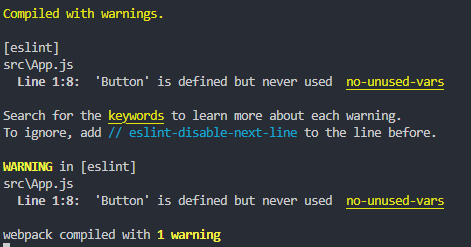
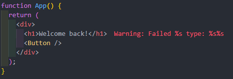
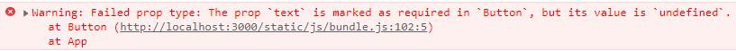

# create-react-app

많은 스크립트들과 많은 사전설정을 미리 설정해주기 때문에 create-react-app을 사용하면 쉽게 react에 접근할 수 있음


node.js를 설치하고

터미널에 입력 아래의 코드를 입력

```bash
$ npx create-react-app 프로젝트명
```


## npm과 npx의 차이

npm은 node.js의 의존성과 패키지 관리를 위한 패키지 매니저입니다.

프로젝트의 패키지를 설치할 때 `npm install`을 실행함으로써 package.json 파일에 있는 패키지들을 지정할 수 있다는 것을 의미합니다.

또한, 버전관리를 지원하여 패키지의 버전을 명시해 원하는 버전을 설치하도록 할 수 있습니다.


npx는 node 패키지를 실행시키는 하나의 도구이며 npm 5.2버전부터 내장되어있습니다.

npx는 기본적으로 실행될 패키지가 경로에 있는지 먼저 확인한 뒤 경로에 있다면 그대로 실행하고 만약 경로에 없다면(설치가 되지 않은 패키지라면) npx가 최신 버전의 패키지를 설치한 후에 실행한 뒤 사라집니다.


react는 모듈 업데이트가 많아 npm으로 재설치하지 않는 경우 이전 버전을 사용할 수 있기 때문에 npx를 통해 항상 최신 버전을 설치하는 것이 중요합니다.


## Button 컴포넌트 생성

```jsx
// src/Button.js

function Button({ text }) {
  return <button>{text}</button>;
}

export default Button;
```

text라는 prop을 가진 Button 컴포넌트를 src 폴더 안에 만들고

App.js에서 가져올 수 있도록 export default Button 코드를 추가해줌


```jsx
// src/App.js

import Button from "./Button";

function App() {
  return (
    <div>
      <h1>Welcome back!</h1>
    </div>
  );
}

export default App;
```

App.js에서 Button을 import해줌


이 때, Button을 import 했지만 사용하지 않았다는 경고 메시지를 출력해줌

이것은 create-react-app에서 알려주는 경고임




```jsx
import Button from "./Button";

function App() {
  return (
    <div>
      <h1>Welcome back!</h1>
      <Button text={"Continue"} />
    </div>
  );
}

export default App;
```

Button을 사용해주면 됨


## prop-types 설치

```bash
$ npm i prop-types
```


```jsx
// Button.js

import PropTypes from "prop-types";

function Button({ text }) {
  return <button>{text}</button>;
}

Button.propTypes = {
  text: PropTypes.string.isRequired,
};

export default Button;
```





필수적인 prop를 안쓰거나 다른 형태로 사용했을 경우 Warning을 알려줌


## JSX 자동완성

https://seoyun-is-connecting-the-dots.tistory.com/317

settings.json 파일에

맨 마지막에 코드 추가

```json
"emmet.includeLanguages": { "javascript": "javascriptreact" }
```


