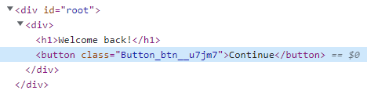
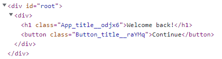

# CSS 설정

css를 설정하기 위해 styles.css라는 파일을 만듦

```css
/* styles.css */

button {
  color: white;
  background-color: tomato;
}
```


index.js에서 styles.css를 import

```jsx
// index.js

import React from "react";
import ReactDOM from "react-dom/client";
import App from "./App";
import "./styles.css";

const root = ReactDOM.createRoot(document.getElementById("root"));
root.render(
  <React.StrictMode>
    <App />
  </React.StrictMode>
);
```


이렇게 할 경우 전역(Global)으로 모든 버튼에 대한 css 설정이 적용됨

하지만 우리는 모든 버튼이 적용되는 것을 원하지 않음


## style prop 설정

```jsx
import PropTypes from "prop-types";

function Button({ text }) {
  return (
    <button
      style={{
        backgroundColor: "tomato",
        color: "white",
      }}
    >
      {text}
    </button>
  );
}

Button.propTypes = {
  text: PropTypes.string.isRequired,
};

export default Button;
```

Button 컴포넌트에 직접 style 속성을 적용하여 전역으로 사용되는 것을 막을 수 있음

하지만 이것도 style을 직접 넣어야 하기 때문에 불편함이 있음


## CSS modules

```css
/* Button.module.css */

.btn {
  color: white;
  background-color: tomato;
}
```

styles.css를 Button.module.css로 이름을 변경하고 button을 .btn 클래스 선택자로 바꿔줌


```jsx
// Button.js

import PropTypes from "prop-types";
import styles from "./Button.module.css";

function Button({ text }) {
  return <button className={styles.btn}>{text}</button>;
}

Button.propTypes = {
  text: PropTypes.string.isRequired,
};

export default Button;
```

우리는 CSS 코드를 작성하지만 create-react-app은 CSS 코드를 javascript 오브젝트로 변환해줌

이 javascript 오브젝트는 안에 btn을 가지고 있는 것임

button에 className으로 styles.btn을 사용하여 CSS 코드를 넣어줄 수 있음




그리고 브라우저에서 확인해보면 무작위적인 랜덤 class를 적용시켜줌

랜덤으로 적용해주기 때문에 다른 클래스 이름들을 기억할 필요가 없어짐


```jsx
// App.js

import Button from "./Button";
import styles from "./App.module.css";

function App() {
  return (
    <div>
      <h1 className={styles.title}>Welcome back!</h1>
      <Button text={"Continue"} />
    </div>
  );
}

export default App;
```

```css
/* App.module.css */

.title {
  font-size: 18px;
}
```


```jsx
// Button.js

import PropTypes from "prop-types";
import styles from "./Button.module.css";

function Button({ text }) {
  return <button className={styles.title}>{text}</button>;
}

Button.propTypes = {
  text: PropTypes.string.isRequired,
};

export default Button;
```

```css
/* Button.module.css */

.title {
  color: white;
  background-color: tomato;
}
```

이렇게 App.module.css와 Button.module.css에서 같은 클래스 이름을 사용해도 



각각 랜덤하게 클래스 이름이 적용되기 때문에 문제가 없음

이것이 CSS modules의 장점