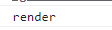
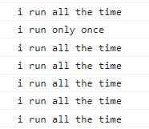
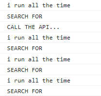

# state 적용

```jsx
import { useState } from "react";

function App() {
  const [counter, setValue] = useState(0);
  const onClick = () => {
    setValue((prev) => prev + 1);
  };
  return (
    <div>
      <h1>{counter}</h1>
      <button onClick={onClick}>click me</button>
    </div>
  );
}

export default App;
```

create-react-app을 사용하고 있기 때문에 useState만 작성해도 자동으로 import를 해줌

counter를 만들고 버튼을 클릭하면 counter가 증가하는 로직을 작성


```jsx
function App() {
  const [counter, setValue] = useState(0);
  const onClick = () => {
    setValue((prev) => prev + 1);
  };
  console.log("render");
  return (
    <div>
      <h1>{counter}</h1>
      <button onClick={onClick}>click me</button>
    </div>
  );
}
```

중간에 render가 될 때마다 콘솔 로그에 render를 출력해보자


## 🚨 StrictMode

```jsx
import React from "react";
import ReactDOM from "react-dom/client";
import App from "./App";

const root = ReactDOM.createRoot(document.getElementById("root"));
root.render(
  <React.StrictMode>
    <App />
  </React.StrictMode>
);
```

기본 create-react-app으로 프로젝트를 생성하면 index.js에 React.StrictMode로 App이 감싸져 있음

https://ko.legacy.reactjs.org/docs/strict-mode.html

StrictMode는 애플리케이션 내의 잠재적인 문제를 알아내기 위한 도구이며 자손들에 대한 부가적인 검사와 경고를 활성화함

그렇기 때문에 render가 두 번 출력됨


StrictMode 태그를 제거하면 정상적으로 render가 한 번씩 출력됨




로그는 state가 변할 때, 즉 counter가 변할 때마다 계속해서 출력됨

하지만 우리는 처음 렌더링했을 때 한 번만 실행하고 state가 변해도 실행이 되지 않게 하고 싶음

예를 들면, API를 통해 데이터를 가져왔을 때 데이터가 수정되면 다시 API를 호출해서 데이터를 가져오는 것이 안되게 하고 싶음


# useEffect

컴포넌트가 처음 렌더링될 때 딱 한 번만 실행하기 위해서 사용하는 함수


useEffect는 두 개의 인자(argument)를 가짐

첫 번째 인자는 딱 한 번만 실행할 코드

```jsx
import { useState, useEffect } from "react";

function App() {
  const [counter, setValue] = useState(0);
  const onClick = () => {
    setValue((prev) => prev + 1);
  };
  console.log("i run all the time");
  const iRunOnlyOnce = () => {
    console.log("i run only once");
  };
  useEffect(iRunOnlyOnce, []);
  return (
    <div>
      <h1>{counter}</h1>
      <button onClick={onClick}>click me</button>
    </div>
  );
}

export default App;
```

useEffect를 import하고

useEffect 안에 첫 번째 인자로 한 번만 실행할 함수를 두 번째 인자로 빈 배열을 작성해줌



버튼을 클릭해도 useEffect 안에 있는 함수는 한 번만 실행되고 다시 실행되지 않음


```jsx
function App() {
  const [counter, setValue] = useState(0);
  const onClick = () => {
    setValue((prev) => prev + 1);
  };
  console.log("i run all the time");
  useEffect(() => {
    console.log("CALL THE API...");
  }, []);
  return (
    <div>
      <h1>{counter}</h1>
      <button onClick={onClick}>click me</button>
    </div>
  );
}
```

위와 같이 화살표 함수로 축약할 수 있음


> useEffect function은 쉽게 말해서 우리 코드가 딱 한 번만 실행될 수 있도록 보호해줌


## Memo vs. useEffect

Memo는 props가 변경되지 않았다면 컴포넌트를 리렌더링하지 않도록 해주는 것

useEffect는 props가 변경되거나 컴포넌트의 생명주기의 처음과 마지막에 한 번 실행하는 함수


## useEffect 두 번째 인자

> dependencies, react.js가 지켜보아야 하는 것들
>
> 그것들이 변할 때, react.js가 코드를 실행시킴

```jsx
import { useState, useEffect } from "react";

function App() {
  const [counter, setValue] = useState(0);
  const [keyword, setKeyword] = useState("");
  const onClick = () => {
    setValue((prev) => prev + 1);
  };
  const onChange = (event) => {
    setKeyword(event.target.value);
  };
  console.log("i run all the time");
  useEffect(() => {
    console.log("CALL THE API...");
  }, []);
  console.log("SEARCH FOR", keyword);
  return (
    <div>
      <input
        value={keyword}
        onChange={onChange}
        type="text"
        placeholder="Search here..."
      />
      <h1>{counter}</h1>
      <button onClick={onClick}>click me</button>
    </div>
  );
}

export default App;
```

검색을 위해 input 태그를 작성하고 value로 keyword state를 연결

value 값이 변경될 때마다 onChange 함수를 호출하여 keyword의 값을 event.target.value로 바꿔줌



하지만 버튼을 클릭하면 console.log(SEARCH FOR, keyword)가 호출됨

이 코드는 keyword가 변경될 때만 실행시키고 싶음(counter가 변하더라도 실행하지 않음)


특정 부분이 변경되었을 때만 원하는 코드들을 실행하는 방법을 써야 함

keyword state가 변했을 때만 실행

```jsx
useEffect(() => {
  console.log("SEARCH FOR", keyword);
}, [keyword]);
```

keyword가 변했을 때만 실행

만약 빈 배열이라면 지켜볼 것이 없기 때문에 한 번만 실행하는 것


하지만 처음 시작할 때도 실행됨

```jsx
useEffect(() => {
  if (keyword !== "" && keyword.length > 5) {
    console.log("SEARCH FOR", keyword);
  }
}, [keyword]);
```

조건문을 사용하여 길이가 5보다 길 때만 실행


이를 통해서 언제 코드가 실행될지 결정하는 방법을 학습

```jsx
useEffect(() => {
  console.log("I run only once");
}, []);
useEffect(() => {
  console.log("I run when 'keyword' changes");
}, [keyword]);
useEffect(() => {
  console.log("I run when 'counter' changes");
}, [counter]);
```

빈 배열의 경우 컴포넌트 생성시 처음 한 번만 실행

두 번째 인자에 state 값을 넣으면 state가 변경될 때마다 실행


```jsx
useEffect(() => {
  console.log("I run when 'keyword' & 'counter' changes");
}, [keyword, counter]);
```

여러 개의 state를 사용 가능하고 하나의 state가 변하면 코드 실행


## component destroy

> component가 파괴될 때 실행하는 함수를 Cleanup function이라고 함
>
> 예를 들어, component가 없어질 때 어떤 분석 결과를 보내는 경우, event listener를 지우거나 console.log에 뭔가를 보여주는 경우


```jsx
function Hello() {
  function byeFn() {
    console.log("bye :(");
  }
  function hiFn() {
    console.log("hi :)");
    return byeFn;
  }

  useEffect(hiFn, []);

  return <h1>Hello</h1>;
}
```

react.js가 지켜볼 dependency가 없기 때문에 component가 생성될 때 한 번 실행

component가 파괴될 때 function을 실행하고 싶다면 hiFn의 return에 function을 작성


### 다양한 사용법

```jsx
function Hello() {
  // 1. 함수를 두 개 따로 작성해서 사용
  function byeFn() {
    console.log("bye :(");
  }
  function hiFn() {
    console.log("hi :)");
    return byeFn;
  }
    
  useEffect(hiFn, []);
    
  // 2. 일반 함수 사용
  useEffect(function () {
    console.log("hi :)");
    return function () {
      console.log("bye :(");
    };
  }, []);

  // 3. 화살표 함수 사용
  useEffect(() => {
    console.log("hi :)");
    return () => {
      console.log("bye :(");
    };
  }, []);

  return <h1>Hello</h1>;
}
```

