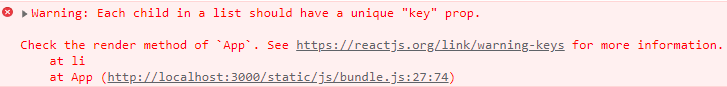

# To Do List

## To Do 작성

```jsx
import { useState } from "react";

function App() {
  const [toDo, setToDo] = useState("");
  const onChange = (event) => {
    setToDo(event.target.value);
  };
  const onSubmit = (event) => {
    event.preventDefault();
    if (toDo === "") {
      return;
    }
    setToDo("");
  };
  return (
    <div>
      <form onSubmit={onSubmit}>
        <input
          onChange={onChange}
          value={toDo}
          type="text"
          placeholder="Write your to do..."
        />
        <button>Submit</button>
      </form>
    </div>
  );
}

export default App;
```

투두 리스트를 만들기 위해 form 태그를 사용하여 input 태그와 button 태그를 생성

input value가 변하면 onChange 함수를 통해 toDo state를 변경

button을 클릭하면 onSubmit 함수를 통해 toDo가 공백이면 바로 리턴, 만약 값이 있다면 toDo를 공백으로 바꿔줌


## To Do를 To Do List에 추가

투두 리스트를 만들기 위해서는 toDo를 배열에 담아야 함

```jsx
import { useState } from "react";

function App() {
  const [toDo, setToDo] = useState("");
  const [toDos, setToDos] = useState([]);
  const onChange = (event) => {
    setToDo(event.target.value);
  };
  const onSubmit = (event) => {
    event.preventDefault();
    if (toDo === "") {
      return;
    }
    setToDo("");
  };
  return (
    <div>
      <form onSubmit={onSubmit}>
        <input
          onChange={onChange}
          value={toDo}
          type="text"
          placeholder="Write your to do..."
        />
        <button>Submit</button>
      </form>
    </div>
  );
}

export default App;
```

배열에 담기 위해 toDos state를 빈 배열로 생성


```jsx
const onSubmit = (event) => {
  event.preventDefault();
  if (toDo === "") {
    return;
  }
  setToDos((currentArray) => [toDo, ...currentArray]);
  setToDo("");
};
```

Submit 버튼을 클릭한다면 toDo의 값이 toDos 배열에 들어가야 함

현재의 toDos를 가지고 새로운 배열을 만들어서 return 해줌

toDo와 함께 이전에 가지고 있던 배열의 요소들과 합쳐서 새로운 배열을 만듦

배열의 요소들만 꺼내서 추가하기 위해 ...을 사용


## To Do List 화면에 렌더링

```jsx
import { useState } from "react";

function App() {
  const [toDo, setToDo] = useState("");
  const [toDos, setToDos] = useState([]);
  const onChange = (event) => {
    setToDo(event.target.value);
  };
  const onSubmit = (event) => {
    event.preventDefault();
    if (toDo === "") {
      return;
    }
    setToDos((currentArray) => [toDo, ...currentArray]);
    setToDo("");
  };
  return (
    <div>
      <h1>My To Dos ({toDos.length})</h1>
      <form onSubmit={onSubmit}>
        <input
          onChange={onChange}
          value={toDo}
          type="text"
          placeholder="Write your to do..."
        />
        <button>Submit</button>
      </form>
      <hr />
      <ul>
        {toDos.map((item) => (
          <li>{item}</li>
        ))}
      </ul>
    </div>
  );
}

export default App;
```

h1 태그를 사용하여 타이틀과 toDos의 길이를 추가해줌

ul 태그와 li 태그를 사용하여 toDos의 요소를 각각 출력

map 함수를 사용하여 배열 각각의 요소들에 접근할 수 있음




하지만 같은 컴포넌트의 배열을 렌더링할 때는 key라는 prop을 넣어줘야 한다는 오류 발생

react가 기본적으로 list에 있는 모든 item들을 인식하기 때문


```jsx
<ul>
  {toDos.map((item, index) => (
    <li key={index}>{item}</li>
  ))}
</ul>
```

map 함수의 두 번째 인자인 index를 key로 사용할 수 있음