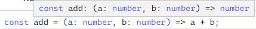

# Function

## call signatures

> 함수 위에 마우스를 올렸을 때 보게 되는 것




```ts
type Add = (a: number, b: number) => number;

const add: Add = (a, b) => a + b;
```

함수의 타입을 만들어두고 함수를 구현하기 전에 함수가 어떻게 작동하는지 서술해둘 수 있음


## overloading

> 함수가 서로 다른 여러 개의 call signatures를 가지고 있을 때 발생시킴
>


```ts
type Add = {
    (a: number, b: number): number
    (a: number, b: string): number
}

const add: Add = (a, b) => {
    if (typeof b === "string") return a
    return a + b
}
```

만약 b의 타입이 string이라면 a를 반환하고 number라면 a + b를 반환함

위와 같이 call signature를 두 개로 작성하여 overloading할 수 있음


### Next.js에서의 예시

```ts
Router.push({
    path: "/home",
    state: 1
})

Router.push("/home")
```

위와 같이 push 함수는 object로 보낼 수도 있고 string으로 보낼 수도 있음


#### 원리

```ts
type Config = {
    path: string,
    state: object
}

type Push = {
    (path: string): void
    (config: Config): void
}

const push: Push = (config) => {
    if (typeof config === "string") {
        console.log(config)
    } else {
        console.log(config.path, config.state)
    }
}
```

push 함수는 Push 타입을 가지고 인자로 config를 받는데 

이 때 타입이 string이라면 config가 path가 되고

타입이 object라면 config는 객체이며 config.path로 path에 접근할 수 있음


### 다른 개수의 파라미터를 가질 때

```ts
type Add = {
    (a: number, b: number): number
    (a: number, b: number, c: number): number
}

const add: Add = (a, b, c?: number) => {
    if (c) return a + b + c
    return a + b
}
```

파라미터의 개수가 다를 경우 남는 파라미터는 옵션이자 선택사항임

함수를 생성할 때 ?를 붙여 옵션으로 만들어주어야 함


## polymorphism(다형성)

> Poly: many, several, much, multi
>
> morphos: form, structure, shape
>
> 여러가지 다른 구조, 여러가지 다른 형태


```ts
type SuperPrint = {
    (arr: number[]): void
    (arr: boolean[]): void
}

const superPrint: SuperPrint = (arr) => {
    arr.forEach(i => console.log(i))
}

superPrint([1, 2, 3, 4])
superPrint([true, false, true])
superPrint(["a", "b", "c"]) // 에러 발생
```


### concrete type

> number, string, boolean, void, unknown 등과 같은 타입


### generic type

> 타입의 placeholder와 같은 것
>
> concrete type을 대신해서 사용 가능하며 타입스크립트에서 추론하여 함수를 사용


#### generic type을 사용하는 이유

> call signature를 작성할 때, 들어올 확실한 타입을 모를 경우 generic을 사용
>
> 제네릭은 선언 시점이 아니라 생성 시점에서 타입을 명시하여 하나의 타입만이 아닌 다양한 타입을 사용할 수 있도록 해줌


```ts
type SuperPrint = {
    <TypePlaceholder>(arr: TypePlaceholder[]): void
}

const superPrint: SuperPrint = (arr) => {
    arr.forEach(i => console.log(i))
}

superPrint([1, 2, 3, 4])
superPrint([true, false, true])
superPrint(["a", "b", "c"])
superPrint([1, 2, true, false])
```

generic을 사용하는 방법은 call signature 앞에 꺽쇠를 사용하여 이름을 정해주고 들어올 타입에 지정한 이름을 작성하면 됨


```ts
type SuperPrint = {
    <TypePlaceholder>(arr: TypePlaceholder[]): TypePlaceholder
    // <T>(arr: T[]): T
    // 위와 같이 T를 자주 사용
}

const superPrint: SuperPrint = (arr) => arr[0]

const a = superPrint([1, 2, 3, 4])
const b = superPrint([true, false, true])
const c = superPrint(["a", "b", "c"])
const d = superPrint([1, 2, true, false])
```

return 값을 generic으로 사용하고 싶다면 return 타입에 꺽쇠 안의 이름을 넣어주면 됨


```ts
type SuperPrint = <T, V>(a: T[], b: V) => T
```

타입스크립트는 제네릭을 처음 인식했을 때와 제네릭의 순서를 기반으로 제네릭의 타입을 알게 됨

타입을 말할 필요 없이 제네릭의 이름만 말해주면 됨


#### any와의 차이점

any와는 다르며 우리가 하는 요청에 따라 call signature를 생성하는 것임

any를 사용하여 모든 타입을 허용하며 오류를 없애는 것이 아님

```ts
type SuperPrint = (arr: any[]) => any

const superPrint: SuperPrint = (arr) => arr[0]

const a = superPrint([1, 2, 3, 4])
a.toUpperCase() // 에러를 알려주지 않지만 실행 후 에러 발생

// type SuperPrint = <T>(arr: T[]) => T
// 제네릭을 사용하면 에러를 알려줌
```


#### generic 실 사용

```ts
function superPrint<T>(a: T[]) {
    return a[0]
}
```


```ts
type Player<E> = {
    name: string,
    extraInfo: E
}

type NicoExtra = {
    favFood: string
}

type NicoPlayer = Player<NicoExtra>

const nico: NicoPlayer = {
    name: "nico",
    extraInfo: {
        favFood: "kimchi"
    }
}

const lynn: Player<null> = {
    name: "lynn",
    extraInfo: null
}
```

함수 뿐 아니라 타입에도 사용할 수 있고 여러 방면으로 사용 가능함


```ts
type A = Array<number>

let a: A = [1, 2, 3, 4]
```

기본적인 타입스크립트의 타입은 제네릭으로 만들어져 있음

