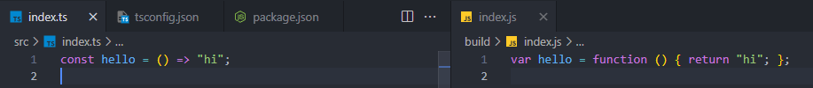
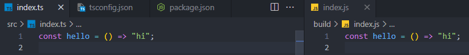
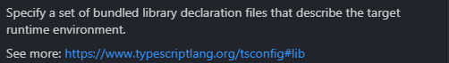
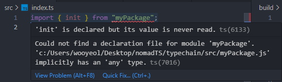
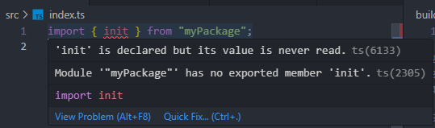
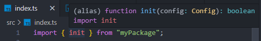
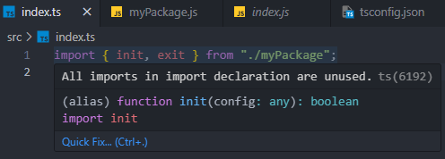
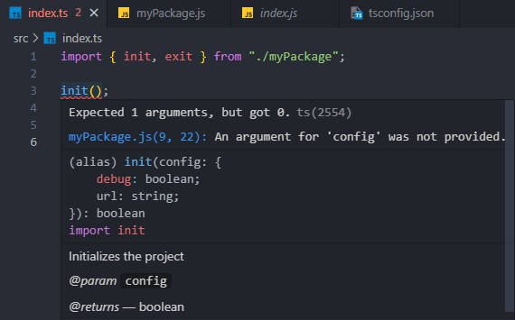

# typescript 프로젝트 만들기

1. 폴더 생성

   

2. nodejs 프로젝트 생성

```bash
$ npm init -y
```


3. package.json 수정

```json
{
 "name": "typechain",
 "version": "1.0.0",
 "description": "",
 "scripts": {

 },
 "keywords": [],
 "author": "",
 "license": "ISC"
}
```

main 지우기, scripts 수정


4. typescript 설치

```bash
$ npm i -D typescript
```

D를 입력하면 타입스크립트가 devDependencies에 설치됨


5. src라는 폴더를 만들고 안에 index.ts 파일 생성

```ts
// index.ts

const hello = () => "hi";
```


6. tsconfig.json 파일 생성

```bash
$ touch tsconfig.json
```


7. tsconfig.json 작성
   1. 어디에 ts 파일이 있는가?
   2. 컴파일 옵션
      1. outDir: 자바스크립트 파일이 생성될 디렉토리 지정

```json
{
 "include": ["src"],
 "compilerOptions": {
   "outDir": "build"
 }
}
```


8. 다시 package.json 수정

```json
{
 "name": "typechain",
 "version": "1.0.0",
 "description": "",
 "scripts": {
   "build": "tsc"
 },
 "keywords": [],
 "author": "",
 "license": "ISC",
 "devDependencies": {
   "typescript": "^5.1.6"
 }
}
```


9. 실행

```bash
$ npm run build
```


10. 결과



화살표 함수를 일반 함수로 바꿔줌

const 대신 var를 사용하는 낮은 버전의 자바스크립트로 바꿔서 어디서든 호환할 수 있도록 해줌


어떤 자바스크립트 버전으로 바꿀지 설정

```json
{
  "include": ["src"],
  "compilerOptions": {
    "outDir": "build",
    "target": "ES6"
  }
}
```

target은 어떤 버전의 자바스크립트로 타입스크립트를 컴파일하고 싶은지 나타내는 것

기본 설정은 ES3이며 ES3에서는 화살표 함수와 const가 존재하지 않음

제일 베스트는 ES6이며 ES6로 변경





11. lib 속성

합쳐진 라이브러리의 정의 파일을 특정해주는 역할

너의 자바스크립트 코드가 어디에서 동작할지를 알려준다는 것

```json
{
  "include": ["src"],
  "compilerOptions": {
    "outDir": "build",
    "target": "ES6",
    "lib": ["ES6", "DOM"]
  },
}
```

ES6를 지원하는 환경에서 실행("ES6"), 브라우저 위에서 실행("DOM")




1. target runtime environment

DOM을 lib에 포함시켜두고 타입스크립트 코드에서 document를 쓰면 타입스크립트가 document가 뭔지 알고 있고 document가 가지고 있는 모든 이벤트와 메소드들을 보여줌(자동완성)

타입스크립트는 모든 것의 타입을 설명해줌

타입스크립트는 JS API로 만들어진 타입 정의들을 기본적으로 내장하고 있음

ctrl 버튼을 누르고 함수를 누르면 lib.dom.d.ts라는 파일로 이동

node_modules/typescript/lib 안에 파일이 있는데 함수의 call signature 같은 것이 있음


2. declaration file

src 안에 myPackage.js라는 파일 생성

```js
export function init(config) {
  return true;
}
export function exit(code) {
  return code + 1;
}
```


index.ts에서 myPackage 파일 import하면 에러 발생

declaration file이 없기 때문




myPackage.d.ts 파일 생성

```ts
declare module "myPackage" {}
```


myPackage 에러는 사라졌지만 여전히 에러 발생



myPackage가 존재하는 것은 알지만 그 안에 init이 있다는 것은 모르기 때문


d.ts 파일은 call signature(타입)만 작성하면 됨(구현이 아님)

타입스크립트에게 타입에 대해 설명하는 것

```ts
interface Config {
  url: string;
}

declare module "myPackage" {
  function init(config: Config): boolean;
}
```


index.ts에서 init 확인

```ts
import { init } from "myPackage";
```



init에 대한 타입을 알려줌


myPackage.d.ts

```ts
interface Config {
  url: string;
}

declare module "myPackage" {
  function init(config: Config): boolean;
  function exit(code: number): number;
}
```

index.ts

```ts
import { init, exit } from "myPackage";

init({
  url: "true",
});

exit(1);
```


즉, 타입스크립트에서 자바스크립트 코드를 import하려면 타입에 대한 정의가 필요함

그 타입 정의를 d.ts 파일에서 작성하는 것

이 방법은 자바스크립트로 만들어진 패키지를 설치했을 때 타입스크립트에 그 패키지의 타입을 정의하는 방법


타입스크립트가 localStorage, window, Math 등의 모듈을 알고 있는 것은 node_modules/typescript/lib에 이미 정의가 되어 있기 때문


12. strict 모드

```json
{
  "include": ["src"],
  "compilerOptions": {
    "outDir": "build",
    "target": "ES6",
    "lib": ["ES6", "DOM"],
    "strict": true
  }
}
```

strict 모드를 true로 바꾸면 모든 오류로부터 타입스크립트가 보호해줌


13. 자바스크립트에서 타입스크립트로 이전할 때(자바스크립트 파일과 타입스크립트 파일이 같이 있을 때)

1. 이미 정의한 myPackage.d.ts 파일 삭제


2. index.ts 수정

```ts
import { init, exit } from "./myPackage";
```

타입스크립트 파일에 "./myPackage" 파일을 불러온다는 의미

하지만 에러 발생


3. allowJs 속성 추가

```json
{
  "include": ["src"],
  "compilerOptions": {
    "outDir": "build",
    "target": "ES6",
    "lib": ["ES6", "DOM"],
    "strict": true,
    "allowJs": true
  }
}
```

타입스크립트 안에 자바스크립트를 허용한다는 의미


4. index.ts에서 에러 사라짐, 타입 추론



자바스크립트 코드를 기준으로 타입스크립트가 함수들의 call signature를 추론

자바스크립트 파일과 타입스크립트 파일을 섞어서 진행하는 방법


14. 타입스크립트 파일이 자바스크립트 파일을 확인하게 하고 완전히 타입스크립트로 이전하고 싶지는 않다면

만약 코드가 몇 천 줄이나 되는 프로젝트라면 당장 코드를 변경하고, 삭제하고 싶지는 않음

코드가 많으면 파일은 그냥 자바스크립트로 두고 타입스크립트 보호를 받고 싶음


타입스크립트는 자바스크립트 코드도 보호해줌

```ts
// @ts-check

export function init(config) {
  return true;
}
export function exit(code) {
  return code + 1;
}
```

@ts-check 코멘트를 맨 위에 작성해 자바스크립트에 보호 장치를 더해줌


보호 장치 사용을 위해 JSDoc 문법을 사용

JSDoc란?

> 코멘트로 이루어진 문법
>
> 함수 바로 위에 코멘트를 작성하면 됨


코멘트를 제대로 작성하면 타입스크립트가 이 코멘트를 읽을 수 있음

```js
// @ts-check
/**
 * Initializes the project
 * @param {object} config
 * @param {boolean} config.debug
 * @param {string} config.url
 * @returns boolean
 */
export function init(config) {
  return true;
}

/**
 *
 * @param {number} code
 * @returns number
 */
export function exit(code) {
  return code + 1;
}
```


index.ts에서 import 된 "./myPackage"를 사용할 수 있음



코멘트만 작성했는데 config 객체의 모양과 리턴값이 boolean이라고 알려줌


이미 돌아가는 프로덕션에 타입스크립트 보호를 받고 싶다면 ts-check를 달고 allowJs를 허용한 다음 코멘트를 잘 달아주면 됨


