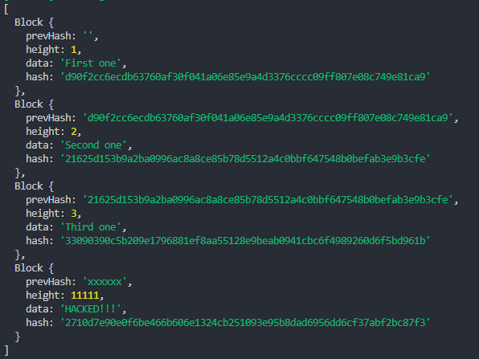

# 블록체인

1. 폴더 생성

   

2. nodejs 프로젝트 생성

```bash
$ npm init -y
```


3. package.json 수정

```json
{
 "name": "typechain",
 "version": "1.0.0",
 "description": "",
 "scripts": {

 },
 "keywords": [],
 "author": "",
 "license": "ISC"
}
```

main 지우기, scripts 수정


4. typescript 설치

```bash
$ npm i -D typescript
```


5. src라는 폴더를 만들고 안에 index.ts 파일 생성

```ts
// index.ts

const hello = () => "hi";
```


6. tsconfig.json 파일 생성

```bash
$ touch tsconfig.json
```


7. tsconfig.json 작성

```json
{
 "include": ["src"],
 "compilerOptions": {
   "outDir": "build"
 }
}
```


8. 다시 package.json 수정

```json
{
 "name": "typechain",
 "version": "1.0.0",
 "description": "",
 "scripts": {
   "build": "tsc"
 },
 "keywords": [],
 "author": "",
 "license": "ISC",
 "devDependencies": {
   "typescript": "^5.1.6"
 }
}
```


9. script 추가

```json
{
  "name": "typechain",
  "version": "1.0.0",
  "description": "",
  "scripts": {
    "build": "tsc",
    "start": "node build/index.js"
  },
  "keywords": [],
  "author": "",
  "license": "ISC",
  "devDependencies": {
    "typescript": "^5.1.6"
  }
}
```


10. 실행

```bash
$ npm run build && npm start
```


11. ts-node 설치

> ts-node는 빌드없이 타입스크립트를 실행할 수 있게 해줌
>
> 프로덕션에서 쓰는 패키지가 아니라 개발 환경에서만 사용
>
> 빌드없이 빠르게 새로고침하고 싶을 때 사용

```bash
$ npm i -D ts-node
```


```json
{
  "name": "typechain",
  "version": "1.0.0",
  "description": "",
  "scripts": {
    "build": "tsc",
    "dev": "ts-node src/index.ts",
    "start": "node build/index.js"
  },
  "keywords": [],
  "author": "",
  "license": "ISC",
  "devDependencies": {
    "ts-node": "^10.9.1",
    "typescript": "^5.1.6"
  }
}
```

dev 스크립트 추가


12. nodemon 설치

> 자동으로 커맨드를 재실행해줘서 일일이 커맨드를 다시 실행할 필요가 없어짐(서버를 재시작할 필요 없음)

```bash
$ npm i nodemon
```


스크립트 수정

```json
{
  "name": "typechain",
  "version": "1.0.0",
  "description": "",
  "scripts": {
    "build": "tsc",
    "dev": "nodemon --exec ts-node src/index.ts",
    "start": "node build/index.js"
  },
  "keywords": [],
  "author": "",
  "license": "ISC",
  "devDependencies": {
    "ts-node": "^10.9.1",
    "typescript": "^5.1.6"
  },
  "dependencies": {
    "nodemon": "^2.0.22"
  }
}
```


실행

```bash
$ npm run dev
```


13. 블록체인 만들기

> 블록체인이란 여러 개의 블록이 사슬처럼 묶인 것
>
> 블록 안에는 데이터가 들어있음(블록체인으로 보호하고 싶은 데이터)
>
> 블록은 다른 블록에 묶여 있음
>
> 연결고리는 해쉬값

```ts
interface BlockShape {
  hash: string;
  prevHash: string;
  height: number;
  data: string;
}

class Block implements BlockShape {
  constructor(
    public prevHash: string,
    public height: number,
    public data: string
  ) {}
}
```

Block은 prevHash(이전 해쉬값)과 위치를 나타내는 height, 블록이 보호할 data, 그리고 hash가 필요


Block 클래스에 interface를 상속하고 constructor를 만들면 hash가 없다고 에러가 생김

하지만 hash는 prevHash, height, data를 이용해서 계산됨

hash는 블록의 고유 서명과 같은 것임

해쉬의 장점은 이상하게 생긴 데이터 표시이면서 결정론적이라는 것

어떤 컴퓨터에서 생성해도 동일한 결과가 나옴

데이터가 변하지 않으면 해쉬값도 변하지 않음

이를 통해 블록체인의 블록 정보가 수정되지 않았다는 것을 확인할 수 있음


크립토 import

```ts
import crypto from "crypto";
```

이 방식은 흔히 알고 있는 import export 방식이지만 에러가 생김

crypto 모듈에 default export가 없기 때문


```ts
import * as crypto from "crypto";
```

위의 코드로 에러를 수정할 수 있지만 더 좋은 방식을 사용


```json
{
  "include": ["src"],
  "compilerOptions": {
    "outDir": "build",
    "target": "ES6",
    "lib": ["ES6"],
    "strict": true,
    "esModuleInterop": true,
    "module": "CommonJS"
  }
}
```

esModuleInterop 속성을 추가하여 모듈을 쉽게 import할 수 있도록 함

allowJs 제거

NodeJS 앱을 만드는 것이기 때문에 lib 속성의 DOM 제거

module 시스템 사용을 위해 module 속성 추가

브라우저 앱을 만들고 있다면 UMD 선택

대체적으로 브라우저 앱을 만들 때는 타입스크립트 코드만 쓰지 않고 웹팩을 사용하고 웹팩이 타입스크립트를 사용함


14. 타입스크립트로 작성되지 않은 패키지를 import할 때

타입 정의를 일일이 다 작성하고 싶지 않다면

DefinitelyTyped라는 레포에 접속

이 레포지토리는 npm에 존재하는 거의 모든 패키지의 타입 정의가 있음

이 타입 정의들을 콘솔을 통해서 설치

```bash
$ npm i -D @types/node
```


패키지별로 설치하려면 패키지를 설치하고 @types/[패키지명]을 설치하면 됨

하지만 최근에는 패키지에 .d.ts 파일을 추가해놓은 경우가 많아서 일일이 설치할 필요가 없음

또 ts-node에 이미 @types/node가 같이 설치되기 때문에 위와 같은 작업을 할 필요가 없음


15. 블록체인 완성시키기

```ts
import crypto from "crypto";

interface BlockShape {
  hash: string;
  prevHash: string;
  height: number;
  data: string;
}

class Block implements BlockShape {
  public hash: string;
  constructor(
    public prevHash: string,
    public height: number,
    public data: string
  ) {
    this.hash = Block.calculateHash(prevHash, height, data);
  }
  static calculateHash(prevHash: string, height: number, data: string) {
    const toHash = `${prevHash}${height}${data}`;
    return crypto.createHash("sha256").update(toHash).digest("hex");
  }
}

class Blockchain {
  private blocks: Block[];
  constructor() {
    this.blocks = [];
  }
  private getPrevHash() {
    if (this.blocks.length === 0) return "";
    return this.blocks[this.blocks.length - 1].hash;
  }
  public addBlock(data: string) {
    const newBlock = new Block(
      this.getPrevHash(),
      this.blocks.length + 1,
      data
    );
    this.blocks.push(newBlock);
  }
  public getBlocks() {
    return this.blocks;
  }
}

const blockchain = new Blockchain();

blockchain.addBlock("First one");
blockchain.addBlock("Second one");
blockchain.addBlock("Third one");

console.log(blockchain.getBlocks());
```

이렇게 했을 경우는 보안 상에 문제가 있음

getBlocks가 public 함수이고 this.blocks를 불러오지만 blocks는 private 값임

getBlocks 함수를 통해 배열에 접근도 가능하고 새로운 값을 집어넣을 수 있음


```ts
blockchain.getBlocks().push(new Block("xxxxxx", 11111, "HACKED!!!"));
```



이전 블록과 연결되지 않은 가짜 데이터가 들어있음


```ts
public getBlocks() {
  return [...this.blocks];
}
```

getBlocks 함수를 [...this.blocks]를 리턴하는 함수로 바꾸면 배열 안에 있는 데이터를 가진 새로운 배열을 리턴해줌

즉, 원본 값이 아닌 복사된 값이 리턴되기 때문에 수정이 되어도 상관이 없음


