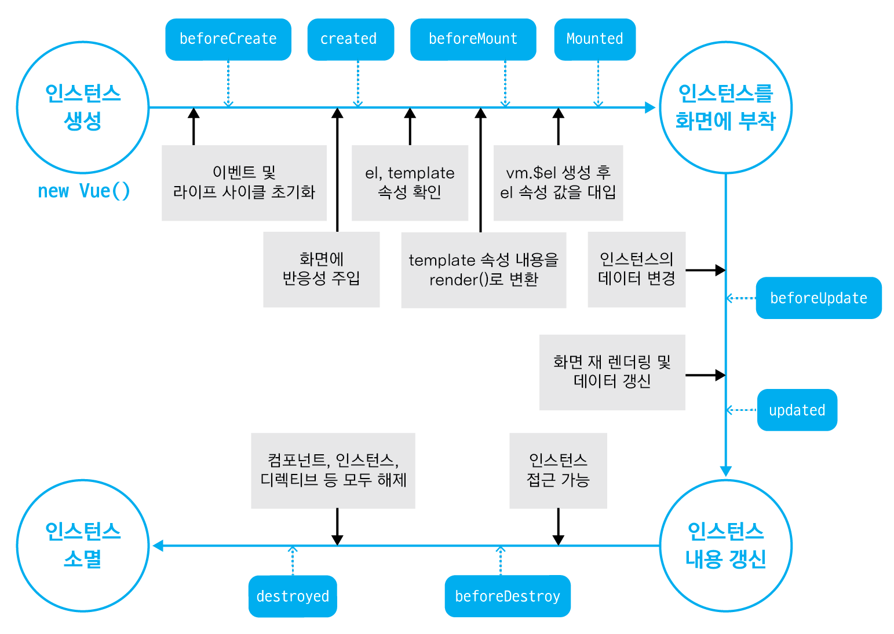
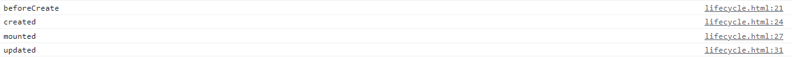

# Do it! Vue.js

## 뷰 인스턴스

> 뷰로 화면을 개발하기 위해 필수적으로 생성해야 하는 기본 단위

<br>

### 뷰 인스턴스 생성

- 뷰 인스턴스를 사용하기 위한 코드

```js
new Vue({
  ...
});
```

<br>

- 예제

```js
// 인스턴스
new Vue({
  // el 속성
  el: '#app',
  // data 속성
  data: {
	message: 'Hello Vue.js!'
  }
});
```

- 'Hello Vue.js!' 텍스트를 화면에 표시하기 위해
  - new Vue()로 뷰 인스턴스를 생성
  - 인스턴스 안에 el 속성으로 뷰 인스턴스가 그려질 지점을 지정
  - data 속성에 message 값을 정의하여 화면의 {{ message }}에 연결

<br>

### 뷰 인스턴스 생성자

> new Vue()로 인스턴스를 생성할 때 Vue를 생성자라고 함

<br>

- Vue 생성자는 뷰 라이브러리를 로딩하고 나면 접근 가능

- 생성자를 사용하는 이유
  - 뷰로 개발할 때 필요한 기능들을 생성자에 미리 정의해 놓고 사용자가 그 기능을 재정의하여 편리하게 사용하도록 하기 위해
  - 생성자란?
    - 객체를 새로 생성할 때 자주 사용하는 옵션과 기능들을 미리 특정 객체에 저장해 놓고, 새로 객체를 생성할 때 기존에 포함된 기능과 더불어 기존 기능을 쉽게 확장하여 사용하는 기법
    - 일반적으로 객체 지향 프로그래밍에서 사용하는 객체 정의 방식으로 미리 정의된 속성과 메서드를 재활용하기 위해 사용

<br>

### 뷰 인스턴스 옵션 속성

> 인스턴스를 생성할 때 재정의할 data, el, template 등의 속성을 의미

<br>

- 

```js
// 인스턴스
new Vue({
  // el 속성
  el: '#app',
  // data 속성
  data: {
	message: 'Hello Vue.js!'
  }
});
```

- Hello Vue.js! 예제에서는 data라는 미리 정의되어 있는 속성을 사용
  - 그 안에 message라는 새로운 속성을 추가하고 Hello Vue.js!라는 값을 주었을 뿐
- `el` 속성 역시 미리 정의되어 있음
  - 뷰로 만든 화면이 그려지는 시작점 의미
  - 뷰 인스턴스로 화면을 렌더링할 때 화면이 그려질 위치의 돔 요소를 지정해 주어야 함
  - #app 값은 화면의 돔 요소 중 app이라는 아이디를 가진 요소를 의미
  - \# 선택자는 CSS 선택자 규칙과 같음
  
- `template` 속성
  - 화면에 표시할 HTML, CSS 등의 마크업 요소를 정의하는 속성
  - 뷰의 데이터 및 기타 속성들도 함께 화면에 그릴 수 있음
- `methods` 속성
  - 화면 로직 제어와 관계된 메서드를 정의하는 속성
  - 마우스 클릭 이벤트 처리와 같이 화면의 전반적인 이벤트와 화면 동작과 관련된 로직 추가 가능
- `created` 속성
  - 뷰 인스턴스가 생성되자마자 실행할 로직을 정의할 수 있는 속성

<br>

### 뷰 인스턴스의 유효 범위

> 뷰 인스턴스를 생성하면 HTML의 특정 범위 안에서만 옵션 속성들이 적용되어 나타나며, 이를 인스턴스의 유효 범위라고 함
>
> 인스턴스의 유효 범위는 el 속성과 밀접한 관계가 있음

<br>

- 인스턴스의 유효 범위 이해

  - 인스턴스가 생성된 후 화면에 어떻게 적용되는지 알아야 함

  - new Vue()로 인스턴스를 생성한 뒤 화면에 인스턴스 옵션 속성을 적용하는 과정

    - 뷰 라이브러리 파일 로딩 => 인스턴스 객체 생성(옵션 속성 포함) => 특정 화면 요소에 인스턴스를 붙임 => 인스턴스 내용이 화면 요소로 변환 => 변환된 화면 요소를 사용자가 최종 확인

    - ```html
      <div id="app">
        {{ message }}
      </div>
      
      new Vue({
        el: '#app',
        data: {
      	message: 'Hello Vue.js!'
        }
      });
      ```

      1. 자바스크립트 코드 상에서 인스턴스 옵션 속성 el과 data를 인스턴스에 정의하고 new Vue()로 인스턴스 생성. 그리고 브라우저에서 위 샘플 코드를 실행하면 el 속성에 지정한 화면 요소(DOM)에 인스턴스 부착
      2. el 속성에 인스턴스가 부착되면 인스턴스에 정의한 옵션 객체의 내용(data 속성)이 el 속성에 지정한 화면 요소와 그 이하 레벨의 화면 요소에 적용되어 값이 치환
         - {{ message }} => Hello Vue.js!

<br>

- 인스턴스 유효 범위 확인

  - 인스턴스의 유효 범위를 넘어가게 된다면?

  - ```html
    <div id="app">
    
    </div>
    {{ message }}
    ```

  - 현재 코드에서 인스턴스의 유효 범위는 el 속성으로 지정한 `<div id="app">` 태그 아래에 오는 요소들로 제한

  - `<div>` 태그 바깥에 있는 {{ message }}는 뷰에서 인식하지 못하기 때문에 그대로 출력

<br>

### 뷰 인스턴스 라이프 사이클

> 인스턴스의 상태에 따라 호출할 수 있는 속성들을 라이프 사이클(life cycle) 속성이라고 함
>
> 각 라이프 사이클 속성에서 실행되는 커스텀 로직을 라이프 사이클 훅(hook)이라고 함

- 라이프 사이클 속성에는 created, beforeCreate, beforeMount, mounted 등 인스턴스의 생성, 변경, 소멸과 관련된 8개의 속성이 있음




- 라이프 사이클의 단계를 크게 나누면
  - 인스턴스의 **생성**
  - 인스턴스를 화면에 **부착**
  - 화면에 부착된 인스턴스의 내용이 **갱신**
  - 인스턴스가 제거되는 **소멸**

<br>

#### beforeCreate

> 인스턴스가 생성되고 나서 가장 처음으로 실행되는 라이프 사이클 단계

- data 속성과 methods 속성이 아직 인스턴스에 정의되어 있지 않고, 돔과 같은 화면 요소에도 접근할 수 없음

<br>

#### created

> beforeCreate 라이프 사이클 단계 다음에 실행되는 단계

- data 속성과 methods 속성이 정의되었기 때문에 this.data 또는 this.fetchData()와 같은 로직들을 이용해 data 속성과 methods 속성에 정의된 값에 접근하여 로직 실행 가능
- 아직 인스턴스가 화면 요소에 부착되기 전이기 때문에 template 속성에 정의된 돔 요소로 접근할 수 없음
- data 속성과 methods 속성에 접근할 수 있는 가장 첫 라이프 사이클 단계이자 컴포넌트가 생성되고 나서 실행되는 단계이기 때문에 서버에 데이터를 요청하여 받아오는 로직을 수행하기 좋음

<br>

#### beforeMount

> created 단계 이후 template 속성에 지정한 마크업 속성을 render() 함수로 변환한 후 el 속성에 지정한 화면 요소(돔)에 인스턴스를 부착하기 전에 호출되는 단계

- render() 함수가 호출되기 직전의 로직을 추가하기 좋음

<br>

#### mounted

> el 속성에서 지정한 화면 요소에 인스턴스가 부착되고 나면 호출되는 단계

- template 속성에 정의한 화면 요소(돔)에 접근할 수 있어 화면요소를 제어하는 로직을 수행하기 좋은 단계
- 돔에 인스턴스가 부착되자마자 바로 호출되기 때문에 하위 컴포넌트나 외부 라이브러리에 의해 추가된 화면 요소들이 최종 HTML 코드로 변환되는 시점과 다를 수 있음
- 변환되는 시점이 다를 경우 $next Tick() API를 활용하여 HTML 코드로 최종 파싱(변환)될 때까지 기다린 후 돔 제어 로직을 추가

<br>

#### beforeUpdate

> el 속성에서 지정한 화면 요소에 인스턴스가 부착되고 나면 인스턴스에 정의한 속성들이 화면에 치환

- 치환된 값은 뷰의 반응성(Reactivity)을 제공하기 위해 $watch 속성으로 감시 (데이터 관찰)
- 관찰하고 있는 데이터가 변경되면 가상 돔으로 화면을 다시 그리기 전에 호출되는 단계
- 변경 예정인 새 데이터에 접근할 수 있어 변경 예정 데이터의 값과 관련된 로직을 미리 넣을 수 있고, 여기에 값을 변경하는 로직을 넣더라도 화면이 다시 그려지지는 않음

<br>

#### updated

> 데이터가 변경되고 나서 가상 돔으로 다시 화면을 그리고 나면 실행되는 단계

- 데이터 변경으로 인한 화면 요소 변경까지 완료된 시점이므로, 데이터 변경 후 화면 요소 제어와 관련된 로직을 추가하기 좋은 단계
- 데이터 값을 변경하면 무한 루프에 빠질 수 있기 때문에 값을 변경하려면 computed, watch와 같은 속성을 사용해야 함
- 데이터 값을 갱신하는 로직은 가급적이면 beforeUpdate에 추가하고, updated에서는 변경 데이터의 화면 요소(돔)와 관련된 로직을 추가하는 것이 좋음

<br>

#### beforeDestroy

> 뷰 인스턴스가 파괴되기 직전에 호출되는 단계

- 아직 인스턴스에 접근할 수 있음
- 뷰 인스턴스의 데이터를 삭제하기 좋은 단계

<br>

#### destroyed

> 뷰 인스턴스가 파괴되고 나서 호출되는 단계

- 뷰 인스턴스에 정의한 모든 속성이 제거되고 하위에 선언한 인스턴스들 또한 모두 파괴됨

<br>

```html
<html lang="en">
  <head>
    <title>Vue Instance Lifecycle</title>
  </head>
  <body>
    <div id="app">
      {{ message }}
    </div>

    <script src="https://cdn.jsdelivr.net/npm/vue@2.5.2/dist/vue.js"></script>
    <script>
      new Vue({
        el: '#app',
        data: {
          message: 'Hello Vue.js!'
        },
        beforeCreate: function() {
          console.log("beforeCreate");
        },
        created: function() {
          console.log("created");
        },
        mounted: function() {
          console.log("mounted");
          this.message = 'Hello Vue!';
        },
        updated: function() {
          console.log("updated");
        }
      });
    </script>
  </body>
</html>
```



- updated가 출력되기 위해서는 data의 값이 변경되어야 함
- mounted 단계에서 message 값이 변경되면 updated가 출력됨

