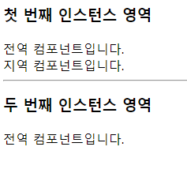
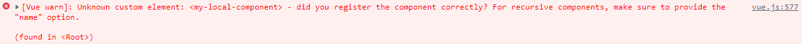

# Do it! Vue.js

## 뷰 컴포넌트

### 컴포넌트란?

> 조합하여 화면을 구성할 수 있는 블록(화면의 특정 영역)
>
> 자료구조의 트리(Tree) 모양과 유사

- 컴포넌트를 활용하면 화면을 빠르게 구조화하여 일괄적인 패턴으로 개발 가능
- 화면의 영역을 컴포넌트로 쪼개서 재활용할 수 있는 형태로 관리하면 코드의 재사용성이 증가함

- 정해진 방식대로 컴포넌트를 등록하거나 사용하게 되므로 남이 작성한 코드를 직관적으로 이해 가능

<br>

### 컴포넌트 등록

- 컴포넌트 등록 방법에는 전역과 지역, 두 가지가 있음
- 지역(Local) 컴포넌트
  - 특정 인스턴스에서만 유효한 범위를 갖음
- 전역(Global) 컴포넌트
  - 여러 인스턴스에서 공통으로 사용할 수 있음

<br>

#### 전역 컴포넌트 등록

- 뷰 라이브러리를 로딩하고 나면 접근 가능한 Vue 변수를 이용하여 등록
- 전역 컴포넌트를 모든 인스턴스에 등록하려면 Vue 생성자에서 .component()를 호출하여 수행

```js
Vue.component('컴포넌트 이름', {
  // 컴포넌트 내용
});
```

- 전역 컴포넌트 등록 형식에는 컴포넌트 이름과 컴포넌트 내용이 있음
- 컴포넌트 이름은 template 속성에서 사용할 HTML 사용자 정의 태그(custom tag) 이름을 의미
- 태그 이름의 명명 규칙은 HTML 사용자 정의 태그 스펙에서 강제하는 '모두 소문자'와 '케밥 기법'을 따르지 않아도 됨

- 컴포넌트 태그가 실제 화면 HTML 요소로 변환될 때 표시될 속성들을 컴포넌트 내용에 작성
- 컴포넌트 내용에는 template, data, methods 등 인스턴스 옵션 속성을 정의할 수 있음

<br>

```html
<html lang="en">
  <head>
    <title>Vue Component Registration</title>
  </head>
  <body>
    <div id="app">
      <button>컴포넌트 등록</button>
      <!-- 전역 컴포넌트 표시 -->
      <my-component></my-component>
    </div>

    <script src="https://cdn.jsdelivr.net/npm/vue@2.5.2/dist/vue.js"></script>
    <script>
      // 전역 컴포넌트 등록
      Vue.component('my-component', {
        template: '<div>전역 컴포넌트가 등록되었습니다!</div>'
      });

      new Vue({
        el: '#app'
      });
    </script>
  </body>
</html>
```

- 전역 컴포넌트를 등록하려면 HTML에서 사용할 태그 이름을 컴포넌트 이름으로 작성하고, 중괄호 {} 안에는 HTML 태그가 실제로 화면에서 그려질 때 표시될 내용(컴포넌트 내용)을 작성

<br>

#### 지역 컴포넌트 등록

- 인스턴스에 components 속성을 추가하고 등록할 컴포넌트 이름과 내용을 정의

```js
new Vue({
  components: {
	'컴포넌트 이름': 컴포넌트 내용
  }
});
```

- 컴포넌트 이름은 전역 컴포넌트와 마찬가지로 HTML에 등록할 사용자 정의 태그를 의미, 컴포넌트 내용은 컴포넌트 태그가 실제 화면 요소로 변환될 때의 내용을 의미

<br>

```html
...
<script>
  var cmp = {
    // 컴포넌트 내용
    template: '<div>지역 컴포넌트가 등록되었습니다!</div>'
  };
  
  new Vue({
    el: '#app',
    components: {
      'my-local-component': cmp
    }
  });
</script>
...
```

- 변수 `cmp`에는 화면에 나타날 컴포넌트 내용을 정의
- 컴포넌트 내용에 template, data, methods 등 여러 가지 속성이 들어갈 수 있음
- 아래 뷰 인스턴스에 components 속성을 추가하고 컴포넌트 이름에는 my-local-component를, 컴포넌트 내용에는 앞에서 컴포넌트 내용을 정의한 변수 cmp를 지정

<br>

```html
<div id="app">
  <button>컴포넌트 등록</button>
  <my-local-component></my-local-component>
</div>
```

<br>

### 지역 컴포넌트와 전역 컴포넌트의 차이

```html
<html lang="en">
  <head>
    <title>Vue Component Registration</title>
  </head>
  <body>
    <div id="app">
      <h3>첫 번째 인스턴스 영역</h3>
      <my-global-component></my-global-component>
      <my-local-component></my-local-component>
    </div>
    <hr>
    <div id="app2">
      <h3>두 번째 인스턴스 영역</h3>
      <my-global-component></my-global-component>
      <my-local-component></my-local-component>
    </div>

    <script src="https://cdn.jsdelivr.net/npm/vue@2.5.2/dist/vue.js"></script>
    <script>
      // 전역 컴포넌트 등록
      Vue.component('my-global-component', {
        template: '<div>전역 컴포넌트입니다.</div>'
      });
      // 지역 컴포넌트 내용
      var cmp = {
        template: '<div>지역 컴포넌트입니다.</div>'
      };
      // 첫 번째 인스턴스
      new Vue({
        el: '#app',
        // 지역 컴포넌트 등록
        components: {
          'my-local-component': cmp
        }
      });
      // 두 번째 인스턴스
      new Vue({
        el: '#app2'
      });
    </script>
  </body>
</html>
```





- 첫 번째 인스턴스 영역에는 전역, 지역 컴포넌트가 모두 정상적으로 나타남. 하지만 두 번째 인스턴스 영역에는 전역 컴포넌트만 나타나고, 지역 컴포넌트는 나타나지 않음
- 전역 컴포넌트와 지역 컴포넌트의 유효 범위가 다르기 때문
- `<my-local-component>` 태그가 두 번째 인스턴스의 유효 범위 안에 있더라도 컴포넌트가 등록된 첫 번째 유효 범위를 벗어나기 때문에 브라우저에서 HTML 사용자 정의 태그로 인식하고, 뷰에서 해당 컴포넌트를 제대로 등록했는지 물어보는 오류 발생

<br>

- 전역 컴포넌트는 인스턴스를 새로 생성할 때마다 인스턴스에 components 속성으로 등록할 필요 없이 한 번 등록하면 어느 인스턴스에서든지 사용 가능
- 지역 컴포넌트는 새 인스턴스를 생성할 때마다 등록해줘야 함

