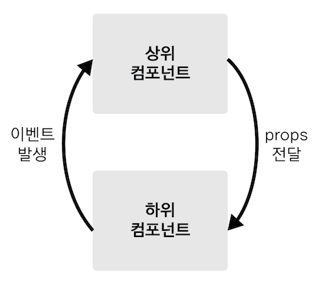

# Do it! Vue.js

## 뷰 컴포넌트 통신

### 컴포넌트 간 통신과 유효 범위

- 뷰의 경우 컴포넌트로 화면을 구성하므로 같은 웹 페이지라도 데이터를 공유할 수 없음
- 컴포넌트마다 자체적으로 고유한 유효 범위(scope)를 갖기 때문
- 각 컴포넌트의 유효 범위가 독립적이기 때문에 다른 컴포넌트의 값을 직접 참조할 수 없음

<br>

```html
<div id="app">
  <my-component1></my-component1>
  <my-component2></my-component2>
</div>

<script src="https://cdn.jsdelivr.net/npm/vue@2.5.2/dist/vue.js"></script>
<script>
  // 첫 번째 컴포넌트 내용
  var cmp1 = {
    template: "<div>첫 번째 지역 컴포넌트 : {{ cmp1Data }}</div>",
    data: function () {
      return {
        cmp1Data: 100,
      };
    },
  };

  // 두 번째 컴포넌트 내용
  var cmp2 = {
    template: "<div>두 번째 지역 컴포넌트 : {{ cmp2Data }}</div>",
    data: function () {
      return {
        cmp2Data: cmp1.data.cmp1Data,
      };
    },
  };

  new Vue({
    el: "#app",
    // 지역 컴포넌트 등록
    components: {
      "my-component1": cmp1,
      "my-component2": cmp2,
    },
  });
</script>
```


- 2개의 지역 컴포넌트를 등록하고, 한 컴포넌트에서 다른 컴포넌트의 값을 직접 참조하는 예제
- `my-component2` 컴포넌트 내용에서 `{{ cmp2Data }}`는 `my-component1` 컴포넌트의 `data.cmp1Data`를 참조하고 있음
- 자바스크립트의 객체 참조 방식을 생각해 보면 참조 값 100이 화면에 표시되어야 하지만 아무것도 표시하지 않음

- `{{ cmp2Data }}`에 아무것도 출력되지 않은 이유는 `my-component2`에서 `my-component1`의 값을 직접 참조할 수 없기 때문

- 이를 통해 개발자 개개인의 스타일대로 구성되지 않고, 애플리케이션 모두 동일한 데이터 흐름을 갖게 되며, 다른 사람의 코드를 빠르게 파악할 수 있어 협업에 유용함

<br>

### 상-하위 컴포넌트 관계

> 뷰 프레임워크 자체에서 정의한 컴포넌트 데이터 전달 방법을 따라야 함
>
> 가장 기본적인 전달 방법은 바로 상위(부모) - 하위(자식) 컴포넌트 간의 데이터 전달 방법

<br>

- 상위 - 하위 컴포넌트란 트리 구조에서 부모 노드, 자식 노드처럼 컴포넌트 간의 관계가 부모, 자식으로 이루어진 컴포넌트를 의미



- 다음 그림은 뷰에서 상위 - 하위 컴포넌트 간에 데이터를 전달하는 기본적인 구조
- 상위에서 하위로는 `props`라는 특별한 속성을 전달
- 하위에서 상위로는 기본적으로 **이벤트**만 전달

<br>

### 상위에서 하위 컴포넌트로 데이터 전달하기

#### props 속성

> props는 상위 컴포넌트에서 하위 컴포넌트로 데이터를 전달할 때 사용하는 속성

<br>

```js
Vue.component('child-component', {
  props: ['props 속성 이름'],
});
```

- 위와 같이 하위 컴포넌트의 속성 정의

<br>

```vue
<child-component v-bind:props 속성 이름="상위 컴포넌트의 data 속성"></child-component>
```

- 상위 컴포넌트의 HTML 코드에 등록된 `child-component` 컴포넌트 태그에 `v-bind` 속성을 추가
- `v-bind` 속성의 왼쪽 값으로 하위 컴포넌트에서 정의한 `props` 속성을 넣고, 오른쪽 값으로 하위 컴포넌트에 전달할 상위 컴포넌트의 data 속성을 지정

<br>

```html
<div id="app">
  <child-component v-bind:propsdata="message"></child-component>
</div>

<script src="https://cdn.jsdelivr.net/npm/vue@2.5.2/dist/vue.js"></script>
<script>
  Vue.component("child-component", {
    props: ["propsdata"],
    template: "<p>{{ propsdata }}</p>",
  });

  new Vue({
    el: "#app",
    data: {
      message: "Hello Vue! passed from Parent Component",
    },
  });
</script>
```

- 이 코드는 상위 컴포넌트의 `message` 속성을 하위 컴포넌트에 `props`로 전달하여 메시지를 출력하는 예제

1. `new Vue()`로 인스턴스를 하나 생성
2. `Vue.component()`를 이용하여 하위 컴포넌트인 `child-component` 등록
3. `child-component`의 내용에 `props` 속성으로 `propsdata` 정의
4. HTML에 컴포넌트 태그 추가. `<child-component>` 태그의 v-bind 속성을 보면, `v-bind: propsdata="message"`는 상위 컴포넌트의 message 속성 값인 `Hello Vue! passed from Parent Component` 텍스트를 하위 컴포넌트의 `propsdata`로 전달

5. `child-component`의 template 속성에 정의된 `<p>{{ propsdata }}</p>`는 `Hello Vue! passed from Parent Component`가 됨

<br>

- 한 줄로 정리하면 뷰 인스턴스의 data 속성에 정의된 message 속성을 하위 컴포넌트에 props로 전달하여 화면에 나타냄

<br>

#### 컴포넌트 간의 관계

- child-component를 전역으로 등록한 것 이외에 딱히 상위 컴포넌트를 지정하지 않았지만 뷰 인스턴스 안에 상위 컴포넌트가 존재하는 것처럼 하위 컴포넌트로 props를 내려 보냈음
- 그 이유는 컴포넌트를 등록함과 동시에 뷰 인스턴스 자체가 상위 컴포넌트가 되기 때문
- 인스턴스에 새로운 컴포넌트를 등록하면 기존에 있는 인스턴스는 상위 컴포넌트(부모)가 되고, 새로 등록된 컴포넌트는 하위(자식) 컴포넌트가 됨. 새 컴포넌트를 등록한 인스턴스를 최상위 컴포넌트(Root Component)라고도 부름

<br>

### 하위에서 상위 컴포넌트로 이벤트 전달

#### 이벤트 발생과 수신

> 하위 컴포넌트에서 상위 컴포넌트의 통신은 이벤트를 발생시켜(event emit) 상위 컴포넌트에 신호를 보냄

- 상위 컴포넌트에서 하위 컴포넌트의 특정 이벤트가 발생하기를 기다리고 있다가 하위 컴포넌트에서 특정 이벤트가 발생하면 상위 컴포넌트에서 해당 이벤트를 수신하여 상위 컴포넌트의 메서드를 호출

<br>

#### 이벤트 발생과 수신 형식

> 이벤트 발생과 수신은 `$emit()`과 `v-on:` 속성을 사용하여 구현

- 이벤트 발생

```js
this.$emit('이벤트명');
```

- 이벤트 수신

```vue
<child-component v-on:이벤트명="상위 컴포넌트의 메서드명"></child-component>
```

<br>

- `$emit()`을 호출하면 괄호 안에 있는 이벤트가 발생
- `$emit()`을 호출하는 위치는 하위 컴포넌트의 특정 메서드 내부
- `$emit()`을 호출할 때 사용하는 this는 하위 컴포넌트를 가리킴

<br>

- 호출한 이벤트는 하위 컴포넌트를 등록하는 태그(상위 컴포넌트의 template 속성에 위치)에서 `v-on:`으로 받음
- 하위 컴포넌트에서 발생한 이벤트명을 `v-on:` 속성에 지정하고, 속성의 값에 이벤트가 발생했을 때 호출될 상위 컴포넌트의 메서드 지정

<br>

```html
<div id="app">
  <child-component v-on:show-log="printText"></child-component>
</div>

<script src="https://cdn.jsdelivr.net/npm/vue@2.5.2/dist/vue.js"></script>
<script>
  Vue.component("child-component", {
    template: '<button v-on:click="showLog">show</button>',
    methods: {
      showLog: function () {
        this.$emit("show-log");
      },
    },
  });

  new Vue({
    el: "#app",
    data: {
      message: "Hello Vue! passed from Parent Component",
    },
    methods: {
      printText: function () {
        console.log("received an event");
      },
    },
  });
</script>
```

- 이 코드는 `child-component`의 [show] 버튼을 클릭하여 이벤트를 발생시키고, 발생한 이벤트로 상위 컴포넌트의 `printText()` 메서드를 실행시키는 예제
- [show] 버튼을 클릭했을 때 처리되는 과정
  1. [show] 버튼을 클릭하면 클릭 이벤트 `v-on:click="showLog"`에 따라 `showLog()` 메서드가 실행
  2. `showLog()` 메서드 안에 `this.$emit('show-log')`가 실행되면서 `show-log` 이벤트 발생
  3. `show-log` 이벤트는 `<child-component>`에 정의한 `v-on:show-log`에 전달, `v-on:show-log`의 대상 메서드인 최상위 컴포넌트의 메서드 `printText()`가 실행
  4. `printText()`는 `received an event`라는 로그를 출력하는 메서드이므로 콘솔에 로그가 출력

<br>

### 같은 레벨의 컴포넌트 간 통신

> 바로 옆 컴포넌트에 값을 전달하기 위해서는 하위에서 공통 상위 컴포넌트로 이벤트를 전달한 후 공통 상위 컴포넌트에서 2개의 하위 컴포넌트에 props를 내려 보내야 함

- 이런 방식으로 통신해야 하는 이유는 컴포넌트 고유의 유효 범위 때문
- 다른 컴포넌트의 값을 직접 참조하지 못하므로 기본적인 데이터 전달 방식을 활용하여 같은 레벨 간에 통신이 가능하도록 구조를 갖춰야 함
- 이런 통신 구조 때문에 같은 레벨 간 통신을 위해 강제로 상위 컴포넌트를 두어야 하는데 이를 해결하기 위해 이벤트 버스를 사용

<br>

### 관계 없는 컴포넌트 간 통신 - 이벤트 버스

> 이벤트 버스(Event Bus)는 개발자가 지정한 2개의 컴포넌트 간에 데이터를 주고받을 수 있는 방법

<br>

#### 이벤트 버스 형식

```js
// 이벤트 버스를 위한 추가 인스턴스 1개 생성
var eventBus = new Vue();

// 이벤트를 보내는 컴포넌트
methods: {
  메서드명: function() {
    eventBus.$emit('이벤트명', 데이터);
  }
}

// 이벤트를 받는 컴포넌트
methods: {
  created: function() {
    eventBus.$on('이벤트명', function(데이터) {
      ...
    })
  }
}
```

- 이벤트 버스를 구현하려면 애플리케이션 로직을 담는 인스턴스와는 별개로 새로운 인스턴스를 1개 더 생성하고, 새 인스턴스를 이용하여 이벤트를 보내고 받음
- 보내는 컴포넌트에서는 `.$emit()`을, 받는 컴포넌트에서는 `.$on()`을 구현

<br>

```html
<div id="app">
  <child-component></child-component>
</div>

<script src="https://cdn.jsdelivr.net/npm/vue@2.5.2/dist/vue.js"></script>
<script>
  var eventBus = new Vue();
  Vue.component("child-component", {
    template:
      '<div>하위 컴포넌트 영역<button v-on:click="showLog">show</button></div>',
    methods: {
      showLog: function () {
        eventBus.$emit("triggerEventBus", 100);
      },
    },
  });

  var app = new Vue({
    el: "#app",
    created: function () {
      eventBus.$on("triggerEventBus", function (value) {
        console.log("이벤트를 전달받음. 전달받은 값 : ", value);
      });
    },
  });
</script>
```

- 위 코드는 등록한 하위 컴포넌트의 [show] 버튼을 클릭했을 때 이벤트 버스를 이용하여 상위 컴포넌트로 데이터를 전달하는 코드

1. 이벤트 버스로 활용할 새 인스턴스를 1개 생성하고 `eventBus`라는 변수에 참조. 이제 `eventBus` 변수로 새 인스턴스의 속성과 메서드에 접근 가능
2. 하위 컴포넌트에는 template 속성과 methods 속성을 정의. template 속성에는 '하위 컴포넌트 영역'이라는 텍스트와 [show] 버튼 추가. methods 속성에는 `showLog()` 메서드를 정의하고, 메서드 안에는 `eventBus.$emit()`을 선언하여 `triggerEventBus`라는 이벤트를 발생하는 로직 추가. 이 이벤트는 발생할 때 수신하는 쪽에 인자 값으로 100이라는 숫자를 함께 전달
3. 상위 컴포넌트의 created 라이프 사이클 훅에 `eventBus.$on()`으로 이벤트를 받는 로직을 선언. 발생한 이벤트 `triggerEventBus`를 수신할 때 앞에서 전달된 인자 값 100이 콘솔에 출력

<br>

- 간단하게 정리해 보면 [show] 버튼을 클릭하여 `showLog()`가 실행되었을 때 `eventBus`의 이벤트가 발생. 발생한 이벤트는 상위 컴포넌트의 created()에 있는 `eventBus.$on()`에서 전달받음. 이벤트와 함께 전달된 인자 값 100이 출력

<br>

- 이벤트 버스를 활용하면 props 속성을 이용하지 않고도 원하는 컴포넌트 간에 직접적으로 데이터를 전달할 수 있어 편리하지만 컴포넌트가 많아지면 어디서 어디로 보냈는지 관리가 되지 않는 문제 발생
- 이 문제를 해결하기 위해 뷰엑스(Vuex)라는 상태 관리 도구 필요