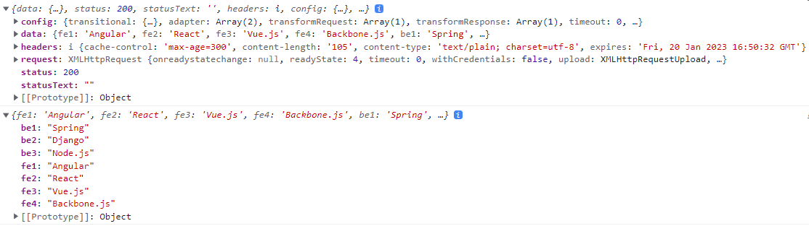

# Do it! Vue.js

## 뷰 HTTP 통신

### 웹 앱의 HTTP 통신 방법

> 웹 앱에서 서버에 데이터를 요청하는 HTTP(HyperText Transfer Protocol) 통신은 필수로 구현해야 하는 기능
>
> 사용자와의 상호 작용에 따라 데이터를 동적으로 화면에 표시해줘야 하기 때문
>
> - HTTP란?
>   - 브라우저와 서버 간에 데이터를 주고받는 통신 프로토콜
>   - 브라우저에서 특정 데이터를 보내달라고 요청(request)을 보내면 서버에서 응답(response)으로 해당 데이터를 보내주는 방식
>   - 서버에 '해당 데이터를 보내주세요.'라는 메시지를 보내는 것이 'HTTP 요청을 보낸다.'와 같은 의미

<br>

#### 웹 앱 HTTP 통신의 대표적인 사례로 제이쿼리(jQuery)의 ajax

> ajax는 서버에서 받아온 데이터를 표시할 때 화면 전체를 갱신하지 않고도 화면의 일부분만 변경할 수 있게 하는 자바스크립트 기법

- 뷰 프레임워크의 필수 라이브러리로 관리하던 뷰 리소스와 요즘 가장 많이 사용하는 액시오스(axios)가 ajax를 지원하기 위한 라이브러리

<br>

### 뷰 리소스

> 뷰 리소스(resource)는 초기에 코어 팀에서 공식적으로 권하는 라이브러리였으나 2016년 말에 공식적인 지원을 중단하고 기존에 관리했던 PageKit 팀의 라이브러리로 돌아감
>
> 이유는 HTTP 통신 관련 라이브러리는 뷰 라우팅, 상태 관리와 같은 라이브러리와 다르게 프레임워크에 필수적인 기능이 아니라고 판단했기 때문

<br>

- CDN 설치 방법을 이용하여 뷰 리소스로 서버에서 특정 데이터를 받아와 로그로 출력하는 예제

```html
<div id="app">
  <button v-on:click="getData">프레임워크 목록 가져오기</button>
</div>

<script src="https://cdn.jsdelivr.net/npm/vue@2.5.2/dist/vue.js"></script>
<script src="https://cdn.jsdelivr.net/npm/vue-resource@1.3.4"></script>
<script>
  new Vue({
    el: "#app",
    methods: {
      getData: function () {
        this.$http
          .get(
            "https://raw.githubusercontent.com/joshua1988/doit-vuejs/master/data/demo.json"
          )
          .then(function (response) {
            console.log(response);
            console.log(JSON.parse(response.data));
          });
      },
    },
  });
</script>
```


> 버튼을 클릭하면 지정한 URL의 데이터를 가져오는 예제
>
> 불러오는 데이터는 JSON 형식의 파일이며 '프레임워크 종류 - 프레임워크 이름' 형태의 '키 - 쌍' 조합으로 7개의 데이터 쌍으로 존재

1. 버튼은 인스턴스 영역 안에 `<div>` 태그 안에 `<button>` 태그로 추가.` v-on:click`을 이용하여 버튼을 클릭했을 때 `getData()`가 호출되도록 클릭 이벤트 설정
2. `getData()`에는 뷰 리소스에서 제공하는 API인 `this.$http.get()`을 사용하여 해당 URL에서 제공하는 데이터를 받아옴. API 이름에서 유추할 수 있듯이 `this.$http.get()`은 HTTP GET 요청을 서버에 보내고 특정 데이터를 받아옴
3. 버튼을 클릭하여 해당 URL로 HTTP GET 요청을 보내고 나면 `.then()` 안에서 응답을 받은 데이터 response를 콘솔에 출력

<br>

- 첫 번째 로그는 response의 내용. url 속성 값에는 HTTP GET 요청을 할 때 넣었던 사이트의 URL이 들어 있음
- 두 번째 로그는 응답 데이터의 body 값이 문자열이 기 때문에 `JSON.parse()` 자바스크립트 API를 이용하여 자바스크립트 객체로 보기 쉽게 변환

<br>

### 액시오스 ([링크](https://github.com/axios/axios))

> 액시오스(Axios)는 현재 뷰 커뮤니티에서 가장 많이 사용되는 HTTP 통신 라이브러리
>
> Promise 기반의 API 형식이 다양하게 제공되어 별도의 로직을 구현할 필요 없이 주어진 API만으로도 간편하게 원하는 로직 구현 가능
>
> - Promise 기반의 API 형식이란?
>   - Promise란 서버에 데이터를 요청하여 받아오는 동작과 같은 비동기 로직 처리에 유용한 자바스크립트 객체
>   - 자바스크립트는 단일 스레드(thread)로 코드를 처리하기 때문에 특정 로직의 처리가 끝날 때까지 기다려주지 않음. 따라서 데이터를 요청하고 받아올 때가지 기다렸다가 화면에 나타내는 로직을 실행해야 할 때 주로 Promise를 활용
>   - 데이터를 받아왔을 때 Promise로 데이터를 화면에 표시하거나 연산을 수행하는 등 특정 로직 수행
>   - 데이터 통신과 관련한 여러 라이브러리 대부분에서 Promise를 활용하고 있으며, 액시오스에서도 Promise 기반의 API를 지원

<br>

#### 액시오스 설치 및 사용

- CDN을 이용하는 방법

```html
<script src="https://unpkg.com/axios/dist/axios.min.js"></script>
```

<br>

- 액시오스가 제공하는 API

```html
<script>
  // HTTP GET 요청
  axios.get('URL 주소').then().catch();
    
  // HTTP POST 요청
  axios.post('URL 주소').then().catch();
    
  // HTTP 요청에 대한 옵션 속성 정의
  axios({
    method: 'get',
    url: 'URL 주소',
    ...
  })
</script>
```

| API 유형                                | 처리 결과                                                    |
| --------------------------------------- | ------------------------------------------------------------ |
| `axios.get('URL 주소').then().catch()`  | 해당 URL 주소에 대해 HTTP GET 요청을 보냄. 서버에서 보낸 데이터를 정상적으로 받아오면 `then()` 안에 정의한 로직이 실행되고, 데이터를 받아올 때 오류가 발생하면 `catch()`에 정의한 로직이 수행됨 |
| `axios.post('URL 주소').then().catch()` | 해당 URL 주소에 대해 HTTP POST 요청을 보냄. `then()`과 `catch()`의 동작은 위에 살펴본 내용과 동일 |
| `axios({ 옵션 속성 })`                  | HTTP 요청에 대한 자세한 속성들을 직접 정의하여 보낼 수 있음. 데이터 요청을 보낼 URL, HTTP 요청 방식, 보내는 데이터 유형, 기타 등등 |

- 참고 : [더 많은 API 형식](https://github.com/axios/axios#axios-api)

<br>

```html
<div id="app">
  <button v-on:click="getData">프레임워크 목록 가져오기</button>
</div>

<script src="https://cdn.jsdelivr.net/npm/vue@2.5.2/dist/vue.js"></script>
<script src="https://unpkg.com/axios/dist/axios.min.js"></script>
<script>
  new Vue({
    el: "#app",
	methods: {
	  getData: function () {
	    axios
		  .get("https://raw.githubusercontent.com/joshua1988/doit-vuejs/master/data/demo.json")
		  .then(function (response) {
            console.log(response);
			console.log(response.data);
          });
	  },
	},
  });
</script>
```



- response 객체를 확인해 보면 data 속성이 일반 문자열 형식이 아니라 객체 형태이기 때문에 별도로 `JSON.parse()`를 사용하여 객체로 변환할 필요가 없음
- `response.data`로 원하는 데이터를 객체 형태로 받을 수 있음

