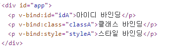
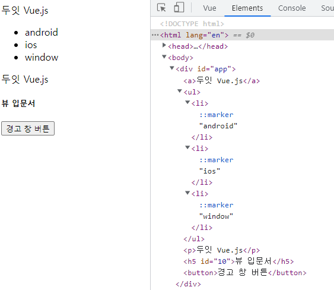
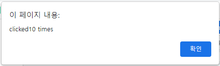
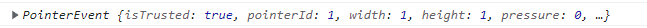

# Do it! Vue.js

## 뷰 템플릿

> 뷰의 템플릿은 HTML, CSS 등의 마크업 속성과 뷰 인스턴스에서 정의한 데이터 및 로직들을 연결하여 사용자가 브라우저에서 볼 수 있는 형태의 HTML로 변환해 주는 속성

<br>

### 템플릿 속성 사용 방법

#### 1. ES5에서 뷰 인스턴스의 template 속성을 활용

```html
template: '<p>Hello {{ message }}</p>'
```

```html
<script>
  new Vue({
    template: '<p>Hello {{ message }}</p>'
  });
</script>
```

<br>

- 템플릿 속성의 특징
  - 사용자가 볼 수는 없지만 라이브러리 내부적으로 template 속성에서 정의한 마크업 + 뷰 데이터를 가상 돔 기반의 `render()` 함수로 변환
  - 변환된 `render()` 함수는 최종적으로 사용자가 볼 수 있게 화면을 그리는 역할을 하고 변환 과정에서 뷰의 반응성(Reactivity)이 화면에 더해줌

<br>

1.

```html
<div id="app">
  <h3>{{ message ]}</h3>
</div>
...
<script>
  new Vue({
    el: '#app',
    data: {
      message: 'Hello Vue.js!'
    }
  });
</script>
```

2.

```html
<div id="app">
</div>
...
<script>
  new Vue({
    el: '#app',
    data: {
      message: 'Hello Vue.js!'
    },
    template: '<h3>{{ message ]}</h3>'
  });
</script>
```

- 위의 두 코드는 최종적으로 화면에 나타나는 것은 같지만, 인스턴스의 내용이 적용되는 시점이 다름

1. 코드는 `<h3>{{ message }}</h3>`을 화면에 표시하고, 인스턴스가 생성되면 message 값을 Hello Vue.js!로 치환
2. 코드는 `<div id="app">`에 아무런 내용이 없다가 인스턴스가 생성되면 `<h3>Hello Vue.js!</h3>`가 화면에 표시됨

<br>

#### 2. 싱글 파일 컴포넌트 체계의 `<template>` 코드 활용

```html
<!-- ES6 : 싱글 파일 컴포넌트 체계 -->
<template>
  <p>Hello {{ message }}</p>
</template>
```

<br>

### 데이터 바인딩

> 데이터 바인딩(Data Binding)은 HTML 화면 요소를 뷰 인스턴스의 데이터와 연결하는 것을 의미
>
> 주요 문법으로 `{{ }}` 문법, `v-bind` 속성이 있음

<br>

#### `{{ }}` - 콧수염 괄호

> `{{ }}`는 뷰 인스턴스의 데이터를 HTML 태그에 연결하는 가장 기본적인 텍스트 삽입 방식

```html
<div id="app">
  <h3>{{ message ]}</h3>
</div>

<script>
  new Vue({
    el: '#app',
    data: {
      message: 'Hello Vue.js!'
    }
  });
</script>
```

- data 속성의 message 속성 값인 Hello Vue.js!를 `<div>` 태그 안의 `{{ message }}`에 연결하여 화면에 나타내는 코드
- data 속성의 message 값이 바뀌면 뷰 반응성에 의해 화면이 자동으로 갱신됨

<br>

```html
<div id="app" v-once>
  <h3>{{ message ]}</h3>
</div>
```

- 만약 뷰 데이터가 변경되어도 값을 바꾸고 싶지 않다면 오른쪽과 같이 `v-once` 속성을 사용

<br>

#### v-bind

> v-bind는 아이디, 클래스, 스타일 등의 HTML 속성(attributes) 값에 뷰 데이터 값을 연결할 때 사용하는 데이터 연결 방식
>
> v-bind 속성으로 지정할 HTML 속성이나 props 속성 앞에 접두사로 붙여줌

<br>

```html
<div id="app">
  <p v-bind:id="idA">아이디 바인딩</p>
  <p v-bind:class="classA">클래스 바인딩</p>
  <p v-bind:style="styleA">스타일 바인딩</p>
</div>
...
<script>
  new Vue({
    el: '#app',
    data: {
      idA: 10,
      classA: 'container',
      styleA: 'color: blue'
    }
  });
</script>
```

- HTML의 기본 속성인 id, class, style의 앞에 v-bind:를 붙여 뷰 인스턴스에 정의한 데이터 속성과 연결하여 화면에 나타내는 예제



- 코드를 실행하면 데이터의 값이 각 `<p>` 태그에 연결되어 화면에 나타남

- styleA 속성은 스타일 값이 적용되면서 바로 화면에 반영되어 나타남

<br>

- v-bind: 문법을 :로 간소화할 수 있음. 예를 들면, v-bind:id는 :id로 표현 가능
  - 하지만 뷰 코드가 전반적으로 v- 접두사를 붙이는 형태이기 때문에 가급적 v-bind로 사용하는 것이 HTML 문법과 구분되고 다른 사람들이 코드를 파악하기 쉬움

<br>

### 자바스크립트 표현식

> 뷰 템플릿에서도 자바스크립트 표현식을 사용 가능
>
> 데이터 바인딩 방법 중 하나인 `{{ }}` 안에 자바스크립트 표현식을 넣으면 됨

<br>

```html
<div id="app">
  <p>{{ message }}</p>
  <p>{{ message + "!!!" }}</p>
  <p>{{ message.split('').reverse().join('') }}</p>
</div>
...
<script>
  new Vue({
    el: "#app",
    data: {
      message: 'Hello Vue.js!'
    },
  });
</script>
```

- 첫 번째 `<p>` 태그는 message 값 그대로 Hello Vue.js! 출력
- 두 번째 `<p>` 태그는 message 값에 문자열 !!!를 추가하여 Hello Vue.js!!!! 출력
- 세 번째 `<p>` 태그는 message 값의 순서를 바꿔 !sj.euV olleH 출력

<br>

#### 자바스크립트 표현식에서 주의할 점

1. 자바스크립트의 선언문과 분기 구문은 사용할 수 없음
2. 복잡한 연산은 인스턴스 안에서 처리하고 화면에는 간단한 연산 결과만 표시해야 함

```html
<div id="app">
  {{ var a = 10; }}
  <!-- X, 선언문은 사용 불가능 -->
  {{ if (true) {return 100} }}
  <!-- X, 분기 구문은 사용 불가능 -->
  {{ true ? 100 : 0 }}
  <!-- O, 삼항 연산자로 표현 가능 -->

  {{ message.split('').reverse().join('') }}
  <!-- X, 복잡한 연산은 인스턴스 안에서 수행 -->
  {{ reversedMessage }}
  <!-- O, 스크립트에서 computed 속성으로 계산한 후 최종 값만 표현 -->
</div>

<script src="https://cdn.jsdelivr.net/npm/vue@2.5.2/dist/vue.js"></script>
<script>
  new Vue({
    el: "#app",
    data: {
      message: "Hello Vue.js!",
    },
    computed: {
      reversedMessage: function () {
        return this.message.split("").reverse().join("");
      },
    },
  });
</script>
```

- `{{ var a = 10; }}`은 자바스크립트 선언문이라서 오류 발생
- `{{ if (true) {return 100} }}`은 분기 구문이므로 오류 발생
- 분기 구문과 동일한 로직을 처리하고 싶으면 삼항 연산자 사용 `{{ true ? 100 : 0 }}`

<br>

- message의 텍스트 값을 역순으로 변환하는 연산은 HTML 단에서 수행하지 않고, 자바스크립트 단에서 computed 속성을 이용하여 계산한 후 최종 결과만 표시
- 이러한 방식을 권장하는 이유는 화면단 코드의 가독성을 높일 수 있기 때문

- 반복적인 연산에 대해서는 미리 계산하여 저장해 놓고, 필요할 때 불러오는 캐싱(caching) 효과를 얻을 수 있음
  - 캐싱 : 데이터나 값을 임시 장소에 미리 복사해 놓는 동작. 데이터 접근 시간이나 계산 시간을 줄이기 위해 미리 임시 장소에 값을 저장해 놓고 필요할 때 불러서 사용

<br>

### 디렉티브

> 뷰 디렉티브(Directive)란 HTML 태그 안에 v- 접두사를 가지는 모든 속성들을 의미

<br>

```html
<a v-if="flag">두잇 Vue.js</a>
```

- 위 `<a>` 태그는 뷰 인스턴스 데이터 속성에 정의된 flag 값에 따라 보이기도 하고 안보이기도 함

<br>

- 디렉티브는 화면의 요소를 더 쉽게 조작하기 위해 사용하는 기능
- 뷰의 데이터 값이 변경되었을 때 화면의 요소들이 리액티브(Reactive)하게 반응하여 변경된 데이터 값에 따라 갱신됨
- 화면의 요소를 직접 제어할 필요 없이 뷰의 디렉티브를 활용하여 화면 요소들을 조작 가능

<br>

| 디렉티브 이름 | 역할                                                         |
| ------------- | ------------------------------------------------------------ |
| v-if          | 지정한 뷰 데이터 값의 참, 거짓 여부에 따라 해당 HTML 태그를 화면에 표시하거나 표시하지 않음 |
| v-for         | 지정한 뷰 데이터의 개수만큼 해당 HTML 태그를 반복 출력       |
| v-show        | v-if와 유사하게 데이터의 진위 여부에 따라 해당 HTML 태그를 화면에 표시하거나 표시하지 않음. 다만, v-if는 해당 태그를 완전히 삭제하지만 v-show는 css 효과만 display:none;으로 주어 실제 태그는 남아 있고 화면 상으로만 보이지 않음 |
| v-bind        | HTML 태그의 기본 속성과 뷰 데이터 속성을 연결                |
| v-on          | 화면 요소의 이벤트를 감지하여 처리할 때 사용. v-on:click은 해당 태그의 클릭 이벤트를 감지하여 특정 메서드를 실행할 수 있음 |
| v-model       | 폼(form)에서 주로 사용되는 속성. 폼에 입력한 값을 뷰 인스턴스의 데이터와 즉시 동기화. 화면에 입력된 값을 저장하여 서버에 보내거나 watch와 같은 고급 속성을 이용하여 추가 로직 수행 가능. `<input>`, `<select>`, `<textarea>` 태그에만 사용 가능 |

<br>

```html
<div id="app">
  <a v-if="flag">두잇 Vue.js</a>
  <ul>
    <li v-for="system in systems">{{ system }}</li>
  </ul>
  <p v-show="flag">두잇 Vue.js</p>
  <h5 v-bind:id="uid">뷰 입문서</h5>
  <button v-on:click="popupAlert">경고 창 버튼</button>
</div>

<script src="https://cdn.jsdelivr.net/npm/vue@2.5.2/dist/vue.js"></script>
<script>
  new Vue({
    el: "#app",
    data: {
      flag: true,
      systems: ["android", "ios", "window"],
      uid: 10,
    },
    methods: {
      popupAlert: function () {
        return alert("경고 창 표시");
      },
    },
  });
</script>
```

1. v-if : 분기 처리의 조건 값인 flag 값이 true이므로 '두잇 Vue.js' 텍스트를 화면에 표시
2. v-for : 뷰 데이터 systems는 android, ios, window의 총 3개의 값을 가지는 배열. 이 배열의 요소 개수만큼 `<li>` 태그가 반복되어 {{ system }}으로 각 요소의 값을 화면에 표시
3. v-show : v-if와 마찬가지로 flag 값이 true이므로 '두잇 Vue.js'를 화면에 표시
4. v-bind : HTML 태그의 id 속성을 뷰 데이터에 선언한 uid 값과 연결하여 화면에 표시
5. v-on : [경고 창 버튼]을 클릭했을 때 해당 이벤트를 감지하여 methods 속성에 선언한 popupAlert() 메서드를 수행. 결과적으로 브라우저 기본 경고 창을 염



<br>

### 이벤트 처리

> 뷰는 화면에서 발생한 이벤트를 처리하기 위해 v-on 디렉티브와 methods 속성을 활용

<br>

```html
...
<button v-on:click="clickBtn">클릭</button>
...
<script>
  methods: {
    clickBtn: function() {
      alert('clicked');
    }
  }
</script>
```

- `<button>` 태그에 v-on:click 디렉티브를 추가하여 [클릭] 버튼을 클릭하면 `clickBtn()` 메서드가 실행되도록 지정
- [클릭] 버튼을 클릭하면 methods 속성의 `clickBtn()` 메서드에 정의한 alert() 내장 API가 실행

<br>

```html
...
<button v-on:click="clickBtn(10)">클릭</button>
...
<script>
  methods: {
    clickBtn: function(num) {
      alert('clicked ' + num + ' times');
    }
  }
</script>
```

- 이벤트가 발생할 때 호출될 메서드를 clickBtn(10)으로 적으면 [클릭] 버튼을 눌렀을 때 인자 값을 넘겨 받아 사용할 수 있음



<br>

```html
...
<button v-on:click="clickBtn">클릭</button>
...
<script>
  methods: {
    clickBtn: function(event) {
      console.log(event);
    }
  }
</script>
```



- HTML 태그에서 v-on:click으로 호출하는 메서드에 인자를 전달하지 않아도 `clickBtn: function(event) {}`와 같이 event 인자를 정의하면 해당 돔 요소의 이벤트 객체에 접근할 수 있음

<br>

### 고급 템플릿 기법

> 고급 템플릿 기법은 실제 애플리케이션을 개발할 때 유용한 속성
>
> 데이터 바인딩, 디렉티브와 같은 기본적인 문법과 함께 사용

<br>

### computed 속성

> computed 속성은 데이터 연산들을 정의하는 영역

<br>

```html
...
<div id="app">
  <p>{{ reversedMessage }}</p>
</div>
...
<script>
  new Vue({
    el: '#app',
    data: {
      message: 'Hello Vue.js!'
    },
    computed: {
      reversedMessage: function() {
        return this.message.split('').reverse().join('');
      }
    }
  });
</script>
```

- computed 속성의 첫 번째 장점은 data 속성 값의 변화에 따라 자동으로 다시 연산을 한다는 점
  - computed 속성에서 사용하고 있는 data 속성 값이 변경되면 전체 값을 다시 한번 계산
- 두 번째 장점은 캐싱
  - 동일한 연산을 반복해서 하지 않기 위해 연산의 결과 값을 미리 저장하고 있다가 필요할 때 불러오는 동작

<br>

#### computed 속성과 methods 속성의 차이점

- methods 속성은 호출할 때만 해당 로직이 수행
- computed 속성은 대상 데이터의 값이 변경되면 자동적으로 수행
- 수동적으로 데이터를 갱신(methods)하느냐, 능동적으로 데이터를 갱신(computed)하느냐의 차이점이 있음

<br>

```html
...
<div id="app">
  <p>{{ message }}</p>
  <button v-on:click="reverseMsg">문자열 역순</button>
</div>
...
<script>
  new Vue({
    el: '#app',
    data: {
      message: 'Hello Vue.js!'
    },
    methods: {
      reverseMsg: function() {
        this.message = this.message.split('').reverse().join('');
        return this.message;
      }
    }
  });
</script>
```

- methods 속성은 수행할 때마다 연산을 하기 때문에 별도로 캐싱을 하지 않지만, computed 속성은 데이터가 변경되지 않는 한 이전의 계산 값을 가지고 있다가(캐싱하고 있다가) 필요할 때 바로 반환
- 복잡한 연산을 반속 수행해서 화면에 나타내야 한다면 computed 속성을 이용하는 것이 methods 속성을 이용하는 것보다 성능 면에서 효율적

<br>

### watch 속성

> watch 속성은 데이터 변화를 감지하여 자동으로 특정 로직을 수행
>
> computed 속성과 유사하지만 computed 속성은 내장 API를 활용한 간단한 연산 정도로 적합한 반면에, watch 속성은 데이터 호출과 같이 시간이 상대적으로 더 많이 소모되는 비동기 처리에 적합
>
> - 비동기 처리란?
>   - 웹 앱에서 데이터를 호출할 때 일반적으로 서버에 http 요청을 보냄. 그런데 자바스크립트 코드가 실행되는 시점에서는 서버에 보낸 요청이 언제 응답이 올 지 알 수 없음. 따라서 다른 자바스크립트 연산에 영향을 주지 못하도록 별도의 영역(실행 컨텍스트)에서 해당 데이터를 요청하고 응답을 기다림. 이를 자바스크립트 비동기 처리 로직이라 함

<br>

```html
...
<div id="app">
  <input v-model="message">
</div>
...
<script>
  new Vue({
    el: '#app',
    data: {
      message: 'Hello Vue.js!'
    },
    watch: {
      message: function(data) {
        console.log("message의 값이 바뀝니다 : ", data);
      }
    }
  });
</script>
```

- 인풋 박스의 입력 값을 v-model 디렉티브로 연결하여 입력 값에 변화가 있을 때마다 watch 속성에서 변화된 값을 로그로 출력

