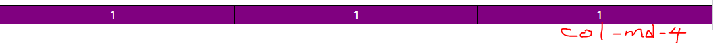
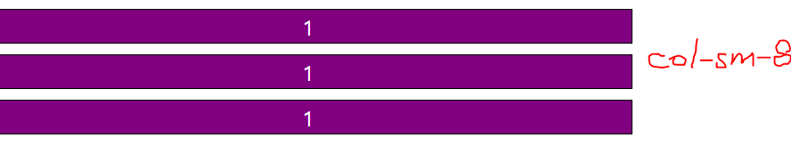
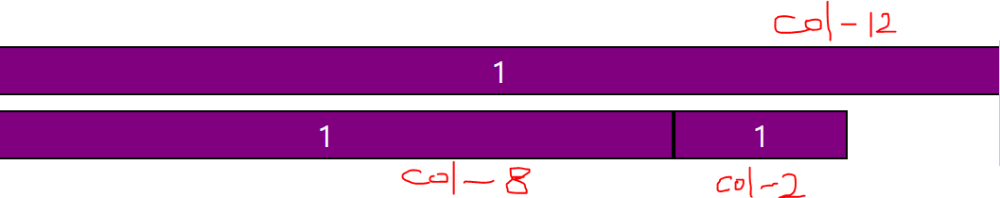
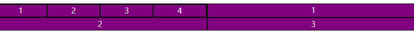
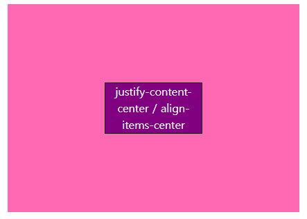
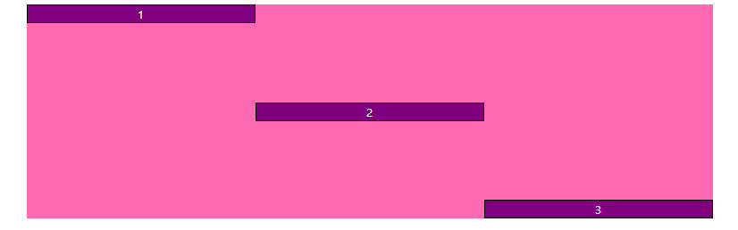

# Bootstrap 사용하기

## Grid [link](https://getbootstrap.com/docs/5.2/layout/grid/)

- 요소들의 디자인과 배치에 도움을 주는 시스템
- 기본 요소
  - `Column` : 실제 컨텐츠를 포함하는 부분
  - `Gutter` : 칼럼과 칼럼 사이의 공간 (사이 간격)
  - `Container` : `Column`들을 담고 있는 공간
- Bootstrap Grid system은 flexbox로 제작됨
- container, row, column으로 컨텐츠를 배치하고 정렬

<table>
    <thead>
        <tr>
            <th></th>
            <th>xs<br/>&lt;576px</th>
            <th>sm<br/>&gt;=576px</th>
            <th>md<br/>&gt;=768px</th>
            <th>lg<br/>&gt;=992px</th>
            <th>xl<br/>&gt;=1200px</th>
            <th>xxl<br/>&gt;=1400px</th>
        </tr>
    </thead>
    <tbody>
        <tr>
            <td>Container (max-width)</td>
            <td>None (auto)</td>
            <td>540px</td>
            <td>720px</td>
            <td>960px</td>
            <td>1140px</td>
            <td>1320px</td>
        </tr>
        <tr>
            <td>Class prefix</td>
            <td style="font-weight: bold;">.col-</td>
            <td style="font-weight: bold;">.col-sm-</td>
            <td style="font-weight: bold;">.col-md-</td>
            <td style="font-weight: bold;">.col-lg-</td>
            <td style="font-weight: bold;">.col-xl-</td>
            <td style="font-weight: bold;">.col-xxl-</td>
        </tr>
        <tr>
            <td style="font-weight: bold;"># of columns</td>
            <td colspan="6">12</td>
        </tr>
        <tr>
            <td>Gutter width</td>
            <td colspan="6">1.5rem (.75rem on left and right)</td>
        </tr>
    </tbody>
</table>

<br/>

## 예제

### Normal

```html
<div class="container">
  <div class="row">
    <div class="col">
      <div class="box">col</div>
    </div>
    <div class="col">
      <div class="box">col</div>
    </div>
    <div class="col">
      <div class="box">col</div>
    </div>
  </div>
</div>
```


<br/>

### Width change

```html
<div class="row">
  <div class="box col-3">col-3</div>
  <div class="box col-6">col-6</div>
  <div class="box col-3">col-3</div>
</div>
```


<br/>

### Width Over

```html
<div class="row">
  <div class="box col-1">1</div>
  <div class="box col-1">2</div>
  <div class="box col-1">3</div>
  <div class="box col-1">4</div>
  <div class="box col-1">5</div>
  <div class="box col-1">6</div>
  <div class="box col-1">7</div>
  <div class="box col-1">8</div>
  <div class="box col-1">9</div>
  <div class="box col-1">10</div>
  <div class="box col-1">11</div>
  <div class="box col-1">12</div>
  <div class="box col-1">13</div>
</div>
```


<br/>

### Responsible Width

```html
<div class="row">
  <div class="box col-sm-8 col-md-4 col-lg-5">1</div>
  <div class="box col-8 col-sm-8 col-md-4 col-lg-5">1</div>
  <div class="box col-2 col-sm-8 col-md-4 col-lg-5">1</div>
</div>
```








<br/>

### Nesting

```html
<div class="row">
  <div class="box col-6">
    <div class="row">
      <div class="box col-3">1</div>
      <div class="box col-3">2</div>
      <div class="box col-3">3</div>
      <div class="box col-3">4</div>
    </div>
  </div>
  <div class="box col-6">1</div>
  <div class="box col-6">2</div>
  <div class="box col-6">3</div>
</div>
```



<br/>

### Offset

```html
<div class="row">
  <div class="box col-md-4 offset-4">.col-md-4 .offset-4</div>
  <div class="box col-md-4 offset-md-4 offset-lg-2">.col-md-4 .offset-md-4 .offset-lg-2</div>
</div>
```


<br/>

### Align

```html
<div class="container">
  <div class="row parent justify-content-center align-items-center">
    <div class="box col-4">justify-content-center / align-items-center</div>
  </div>
</div>
```



<br/>

### Aligns

```html
<div class="row parent">
  <box class="box col-4 align-self-start">1</box>
  <box class="box col-4 align-self-center">2</box>
  <box class="box col-4 align-self-end">3</box>
</div>
```

