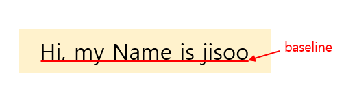

# CSS Position

- 문서 상에서 요소의 위치를 지정
- static : 모든 태그의 기본 값(기준 위치)
  - 일반적인 요소의 배치 순서에 따름(좌측 상단)
  - 부모 요소 내에서 배치될 때는 부모 요소의 위치를 기준으로 배치 됨
- 아래는 좌표 프로퍼티(top, bottom, left, right)를 사용하여 이동 가능
  1. `relative` : 상대 위치
     - 자기 자신의 static 위치를 기준으로 이동 **(normal flow 유지)**
     - 레이아웃에서 요소가 차지하는 공간은 static일 때와 같음 (normal position 대비 offset)
  2. `absolute` : 절대 위치
     - 요소를 일반적인 문서 흐름에서 제거 후 레이아웃에 공간을 차지하지 않음 **(normal flow에서 벗어남)**
     - static이 아닌 가장 가까이 있는 부모/조상 요소를 기준으로 이동 (없는 경우 브라우저 화면 기준으로 이동)
  3. `fixed` : 고정 위치
     - 요소를 일반적인 문서 흐름에서 제거 후 레이아웃에 공간을 차지하지 않음 **(normal flow에서 벗어남)**
  4. `sticky` : 스크롤에 따라 `static` -> `fixed`로 변경
     - 속성을 적용한 박스는 평소에 문서 안에서 `position: static` 상태와 같이 일반적인 흐름에 따르지만 스크롤 위치가 임계점에 이르면 `position: fixed`와 같이 박스를 화면에 고정할 수 있는 속성
     - 예로 네비게이션 바를 `sticky`가 아닌 `fixed`로 설정하면 가장 상단에 위치하지만 레이아웃에 공간을 차지하지 않아, content와 겹쳐 나타나기 때문에 **`sticky`로 설정해야 함**

 

- ## absolute 와 fixed의 차이

  - `absolute`
    - 특정 영역 위에 존재
      - CSS 기본 원칙인 좌측 상단에 배치되지 않음
      - **부모**를 기준으로 가운데 위치
  - `fixed`
    - 브라우저 기준으로 위치
      - CSS 기본 원칙인 좌측 상단에 배치되지 않음
      - **브라우저**를 기준으로 우측 하단에 위치

 

## CSS 원칙

- ### CSS 원칙 1, 2 : Normal flow

  - 모든 요소는 네모(박스 모델), 좌측 상단에 배치
  - display에 따라 크기와 배치가 달라짐

- ### CSS 원칙 3

  - **position으로 위치의 기준을 변경**
    - `relative` : 본인의 원래 위치
    - `absolute` : 특정 부모의 위치
    - `fixed` : 화면의 위치
    - `sticky` : 기본적으로 static이나 스크롤 이동에 따라 fixed로 변경

 

# CSS Layout

## Float

> 박스를 왼쪽 혹은 오른쪽으로 이동 시켜 텍스트를 포함 인라인 요소들이 주변을 wrapping 하도록 함
>
> 요소가 Normal flow를 벗어나도록 함

 

## Flexbox

### CSS Flexible Box Layout

- 행과 열 형태로 아이템들을 배치하는 1차원 레이아웃 모델
- 축 (default : `flex-direction: row`)
  - **main axis (메인 축)**
  - **cross axis (교차 축)**
- 구성 요소
  - **Flex Container (부모 요소)**
  - **Flex Item (자식 요소)**

 

### Flexbox 구성 요소

- Flex Container (부모 요소)
  - flexbox 레이아웃을 형성하는 가장 기본적인 모델
  - Flex Item들이 놓여 있는 영역
  - display 속성을 flex 혹은 inline-flex로 지정
- Flex item (자식 요소)
  - 컨테이너에 속해 있는 컨텐츠(박스)

 

### Flex 속성

- flexbox 시작
  - 부모 요소에 `display: flex;` 혹은 `display: inline-flex;` 설정

- 배치 설정

  - `flex-direction`

    - Main axis 기준 방향 설정
    - 역방향의 경우 HTML 태그 선언 순서와 시각적으로 다르니 유의

    | 속성           | 의미                                        |
    | -------------- | ------------------------------------------- |
    | row (default)  | Main axis 방향을 **가로 방향**으로 정렬     |
    | row-reverse    | Main axis 방향을 **가로의 역방향**으로 정렬 |
    | column         | Main axis 방향을 **세로 방향**으로 정렬     |
    | column-reverse | Main axis 방향을 **세로의 역방향**으로 정렬 |

     

  - `flex-wrap`

    - 아이템이 컨테이너를 벗어나는 경우 해당 영역 내에 배치되도록 설정
    - 즉, 기본적으로 컨테이너 영역을 벗어나지 않도록 함

    | 속성           | 의미                                          |
    | -------------- | --------------------------------------------- |
    | wrap (default) | 아이템들을 아래로 내려(다음 줄로) 정렬        |
    | nowrap         | 아이템들의 크기를 조절하여 한 줄에 모두 정렬  |
    | wrap-reverse   | 아이템들을 아래로 내려(다음 줄로) 역방향 정렬 |

     

  - `flex-flow`

    - flex-direction과 flex-wrap의 shorthand
    - flex-direction과 flex-wrap에 대한 설정 값을 차례로 작성
    - 예시) `flew-flow: row nowrap;`

 

- 공간 나누기

  - `justify-content` (main axis)

    - Main axis를 기준으로 공간 배분

  - `align-content` (cross axis)

    - Cross axis를 기준으로 공간 배분 (아이템이 한 줄로 배치되는 경우 확인할 수 없음)

    | 속성                 | 의미                                                         |
    | -------------------- | ------------------------------------------------------------ |
    | flex-start (default) | 아이템들을 axis 시작점으로                                   |
    | flex-end             | 아이템들을 axis 끝 쪽으로                                    |
    | center               | 아이템들을 axis 중앙으로                                     |
    | space-between        | 아이템 사이의 간격을 균일하게 분배                           |
    | space-around         | 아이템을 둘러싼 영역을 균일하게 분배 (가질 수 있는 영역을 반으로 나눠서 양쪽에) |
    | space-evenly         | 전체 영역에서 아이템 간 간격을 균일하게 분배                 |

 

- 정렬

  - `align-items `

    - 모든 아이템을 Cross axis 기준으로 정렬

  - `align-self `

    - 개별 아이템을 Cross axis 기준으로 정렬
      - 해당 속성은 컨테이너에 적용하는 것이 아니라 개별 아이템에 적용

    | 속성              | 의미                            |
    | ----------------- | ------------------------------- |
    | stretch (default) | 컨테이너를 가득 채움            |
    | flex-start        | 위로 정렬                       |
    | flex-end          | 아래로 정렬                     |
    | center            | 가운데 정렬                     |
    | baseline          | 텍스트 baseline에 기준선을 맞춤 |

  

 

- 기타 속성
  - `flex-grow` : 남은 영역을 아이템에 분배
    - 비율 => 기본 값은 0, 나머지 값들의 합을 구해 비율을 구하여 공간 부여
  - `order` : 배치 순서
    - 음수, 0, 양수의 값을 가짐
    - 우선 순위가 낮은 것부터 정렬됨 (오름차순)