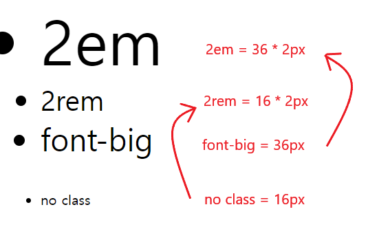
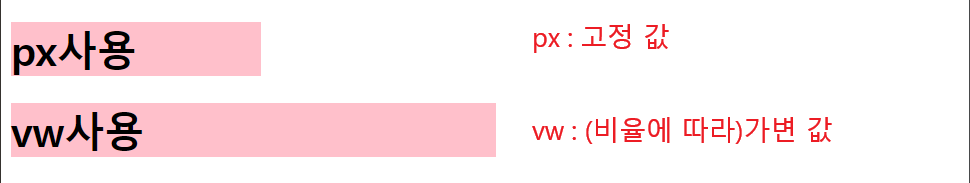

# CSS 기본 스타일

## 크기 단위

- px (픽셀)
  - 모니터 해상도의 한 화소인 '픽셀' 기준

  - 픽셀의 크기는 변하지 않기 때문에 **고정적인** 단위

- %
  - 백분율 단위

  - 가변적인 레이아웃에서 자주 사용

- em

  - (바로 위, 부모 요소에 대한) 상속의 영향을 받음
  - **배수 단위, 요소에 지정된 사이즈**에 상대적인 사이즈를 가짐

- rem

  - (바로 위, 부모 요소에 대한) 상속의 영향을 받지 않음
  - **최상위 요소(html)의 사이즈**를 기준으로 배수 단위를 가짐

<br/>

- ### 예제

```html
<body>
  <ul class="font-big">
    <li class="em">2em</li>
    <li class="rem">2rem</li>
    <li class="font-big">font-big</li>
  </ul>
  <ul>
    <li>no class</li>
  </ul>
</body>
```

```html
<style>
  .font-big {
    font-size: 36px;
  }
  .em {
    font-size: 2em;
  }
  .rem {
    font-size: 2rem;
  }
</style>
```

- ### 예제 확인



<br/>

## 크기 단위 (viewport)

- 웹 페이지를 방문한 유제에게 바로 보이게 되는 웹 컨텐츠의 영역 (디바이스 화면)
- 디바이스의 viewport를 기준으로 상대적인 사이즈가 결정됨
  - 예) vw, vh, vmin, vmax

<br/>

- ### 예제

```html
<body>
  <h1 class="px">px사용</h1>
  <h1 class="vw">vw사용</h1>
</body>
```

```html
<style>
  h1 {
    color: black;
    background-color: pink;
  }
  .px {
    width: 200px;
  }
  .vw {
    width: 50vw;
  }
</style>
```

- ### 예제 확인



<br/>

## 색상 단위

- **색상 키워드**(`background-color: red;`)
  - 대소문자를 구분하지 않음
  - red, blue, black과 같은 특정 색을 직접 글자로 나타냄
- **RGB 색상**(`background-color: rgb(0, 255, 0);`)
  - 16진수 표기법 혹은 함수형 표기법을 사용해서 특정 색을 표현하는 방식
  - `'#' + 16진수` 표기법, `rgb()` 함수형 표기법
- **HSL 색상**(`background-color: hsl(0, 100%, 50%);`)
  - 색상, 채도, 명도를 통해 특정 색을 표현하는 방식
  - `hsla()` 함수형 표기법으로 `alpha(투명도)`를 설정할 수 있음

<br/>

## CSS 문서 표현

- 텍스트
  - 서체(font-family), 서체 스타일(font-style, font-weight 등)
  - 자간(letter-spacing), 단어 간격(word-spacing), 행간(line-spacing) 등
- 컬러(color), 배경(background-image, background-color)
- 기타 HTML 태그별 스타일링
  - 목록(li), 표(table)
