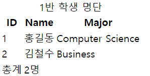
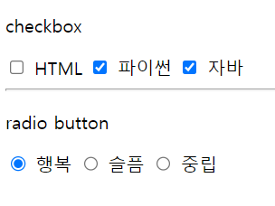
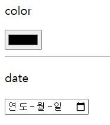

# HTML

## HTML 문서 구조화

- table의 각 영역을 명시하기 위해 `<thead> <tbody> <tfoot>` 요소를 활용
- `<tr>`으로 가로 줄을 구성하고 내부에는 `<th>` 혹은 `<td>`로 셀을 구성
  - `<th>`는 헤더 라인에 들어가는 데이터, `<td>`는 헤더 라인을 제외한 모든 행에 들어가는 데이터
- `colspan, rowspan` 속성을 활용하여 셀 병합
- `<caption>`을 통해 표 설명 또는 제목을 나타냄

```html
<body>
    <table>
        <thead>
            <tr>
                <th>ID</th>
                <th>Name</th>
                <th>Major</th>
            </tr>
        </thead>
        <tbody>
            <tr>
                <td>1</td>
                <td>홍길동</td>
                <td>Computer Science</td>
            </tr>
            <tr>
                <td>2</td>
                <td>김철수</td>
                <td>Business</td>
            </tr>
        <tfoot>
            <tr>
                <td>총계</td>
                <td colspan="2">2명</td>
            </tr>
        </tfoot>
        </tbody>
        <caption>1반 학생 명단</caption>
    </table>
</body>
```

### 예제 확인



<br/>

## Form

- `<form>`은 정보(데이터)를 서버에 제출하기 위해 사용하는 태그

- `<form>` 기본 속성

  - `action` : form을 처리할 서버의 URL (데이터를 보낼 곳)

  - `method` : form을 제출할 때 사용할 HTTP 메서드 (GET 혹은 POST)

  - `enctype` : method가 post인 경우 데이터의 유형

    - application/x-www-form-urlencoded : 기본값
    - multipart/form-data : 파일 전송시 (input type이 file인 경우)
    - text/plain : HTML5 디버깅 용 (잘 사용되지 않음)

    ```html
    <form action="/search" method="GET">
        
    </form>
    ```

<br/>

## Input

- 다양한 타입을 가지는 입력 데이터 유형과 위젯이 제공됨

- `<input>` 대표적인 속성

  - `name` : form control에 적용되는 이름 (이름/값 페어로 전송됨)

  - `value` : form control에 적용되는 값 (이름/값 페어로 전송됨)

  - `required`, `readonly`, `autofocus`, `autocomplete`, `disabled` 등

    ```html
    <form action="/search" method="GET">
        <input type="text" name="q">
    </form>
    
    <!-- 구글 검색창에 'HTML'을 입력했을 때 -->
    <!-- https://www.google.com/search?q=HTML -->
    ```

<br/>

## Input label

- `label`을 클릭하여 `input` 자체의 초점을 맞추거나 활성화 시킬 수 있음

  - 사용자는 선택할 수 있는 영역이 늘어나 웹 / 모바일(터치) 환경에서 편하게 사용할 수 있음
  - `label`과 `input` 입력의 관계가 **시각적 뿐만 아니라 화면 리더기**에서도 `label`을 읽어 쉽게 내용을 확인할 수 있도록 함

- `<input>`에 **id 속성**을, `<label>`에는 **for 속성**을 활용하여 상호 연관을 시킴

  ```html
  <label for="agreement">개인정보 수집에 동의합니다.</label>
  <input type="checkbox" name="agreement" id="agreement">
  ```

<br/>

## input 유형 - 일반

- 일반적으로 입력을 받기 위하여 제공되며 타입별로 HTML 기본 검증 혹은 추가 속성을 활용할 수 있음
  - `text` : 일반 텍스트 입력
  - `password` : 입력 시 값이 보이지 않고 문자를 특수기호`(*)`로 표현
  - `email` : 이메일 형식이 아닌 경우 form 제출 불가
  - `number` : min, max, step 속성을 활용하여 숫자 범위 설정 가능
  - `file` : accept 속성을 활용하여 파일 타입 지정 가능

<br/>

## input 유형 - 항목 중 선택

- 일반적으로 `label` 태그와 함께 사용하여 선택 항목을 작성함

- 동일 항목에 대하여 `name`을 지정하고 선택된 항목에 대한 `value`를 지정해야 함

  - `checkbox` : 다중 선택
  - `radio` : 단일 선택

  ```html
  <body>
      <div>
          <p>checkbox</p>
          <input id="html" type="checkbox" name="language" value="html">
          <label for="html">HTML</label>
          <input id="python" type="checkbox" name="language" value="python">
          <label for="python">파이썬</label>
          <input id="java" type="checkbox" name="language" value="java">
          <label for="java">자바</label>
          <hr>
      </div>
      <div>
          <p>radio button</p>
          <input id="happy" type="radio" name="status" value="happy">
          <label for="happy">행복</label>
          <input id="sad" type="radio" name="status" value="sad">
          <label for="sad">슬픔</label>
          <input id="normal" type="radio" name="status" value="normal">
          <label for="normal">중립</label>
      </div>
  </body>
  ```

  ### 예제 확인

  
  

<br/>

## input 유형 - 기타

- 다양한 종류의 input을 위한 picker를 제공
  - `color` : color picker
  - `date` : date picker

- `hidden input`을 활용하여 사용자 입력을 받지 않고 서버에 전송되어야 하는 값을 설정

  - `hidden` : 사용자에게 보이지 않는 input

  ```html
  <body>
      <div>
          <p>color</p>
          <input type="color">
      </div>
      <hr>
      <div>
          <p>date</p>
          <input type="date">
      </div>
  </body>
  ```

  ### 예제 확인

  

