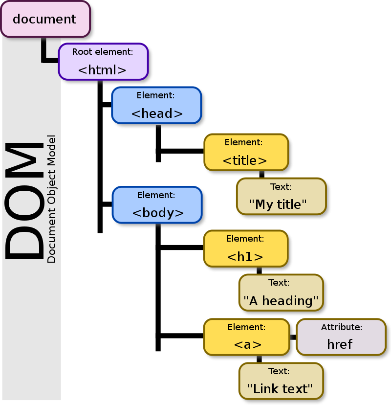

# 자바스크립트

> 브라우저를 조작할 수 있는 유일한 언어
>
> 브라우저 화면을 '동적'으로 만들기 위해 쓰임

<br/>

## 브라우저 (browser)

- URL로 웹(WWW)을 탐색하며 서버와 통신하고, HTML 문서나 파일을 출력하는 GUI 기반의 소프트웨어
- 인터넷의 컨텐츠를 검색 및 열람하도록 함
- "웹 브라우저"라고도 함
- EX) `Google Chrome, Mozilla Firefox, Microsoft Edge, Opera, Safari`

<br/>

### 브라우저에서 할 수 있는 일

  - **DOM 조작**
    - 문서(HTML) 조작
  - **BOM 조작**
    - navigator, screen, location, frames, history, XHR
  - **JavaScript Core (ECMAScript)**
    - Data Structure(Object, Array), Conditional Expression, Iteration

<br/>

## DOM (Document Object Model)

- HTML, XML과 같은 문서를 다루기 위한 문서 프로그래밍 인터페이스

- 문서를 구조화하고 구조화된 구성 요소를 하나의 객체로 취급하여 다루는 논리적 트리 모델

- 문서가 구조화되어 있으며 각 요소는 객체(object)로 취급

- 단순한 속성 접근, 메서드 활용 뿐만 아니라 프로그래밍 언어적 특성을 활용한 조작 가능

- 주요 객체

  - `window` : DOM을 표현하는 창, 가장 최상위 객체 (작성 시 생략 가능)
  - `document` : 페이지 컨텐츠의 Entry Point 역할을 하며, `<body>` 등과 같은 수많은 다른 요소들을 포함
  - `navigator`, `location`, `history`, `screen`

- **DOM 예시 사진**

  

<br/>

## DOM - 해석

- **파싱 (Parsing)**
  - 구문 분석, 해석
  - 브라우저가 문자열을 해석하여 DOM Tree로 만드는 과정

### BOM (Browser Object Model)

  - 자바스크립트가 브라우저와 소통하기 위한 모델

  - 브라우저의 창이나 프레임을 추상화해서 프로그래밍적으로 제어할 수 있도록 제공하는 수단

    - 버튼, URL 입력창, 타이틀 바 등 브라우저 윈도우 및 웹 페이지 일부분을 제어 가능

  - window 객체는 모든 브라우저로부터 지원 받으며 브라우저의 창(window)를 지칭

  - **BOM 조작**

    ```js
    // 탭 창
    window.open()
    
    // 인쇄 창
    window.print()
    
    // 메시지 및 확인, 취소 버튼이 있는 대화상자 창
    window.confirm()
    
    // document도 브라우저 내에 종속되어 있기 때문에 window 전역 객체에 포함
    window.document
    ```

    <br/>

  - **JavaScript Core**

    ```js
    const numbers = [1, 2, 3, 4, 5]
    
    for (let i=0; i<numbers.length; i++) {
        console.log(numbers[i])
    }
    ```

<br/>

## 브라우저(BOM)과 그 내부의 문서(DOM)를 조작하기 위해 ECMAScript(JS)를 학습!!!

<br/>

## DOM 조작 - 개념

- Document는 문서 한 장(HTML)에 해당하고 이를 조작

### DOM 조작 순서

  1. 선택 (Select)
  2. 변경 (Manipulation)

<br/>

### DOM 객체의 상속 구조

  - `EventTarget`
    - Event Listener를 가질 수 있는 객체가 구현하는 DOM 인터페이스
  - `Node`
    - 여러 가지 DOM 타입들이 상속하는 인터페이스
  - `Element`
    - Document 안의 모든 객체가 상속하는 가장 범용적인 인터페이스
    - 부모인 Node와 그 부모인 EventTarget의 속성을 상속
  - `Document`
    - 브라우저가 불러온 웹 페이지를 나타냄
    - DOM 트리의 진입점(entry point) 역할을 수행
  - `HTMLElement`
    - 모든 종류의 HTML 요소
    - 부모 element의 속성 상속

<br/>

### DOM 선택 - 선택 관련 메서드

  | 메서드                                   | 설명                                                         |
  | ---------------------------------------- | ------------------------------------------------------------ |
  | `document.querySelector(selector)`       | 제공한 선택자와 일치하는 element 하나 선택<br />제공한 CSS selector를 만족하는 첫 번째 element 객체를 반환 (없다면 null) |
  | `document.querySelectorAll(selector)`    | 제공한 선택자와 일치하는 여러 element를 선택<br />매칭할 하나 이상의 셀렉터를 포함하는 유요한 CSS selector를 인자(문자열)로 받음<br />지정된 셀렉터에 일치하는 NodeList를 반환 |
  | `document.getElementById(id)`            | 주어진 문자열과 일치하는 id 속성을 가진 요소를 찾고, 이를 나타내는 Element 객체를 반환 |
  | `document.getElementsByTagName(name)`    | Element의 HTMLCollection과 주어진 태그명을 반환              |
  | `document.getElementsByClassName(names)` | 주어진 문자열과 일치하는 모든 자식 요소들을 HTMLCollection과 배열의 형태로 반환 |

  <br/>

  #### `querySelector()`, `querySelectorAll()`을 사용하는 이유

    - id, class 그리고 tag 선택자 등을 모두 사용 가능하므로, 더 구체적이고 유연하게 선택 가능
    - ex) `document.querySelector('#id')`, `document.querySelectAll('.class')`
    
    <br/>

  #### HTMLCollection & NodeList

    - 둘 다 배열과 같이 각 항목에 접근하기 위한 index를 제공 (유사 배열)
    - **HTMLCollection**
      - name, id, index 속성으로 각 항목에 접근 가능
    - **NodeList**
      - index로만 각 항목에 접근 가능
      - 단, HTMLCollection과 달리 배열에서 사용하는 `forEach` 메서드 및 다양한 메서드 사용 가능
    - 둘 다 Live Collection으로 DOM의 변경사항을 실시간으로 반영하지만, `querySelectorAll()`에 의해 반환되는 NodeList는 Static Collection으로 실시간으로 반영되지 않음
    
    <br/>

  #### Live Collection & Static Collection (non-live)

    - **Live Collection**
      - 문서가 바뀔 때 실시간으로 업데이트 됨
      - DOM의 변경사항을 실시간으로 collection에 반영
      - ex) HTMLCollection, NodeList
    - **Static Collection (non-live)**
      - DOM이 변경되어도 collection 내용에는 영향을 주지 않음
      - `querySelectorAll()`의 반환 NodeList만 Static Collection

<br/>

### DOM 변경 - 변경 관련 메서드 (Creation, append DOM, property)

  | 메서드                     | 설명                                                         |
  | -------------------------- | ------------------------------------------------------------ |
  | `document.createElement()` | 작성한 태그 명의 HTML 요소를 생성하여 반환                   |
  | `Element.append()`         | 특정 부모 Node의 자식 NodeList 중 마지막 자식 다음에 Node 객체나 DOMString을 삽입<br />여러 개의 Node 객체, DOMString을 추가할 수 있음<br />반환 값이 없음 |
  | `Node.appendChild()`       | 한 Node를 특정 부모 Node의 자식 NodeList 중 마지막 자식으로 삽입 (Node만 추가 기능)<br />한 번에 오직 하나의 Node만 추가할 수 있음<br />만약 주어진 Node가 이미 문서에 존재하는 다른 Node를 참조한다면 새로운 위치로 이동 |
  | `Node.innerText`           | Node 객체와 그 자손의 텍스트 컨텐츠(DOMString)를 표현 (해당 요소 내부의 raw text)<br />줄 바꿈을 인식하고 숨겨진 내용을 무시하는 등 최종적으로 스타일링이 적용된 모습으로 표현 |
  | `Element.innerHTML`        | 요소(element) 내에 포함된 HTML 마크업을 반환<br />XSS 공격에 취약하므로 사용 시 주의 |

  <br/>

  #### ParentNode.append() VS Node.appendChild()

    - `.append()`를 사용하면 DOMString 객체를 추가할 수 있지만, `.appendChild()`는 Node 객체만 허용
    - `.append()`는 반환 값이 없지만, `.appendChild()`는 추가된 Node 객체를 반환
    - `.append()`는 여러 Node 객체와 문자열을 추가할 수 있지만, `.appendChild()`는 하나의 Node 객체만 추가할 수 있음

  #### XSS (Cross-site Scripting)

    - 공격자가 입력요소를 사용하여 웹 사이트 클라이언트 측 코드에 악성 스크립트를 삽입해 공격하는 방법
    - 피해자(사용자)의 브라우저가 악성 스크립트를 실행하며 공격자가 엑세스 제어를 우회하고 사용자를 가장 할 수 있도록 함

<br/>

### DOM 삭제 - 삭제 관련 메서드

  | 메서드               | 설명                                                         |
  | -------------------- | ------------------------------------------------------------ |
  | `ChildNode.remove()` | Node가 속한 트리에서 해당 Node를 제거                        |
  | `Node.removeChild()` | DOM에서 자식 Node를 제거하고 제거된 Node를 반환<br />Node는 인자로 들어가는 자식 Node의 부모 Node |

<br/>

### DOM 속성 - 속성 관련 메서드

  | 메서드                                | 설명                                                         |
  | ------------------------------------- | ------------------------------------------------------------ |
  | `Element.setAttribute(name, value)`   | 지정된 요소의 값을 설정<br />속성이 이미 존재하면 값을 갱신, 존재하지 않으면 지정된 이름과 값으로 새 속성을 추가 |
  | `Element.getAttribute(attributeName)` | 해당 요소의 지정된 값(문자열)을 반환<br />인자(attributeName)는 값을 얻고자 하는 속성의 이름 |

  
