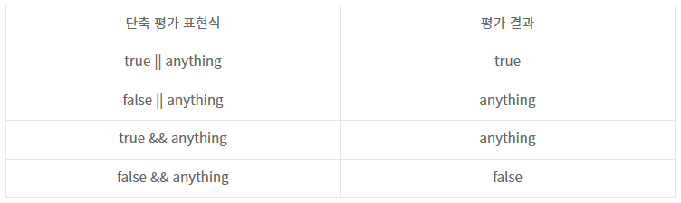

# JavaScript 활용

## 기본 활용

```html
<script>
    // console 창에 print 해줌
	console.log('hello, js!')
    
    // h1 요소(element)를 만들고
    const title = document.createElement('h1')
    // 텍스트를 추가하고
    title.innerText = 'JS 기초'
    // 선택자로 body 태그를 가져와서
    const body = document.querySelector('body')
    // body 태그에 자식 요소로 추가
    body.appendChild(title)
</script>
```

<br/>

## DOM 조작

```html
<body>
    <h1 id="title">
        JS 기초
    </h1>
    <h2>
        DOM 조작
    </h2>
    <p class="text">
        querySelector
    </p>
    <p class="text">
        querySelectorAll
    </p>
</body>
```

```js
document.querySelector('#title')
// <h1 id="title">JS 기초</h1>

document.querySelector('h2')
// <h2>DOM 조작</h2>

document.querySelectorAll('h2')
// NodeList [h2]

document.querySelectorAll('.text')
// NodeList(2) [p.text, p.text]
```


<br/>

## 변수와 식별자

> 식별자(identifier)는 변수를 구분할 수 있는 변수명을 말함
>
> 식별자는 반드시 문자, 달러($) 또는 밑줄(_)로 시작
>
> 대소문자를 구분하며, 클래스명 외에는 모두 소문자로 시작
>
> 예약어 (for, if, function 등) 사용 불가 

<br/>

### 변수의 단계

```js
let foo				// 선언
console.log(foo)	// undefined

foo = 11			// 할당
console.log(foo)	// 11

let bar = 0			// 선언 + 할당 => 초기화
console.log(bar)	// 0
```

- **선언 (Declaration)**
  - 변수를 생성하는 행위 또는 시점
- **할당 (Assignment)**
  - 선언된 변수에 값을 저장하는 행위 또는 시점
- **초기화 (Initialization)**
  - 선언된 변수에 처음으로 값을 저장하는 행위 또는 시점

<br/>

### const & let & var

- `var`
  - **전역 변수**로 사용하는 방식
  - **재선언** 및 **재할당** 모두 **가능**
  - ES6 이전에 사용했던 변수 선언 방식
  - **호이스팅**되는 특성으로 인해 예기치 못한 문제가 발생하기 때문에, 요즘은 `const`, `let`을 더 많이 사용
- `const`
  - 블록 내(블록 스코프)에서 사용되는 **지역 변수**
  - 변수를 선언 후 변경할 수 없음 **(재할당 불가능)**
  - 변수(객체) 안의 속성 값은 변경 가능
  - 같은 이름의 변수를 중복 선언할 수 없음 **(재선언 불가능)**
- `let`
  - 블록 내(블록 스코프)에서 사용되는 **지역 변수**
  - 변수를 선언 후 변경할 수 있음 **(재할당 가능)**
  - 같은 이름의 변수를 중복 선언할 수 없음 **(재선언 불가능)**

```js
// 재할당

var number0 = 10		// 1. 선언 및 초기값 할당
var number0 = 50		// 2. 재할당 및 재선언 가능
console.log(number0)	// 50

const number1 = 10		// 1. 선언 및 초기값 할당
number1 = 10			// 2. 재할당 불가능
// => Uncaught TypeError: Assignment to constant variable.

let number2 = 10		// 1. 선언 및 초기값 할당
number2 = 10			// 2. 재할당 가능
console.log(number2)	// 10
```

```js
// 재선언

let number1 = 10		// 1. 선언 및 초기값 할당
let number1 = 50		// 2. 재선언 불가능
// => Uncaught SyntaxError: Identifier 'number' has already been declared.

const number2 = 10		// 1. 선언 및 초기값 할당
const number2 = 50		// 2. 재선언 불가능
// => Uncaught SyntaxError: Identifier 'number' has already been declared.
```

<br/>

#### 블록 스코프 (block scope)

> if, for, function 등의 중괄호 내부를 가리킴

- 블록 스코프를 가지는 변수는 블록 바깥에서 접근 불가능

```js
let x = 1;

if (x === 1) {
    let x = 2;
    console.log(x);	// 2
}

console.log(x);		// 1
```

<br/>

#### 호이스팅 (hoisting)

> 변수를 선언 이전에 참조할 수 있는 현상

- 변수 선언 이전의 위치에서 접근 시 `undefined`를 반환
- 자바스크립트는 모든 선언을 호이스팅한다.
- `var`, `let`, `const` 모두 호이스팅이 발생하지만, `var`는 선언과 초기화가 동시에 발생하여 **<u>일시적 사각지대</u>**가 존재하지 않는다.

- 호이스팅을 통해 끌어올려진 `var` 변수는 `undefined` 값을 반환하고 변수를 사용 혹은 참조한 후에 선언 및 초기화하여도, 여전히 `undefined`를 반환함

- `const`, `let`는 변수를 상단으로 끌어올리지만 초기화를 하지 않아 문제가 발생하지 않음
  - 선언되기 전에 블록 안에서 변수를 참조하게 되면 `ReferenceError`를 발생시킴

```js
console.log(username)		// undefined
var username = '홍길동'

console.log(email)			// Uncaught ReferenceError
let email = 'gildong@gmail.com'

console.log(age)			// Uncaught ReferenceError
const age = 50
```

<br/>

### 변수와 식별자 정리

| 키워드  | 재선언 | 재할당 | 스코프      | 비고         |
| ------- | ------ | ------ | ----------- | ------------ |
| `let`   | X      | O      | 블록 스코프 | ES6부터 도입 |
| `const` | X      | X      | 블록 스코프 | ES6부터 도입 |
| `var`   | O      | O      | 함수 스코프 | 사용 X       |

<br/>

- ### 따라서 변수 호이스팅의 문제를 방지하기 위해 const, let을 사용하여 변수를 정의하는 것이 안전하다.

<br/>

## 데이터 타입

> 자바스크립트의 모든 값은 특정한 데이터 타입을 가짐
>
> 크게 원시 타입(Primitive type)과 참조 타입(Reference type)으로 분류됨

<table>
	<tr>
		<td rowspan='2'>데이터 타입</td>
		<td style='font-weight: bold;'>원시 타입(Primitive type)</td>
		<td colspan='2'>Number, String, Boolean, undefined, null, Symbol</td>
	</tr>
	<tr>
		<td style='font-weight: bold;'>참조 타입(Reference type)</td>
		<td>Objects =></td>
		<td>Arrays, Function, ... etc</td>
	</tr>
</table>

<br/>

### 원시 타입 (Primitive type)

> 객체 (object)가 아닌 기본 타입

- 변수에 해당 타입의 값이 담김
- 다른 변수에 복사할 때 실제 값이 복사됨

<br/>

#### 원시 타입 종류

- #### 숫자 (Number) 타입

  - 정수, 실수 구분 없는 하나의 숫자 타입
  - 부동소수점 형식을 따름
  - NaN (Not-A-Number)
    - 계산 불가능한 경우 반환되는 값
    - ex) 'Angel' / 1004 => NaN

  ```js
  const a = 13			// 양의 정수
  const b = -5			// 음의 정수
  const c = 3.14			// 실수
  const d = 2.998e8		// 거듭제곱
  const e = Infinity		// 양의 무한대
  const f = -Infinity		// 음의 무한대
  const g = NaN			// 산술 연산 불가
  ```

<br/>

- #### 문자열 (String) 타입

  - 텍스트 데이터를 나타내는 타입
  - 16비트 유니코드 문자의 집합
  - 작은 따옴표 또는 큰 따옴표 모두 가능
  - 템플릿 리터럴 (Template Literal)
    - ES6부터 지원
    - 따옴표 대신 backtick(``` `)으로 표현
    - `${expression}` 형태로 표현식 삽입 가능

  ```js
  const firstName = 'Brandan'
  const lastName = 'Eich'
  const fullName = `${firstName} ${lastName}`
  
  console.log(fullName)	// Brandan Eich
  ```

<br/>

- #### undefined

  - 변수의 값이 없음을 나타내는 데이터 타입
  - 변수 선언 이후 직접 값을 할당하지 않으면, 자동으로 undefined가 할당됨

  ```js
  let firstName
  console.log(firstName)	// undefined
  ```

<br/>

- #### null

  - 변수의 값이 없음을 의도적으로 표현할 때 사용하는 데이터 타입
  - null 타입과 typeof 연산자
    - typeof 연산자 : 자료형 평가를 위한 연산자
    - null 타입은 [ECMA 명세의 원시 타입의 정의](https://tc39.es/ecma262/#sec-primitive-value)에 따라 원시 타입에 속하지만, typeof 연산자의 결과는 객체(object)로 표현됨([참고자료](https://2ality.com/2013/10/typeof-null.html))

  ```js
  let firstName = null
  console.log(firstName)	// null
  
  typeof null				// object
  ```

<br/>

- #### Boolean 타입

  - 논리적 참 또는 거짓을 나타내는 타입
  - `true` 또는 `false`로 표현
  - 조건문 또는 반복문에서 유용하게 사용
    - 조건문 또는 반복문에서 boolean이 아닌 데이터 타입은 [자동 형변환 규칙](https://tc39.es/ecma262/#sec-type-conversion)에 따라 true 또는 false로 변환됨

  ```js
  let isAdmin = true
  console.log(isAdmin)	// true
  
  isAdmin = false
  console.log(isAdmin)	// false
  ```

<br/>

- #### [자동 형변환](https://tc39.es/ecma262/#sec-toboolean) 정리

  | 데이터 타입 | 거짓       | 참               |
  | ----------- | ---------- | ---------------- |
  | Undefined   | 항상 거짓  | X                |
  | Null        | 항상 거짓  | X                |
  | Number      | 0, -0, NaN | 나머지 모든 경우 |
  | String      | 빈 문자열  | 나머지 모든 경우 |
  | Object      | X          | 항상 참          |

<br/>

### 참조 타입 (Reference type)

> 객체 (object) 타입의 자료형

- 변수에 해당 객체의 참조 값이 담김
- 다른 변수에 복사할 때 참조 값이 복사됨

```js
// 원시 타입
let message = 'Hi!'			// 1. message 선언 및 할당

let greeting = message		// 2. greeting에 message 복사
console.log(greeting)		// 3. 'Hi!' 출력

message = 'Hello!'			// 4. message 재할당
console.log(greeting)		// 5. 'Hi!' 출력

// => 원시 타입은 실제 해당 타입의 값을 변수에 저장

// 참조 타입
const message = ['Hi!']		// 1. message 선언 및 할당

const greeting = message	// 2. greeting에 message 복사
console.log(greeting)		// 3. ['Hi!'] 출력

message[0] = 'Hello!'		// 4. message 재할당
console.log(greeting)		// 5. ['Hello!'] 출력

// => 참조 타입은 해당 객체를 참조할 수 있는 참조 값을 저장
```

<br/>

## 연산자

### 할당 연산자

- 오른쪽에 있는 피연산자의 평가 결과를 왼쪽 피연산자에 할당하는 연산자
- 다양한 연산에 대한 단축 연산자 지원
- Increment 및 Decrement 연산자
  - Increment(++) : 피연산자의 값을 1 증가시키는 연산자
  - Decrement(--) : 피연산자의 값을 1 감소시키는 연산자
  - [Airbnb Style Guide](https://github.com/airbnb/javascript#variables--unary-increment-decrement)에서는 '+=' 또는 '-='와 같이 더 분명한 표현으로 적을 것을 권장

```js
let x = 0

x += 10
console.log(x)		// 10

x -= 3
console.log(x)		// 7

x *= 10
console.log(x)		// 70

x /= 10
console.log(x)		// 7

x++
console.log(x)		// 8

x--
console.log(x)		// 7
```

<br/>

### 비교 연산자

- 피연산자를 비교하고 결과값을 `boolean`으로 반환하는 연산자
- 문자열은 유니코드 값을 사용하며 표준 사전 순서를 기반으로 비교
  - ex) 알파벳끼리 비교할 경우
    - 알파벳 순서상 후순위가 더 크다
    - 소문자가 대문자보다 더 크다

```js
const numOne = 1
const numTwo = 100
console.log(numOne < numTwo)		// true

const charOne = 'a'
const charTwo = 'z'
console.log(charOne > charTwo)		// false
```

<br/>

### 동등 비교 연산자 (==)

- 두 피연산자가 같은 값으로 평가되는지 비교 후 `boolean` 값을 반환
- 비교할 때 [암묵적 타입 변환](https://262.ecma-international.org/5.1/#sec-11.9.3)을 통해 타입을 일치시킨 후 같은 값인지 비교
- 두 피연산자가 모두 객체일 경우 메모리의 같은 객체를 바라보는지 판별
- 예상치 못한 결과가 발생할 수 있으므로 특별한 경우를 제외하고 사용하지 않음

```js
const a = 1004
const b = '1004'
console.log(a == b)		// true

const c = 1
const d = true
console.log(c == d)		// true

// 자동 타입 변환 예시
console.log(a + b)		// 10041004
console.log(c + d)		// 2
```

<br/>

### 일치 비교 연산자 (===)

- 두 피연산자가 같은 값으로 평가되는지 비교 후 `boolean` 값을 반환
- [엄격한 비교](https://262.ecma-international.org/5.1/#sec-11.9.6)가 이뤄지며 암묵적 타입 변환이 발생하지 않음
  - 엄격한 비교 : 두 비교 대상의 타입과 값 모두 같은지 비교

```js
const a = 1004
const b = '1004'
console.log(a === b)	// false

const c = 1
const d = true
console.log(c === d)	// false
```

<br/>

### 논리 연산자

- 세 가지 논리 연산자로 구성
  - and 연산은 `&&` 연산자를 이용
  - or 연산은 `||` 연산자를 이용
  - not 연산은 `!` 연산자를 이용
- 단축 평가 지원
  - ex) false && true => false
  - ex) true || false => true

```js
// and 연산
console.log(true && false)	// false
console.log(true && true)	// true
console.log(1 && 0)			// 0
console.log(4 && 7)			// 7
console.log('' && 5)		// ''

// or 연산
console.log(true || false)	// true
console.log(false || false)	// false
console.log(1 || 0)			// 1
console.log(4 || 7)			// 4
console.log('' || 5)		// 5

// not 연산
console.log(!true)			// false
console.log(!'Bonjour!')	// false
```

<br/>

#### 논리 연산자 단축 평가



<br/>

### 삼항 연산자 (Ternary Operator)

- 세 개의 피연산자를 사용하여 조건에 따라 값을 반환하는 연산자
- 가장 왼쪽의 조건식이 참이면 콜론(:) 앞의 값을 사용하고 그렇지 않으면 콜론(:) 뒤의 값을 사용
- 삼항 연산자의 결과 값이기 때문에 변수에 할당 가능
- [한 줄 표기 권장](https://github.com/airbnb/javascript#comparison--nested-ternaries)

```js
console.log(true ? 1 : 2)		// 1
console.log(false ? 1 : 2)		// 2

const result = Math.PI > 4 ? 'Yes' : 'No'
console.log(result)				// No
```

