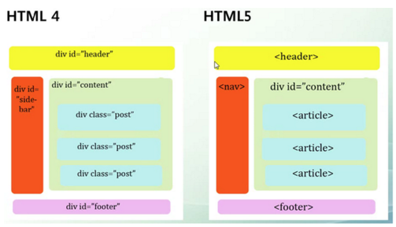

# 시맨틱 태그

- HTML 태그가 특정 목적, 역할 및 의미적 가치(semantic value)를 가지는 것

  - `h1` 태그는 "이 페이지에서 최상위 제목"인 텍스트를 감싸는 역할(또는 의미)을 나타냄

- Non semantic 요소로는 `div`, `span` 등이 있으며 `a`, `form`, `table` 태그들도 시맨틱 태그로 볼 수 있음

- 대표적인 시맨틱 태그 목록

  | 태그      | 의미                                                     |
  | --------- | -------------------------------------------------------- |
  | `header`  | 문서 전체나 섹션의 헤더(머리말 부분)                     |
  | `nav`     | 네비게이션                                               |
  | `aside`   | 사이드에 위치한 공간, 메인 콘텐츠와 관련성이 적은 콘텐츠 |
  | `section` | 문서의 일반적인 구분, 컨텐츠의 그룹을 표현               |
  | `article` | 문서, 페이지, 사이트 안에서 독립적으로 구분되는 영역     |
  | `footer`  | 문서 전체나 섹션의 푸터(마지막 부분)                     |

  

 

## 시맨틱 태그를 사용해야 하는 이유

- 의미론적 마크업
  - 개발자 및 사용자 뿐만 아니라 검색엔진 등에 의미 있는 정보의 그룹을 태그로 표현
  - 단순히 구역을 나누는 것 뿐만 아니라 '**의미**'를 가지는 태그들을 활용하기 위한 노력
  - 요소의 의미가 명확해지기 때문에 **코드의 가독성**을 높이고 유지 보수를 쉽게 함
  - 검색 엔진 최적화(SEO)를 위해서 **메타태그**, **시맨틱 태그** 등을 통한 마크업을 효과적으로 활용해야 함